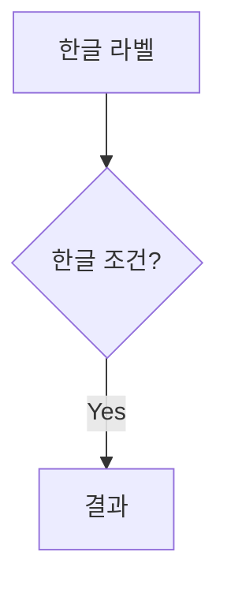
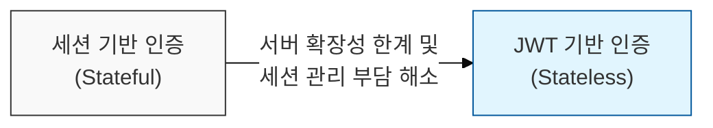

# 마크다운 작성 가이드

## 볼드(`**`) 작성 시 주의사항

`marked.js` 라이브러리에서 **따옴표(`"`)가 `**` 바깥에 있을 때** 볼드가 정상적으로 렌더링되지 않습니다.

### ❌ 잘못된 방식
```markdown
**"모바일웹으로 해결되지 않는 과제를 앱이 얼마나 명확히 해결하는가"**
```

### ✅ 올바른 방식
```markdown
"**모바일웹으로 해결되지 않는 과제를 앱이 얼마나 명확히 해결하는가**"
```
→ 따옴표를 `**` 바깥쪽으로 배치하면 정상적으로 **볼드** 처리됩니다.

---

## 볼드(`**`) 작성 시 주의사항 - 2

### 긴 문장을 하나로 볼드 처리하지 않기
특수문자(`·`, `/`, `(`, `)` 등)가 많은 긴 문장을 하나의 `**`로 감싸면 파싱에 실패합니다.

#### ❌ 잘못된 예
```markdown
**기획·디자인·개발·QA·보안·스토어 배포·운영대응 인월(M/M)**
```

#### ✅ 올바른 예
```markdown
**기획**·**디자인**·**개발**·**QA**·**보안**·**스토어 배포**·**운영대응 인월**(M/M)
```
→ 각 단어를 개별 볼드로 처리하고 중간점은 볼드 밖에 둡니다.

---

## Mermaid 필수 설정 (신규 프로젝트)

Docusaurus에서 Mermaid를 사용하려면 **패키지 설치와 설정 두 가지가 모두 필요**합니다.  
어느 하나라도 빠지면 다이어그램이 렌더링되지 않고 코드 블록 원문이 그대로 표시됩니다.

### 1. 패키지 설치

```bash
npm install @docusaurus/theme-mermaid
```

또는 `package.json`에 직접 추가:

```json
"dependencies": {
  "@docusaurus/theme-mermaid": "3.10.1"
}
```

### 2. `docusaurus.config.ts` 설정

```ts
const config: Config = {
  markdown: {
    mermaid: true,
  },
  themes: ['@docusaurus/theme-mermaid'],
  // ... 나머지 설정
};
```

> **주의**: `markdown.mermaid: true`와 `themes` 배열 **둘 다** 설정해야 합니다.

---

## 수식(LaTeX) 필수 설정 (신규 프로젝트)

`$$...$$` 또는 `$...$` 수식을 사용하려면 **패키지 설치와 플러그인 설정 두 가지가 모두 필요**합니다.  
설정이 빠지면 수식이 렌더링되지 않고 MDX 컴파일 오류가 발생합니다.

### 1. 패키지 설치

```bash
npm install remark-math rehype-katex
```

### 2. `docusaurus.config.ts` 설정

```ts
import remarkMath from 'remark-math';
import rehypeKatex from 'rehype-katex';

const config: Config = {
  presets: [
    ['classic', {
      docs: {
        remarkPlugins: [remarkMath],
        rehypePlugins: [rehypeKatex],
        // ... 나머지 설정
      },
    }],
  ],
};
```

### 수식 작성 예시

```markdown
블록 수식:
$$
\text{Speedup}(S) = \frac{1}{(1-P) + \frac{P}{N}}
$$

인라인 수식: $S = \frac{1}{(1-P)}$
```

> **주의**: `remark-math`와 `rehype-katex`는 **둘 다** 설정해야 합니다. 하나만 설정하면 동작하지 않습니다.

---

## Mermaid 다이어그램 작성 시 주의사항

### ✅ 정상

- 노드 라벨은 `""`로 감싸기
- 화살표 라벨도 `""`로 감싸기

---

## 1단락(개요) 다이어그램 작성 규칙

1단락의 `mermaid` 다이어그램은 문제 해결 중심의 변화 과정을 나타냅니다.

### 구조: `A --(핵심 동인)--> B`
- **A (이전 방법/상태):** 변화 전의 상태 또는 문제점이 있는 이전 방식
- **B (채택된 솔루션):** 핵심 변화 동인을 통해 채택된 해결책 (예: JWT)
- **핵심 동인:** A에서 B로 변화하게 된 기술적/비즈니스적 필요성

### 예시 (JWT)


---

## MDX 컴파일 오류 방지 (꺾쇠괄호 사용)

MDX(Docusaurus) 환경에서는 텍스트 내의 꺾쇠괄호(`< >`)를 JSX 태그로 오인하여 컴파일 오류가 발생할 수 있습니다.

### ❌ 잘못된 방식
```markdown
클라이언트는 JWT를 헤더(**Authorization: Bearer <token>**)에 포함합니다.
```
→ `<token>`을 HTML 태그로 인식하여 에러가 발생합니다.

### ✅ 올바른 방식 (이스케이프 처리)
```markdown
클라이언트는 JWT를 헤더(**Authorization: Bearer \<token\>**)에 포함합니다.
```
→ 꺾쇠괄호 앞에 백슬래시(`\`)를 붙여 이스케이프 처리합니다.

### ✅ 올바른 방식 (인라인 코드 사용)
```markdown
클라이언트는 JWT를 헤더(`Authorization: Bearer <token>`)에 포함합니다.
```
→ 백틱(`` ` ``)을 사용한 인라인 코드 내에서는 자유롭게 사용 가능합니다.
