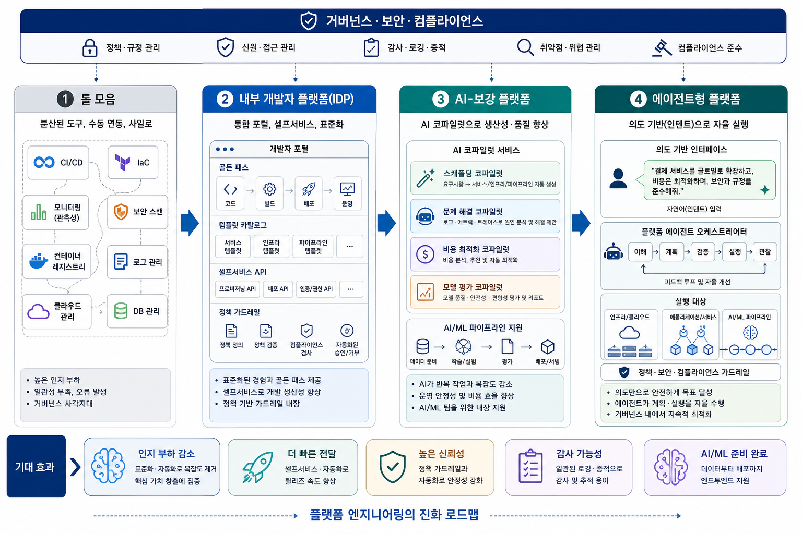

플랫폼 엔지니어링의 미래는 "도구를 더 많이 붙이는 것"이 아니라, 개발자가 복잡함을 직접 다루지 않도록 추상화하는 것에 있다. 툴 모음 → IDP → AI-보강 → 에이전트형, 4단계 진화 로드맵을 정리했다.

{/* truncate */}

## 배경: 왜 지금 플랫폼 엔지니어링인가

현대의 소프트웨어 개발 환경은 클라우드 네이티브 아키텍처의 확산으로 인해 복잡성이 극도로 높아졌다. 개발자들은 비즈니스 로직 구현보다 인프라 설정, 보안 스캔, CI/CD 파이프라인 관리 등 부수적인 작업에 더 많은 시간을 할애하게 되었다.

이러한 **인지 부하(Cognitive Load)** 의 증가는 생산성 저하와 운영 오류로 이어지며, 기업 성장의 발목을 잡는 주요 원인이 되고 있다.

---

## 4단계 진화 모델

파편화된 도구 모음에서 시작해 의도 기반의 자율 실행이 가능한 에이전트형 플랫폼으로 나아가는 4단계 진화 과정이다.

### 1단계 — 툴 모음: 분산과 사일로

CI/CD, IaC, Kubernetes, 보안 스캐너, 관측성 도구가 각각 흩어져 있다. 개발자는 "빠르게 만들기"보다 **"어떤 도구를 어떤 순서로 써야 하지?"** 를 먼저 고민하게 된다.

문제의 본질은 기능 개발보다 인지 부하가 커진다는 점이다. 사일로화된 구조로 인해 거버넌스 사각지대도 발생한다.

### 2단계 — IDP: 내부 개발자 플랫폼

포털, 서비스 카탈로그, 템플릿, 골든 패스, 셀프서비스 API가 하나의 경험으로 묶인다. 개발자는 "서버/클러스터를 어떻게 만들까?"보다 **"새 서비스 하나 시작"** 같은 제품형 UX를 받게 된다.

플랫폼 팀은 운영팀이 아니라 **내부 제품 팀처럼 움직이게 된다.** 표준화된 '골든 패스'를 통해 개발 경험을 일원화하는 것이 핵심이다.

### 3단계 — AI-보강 플랫폼: 코파일럿의 등장

AI가 서비스 스캐폴딩, 장애 원인 탐색, 로그 요약, 비용 최적화, 정책 위반 탐지까지 보조한다. 플랫폼은 문서 저장소가 아니라, **질문하면 실행 가능한 추천을 주는 인터페이스** 로 바뀐다.

개발자는 YAML을 외우기보다 **"이 서비스에 표준 배포 파이프라인 붙여줘"** 같은 요청을 하게 된다.

### 4단계 — 에이전트형 플랫폼: 의도 기반 자율 실행

사용자는 자연어로 의도를 말하고, 플랫폼 에이전트가 배포/권한/테스트/정책/AI 파이프라인까지 조합한다.

> "결제 서비스를 글로벌로 확장하고, 보안 규정을 준수하며 비용을 최적화해줘."

플랫폼 에이전트 오케스트레이터는 이 의도를 분석하여 인프라, 애플리케이션, AI/ML 파이프라인을 가로지르는 실행 계획을 수립하고 자율적으로 수행한다.

단, 완전 자율보다 중요한 것은 **감사 가능성, 승인 흐름, 정책 통제, 롤백 가능성** 이다.

---

## 플랫폼의 동작 원리: 거버넌스 가드레일

플랫폼의 모든 단계 상단에는 **정책 관리, 신원 접근 제어, 취약점 관리** 등 '거버넌스 가드레일'이 배치되어 있다. 개발자가 자유롭게 플랫폼을 사용하되, 조직의 보안 기준을 벗어나지 않도록 강제하는 구조다.

보안, 정책, 컴플라이언스가 사후 점검이 아니라 **사전 내장** 되는 것이 핵심이다.

---

## 실제 활용 시나리오

| 시나리오 | 내용 |
|---------|------|
| **개발 생산성** | 표준화된 템플릿 카탈로그를 통해 인프라와 파이프라인을 단 몇 번의 클릭으로 프로비저닝 |
| **AI/ML 워크플로우** | 데이터 준비부터 학습, 평가, 배포까지 이어지는 엔드투엔드 파이프라인 자동화 |
| **지능형 운영** | 코파일럿이 로그와 트레이스를 분석하여 근본 원인을 진단하고 해결책을 제안 |
| **비용 및 모델 평가** | 클라우드 비용 리포트와 모델의 안전성/편향성 평가를 자동 수행 |

---

## 무엇이 달라지나: 5가지 전환점

### 1. Self-service가 기본값

티켓 기반 요청 → 포털/CLI/API 기반 즉시 실행으로 전환된다.

### 2. Golden path가 표준

"자유롭게 다 하세요"보다 **"가장 안전하고 빠른 기본 경로"** 를 제공하는 방식으로 바뀐다.

### 3. Guardrails가 플랫폼 안으로

보안, 정책, 컴플라이언스가 사후 점검이 아니라 사전 내장된다.

### 4. AI workload까지 플랫폼 범위가 확장

앱 플랫폼 + 데이터/모델/에이전트 운영 플랫폼의 경계가 합쳐진다.

### 5. Platform team의 역할이 제품화

내부 고객은 개발자, 데이터팀, AI팀이다. 성공 지표도 **uptime보다 개발 리드타임, 채택률, 재사용률, 인지 부하 감소** 로 이동한다.

---

## 기대효과

| 가치 | 내용 |
|------|------|
| **인지 부하 감소** | 복잡한 도구 체인을 추상화하여 개발자가 핵심 가치 창출에 집중 |
| **더 빠른 전달(Velocity)** | 셀프서비스와 자동화를 통해 릴리즈 속도 혁신 |
| **높은 신뢰성** | 정책 기반 가드레일 내장으로 휴먼 에러 방지, 시스템 안정성 강화 |
| **감사 가능성(Auditability)** | 모든 변경 사항이 일관된 로깅과 증적 자료로 관리되어 컴플라이언스 준수 용이 |
| **AI/ML 준비 완료** | 데이터부터 배포까지 지원하는 인프라로 최신 AI 기술 도입 장벽 제거 |

---

## 결론: 한 문장으로

플랫폼 엔지니어링의 미래는 "복잡한 기술 스택을 잘 운영하는 능력"보다, **개발자와 AI 에이전트가 안전하게 빠르게 일하도록 "좋은 기본 경로를 제품처럼 제공하는 능력"** 에 달려 있다.
