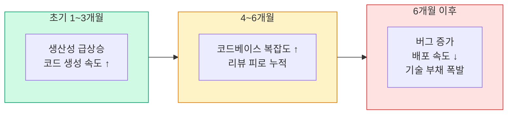

# DORA 2025: AI와 소프트웨어 공학

## DORA란

DORA(DevOps Research and Assessment)는 Google이 후원하는 소프트웨어 개발 성과 연구 프로젝트입니다. 매년 수만 명의 개발자를 대상으로 팀 성과, 소프트웨어 제공 능력, 조직 문화를 측정합니다.

## 2025 핵심 발견

### AI의 역할: 증폭기

DORA 2025 보고서는 AI의 핵심 역할을 명확히 정의합니다.

> "AI는 조직의 기존 강점과 약점을 **증폭**한다."

이것은 단순한 비유가 아닙니다. 데이터로 검증된 패턴입니다.

- **높은 성과 팀 + AI**: 배포 빈도, 변경 실패율, 복구 시간 모두 개선
- **낮은 성과 팀 + AI**: 배포 속도는 빠르지만 장애 빈도, 기술 부채 증가

### 공학 역량이 AI 효과를 결정한다

DORA는 다음 공학 역량들이 AI 도구 활용 효과와 강한 상관관계를 보인다고 보고합니다.

| 공학 역량 | AI 효과와의 상관관계 |
|-----------|---------------------|
| 자동화된 테스트 체계 | 매우 강함 |
| 지속적 통합/배포 (CI/CD) | 강함 |
| 트렁크 기반 개발 | 강함 |
| 코드 리뷰 문화 | 강함 |
| 문서화 습관 | 보통 |

### 경고: 기반 없는 AI 도입

DORA는 공학 기반 없이 AI를 도입한 팀에서 나타나는 패턴을 경고합니다.

1. 초기 2-3개월: 생산성 급상승 (코드 생성 속도)
2. 4-6개월 후: 코드베이스 복잡도 증가, 리뷰 피로
3. 6개월 이후: 버그 증가, 배포 속도 저하, 기술 부채 폭발

## 시사점

**AI 도입 전에 물어야 할 질문:**

1. 우리 팀의 테스트 자동화 수준은?
2. 코드 리뷰 문화가 살아있는가?
3. 아키텍처 가이드라인이 명문화되어 있는가?
4. 신규 입사자가 코드베이스를 이해하는 데 얼마나 걸리는가?

이 질문들에 자신 있게 답할 수 없다면, AI 도입보다 공학 기반 강화가 우선입니다.
