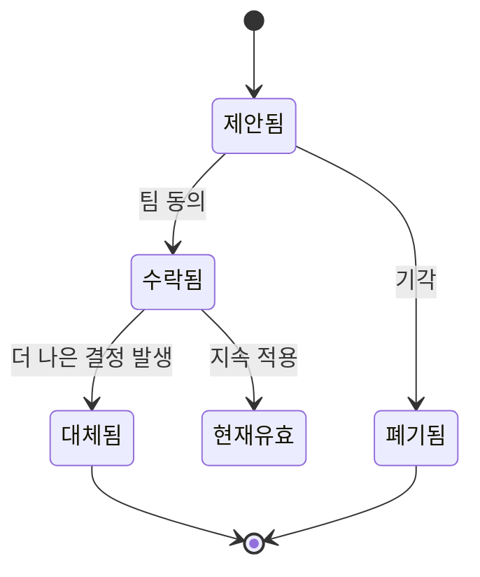

# ADR과 문서화 전략

## ADR이란

ADR(Architecture Decision Record)은 **아키텍처 결정과 그 이유를 기록**하는 경량 문서입니다. AI 시대에 ADR의 가치는 두 배가 되었습니다.

1. **팀 협업**: 기존 결정의 이유를 공유해 중복 논의 방지
2. **AI 컨텍스트**: AI 에이전트가 일관된 방향으로 코드를 생성하는 근거 제공

## ADR 작성 방법

### 파일 위치

```
docs/adr/
├── 0001-use-postgresql.md
├── 0002-adopt-clean-architecture.md
├── 0003-use-event-sourcing-for-orders.md
└── README.md (ADR 목록)
```

### 템플릿

```markdown
# ADR-NNNN: [결정 제목]

날짜: YYYY-MM-DD
상태: 제안됨 | 수락됨 | 폐기됨 | 대체됨 (ADR-XXXX에 의해)

## 맥락

[이 결정이 왜 필요한지, 어떤 문제를 해결하는지]

## 결정

[어떤 결정을 내렸는지, 구체적으로]

## 결과

### 긍정적 결과
- [이 결정으로 얻는 것]

### 부정적 결과
- [감수해야 하는 트레이드오프]

## 대안 검토

| 대안 | 거부 이유 |
|------|---------|
| [대안 1] | [이유] |
```



## 언제 ADR을 써야 하는가

ADR이 필요한 결정들:
- 기술 스택 선택 (DB, 프레임워크, 언어)
- 아키텍처 패턴 채택 (MSA, 이벤트 소싱, CQRS)
- 외부 서비스 연동 방식
- 데이터 모델 주요 변경
- 보안 정책 결정
- 팀 작업 방식 변경 (브랜치 전략, 리뷰 방식)

## 코드 주석의 역할 변화

AI 시대에 코드 주석의 의미가 달라졌습니다.

**줄어들어야 할 주석:**
```python
# 리스트를 반복하면서 각 항목을 처리합니다
for item in items:  # ← 코드가 이미 설명함
```

**늘어나야 할 주석:**
```python
# 성능상의 이유로 캐시를 먼저 확인합니다.
# DB 쿼리 비용이 높아 캐시 히트율이 중요합니다. (ADR-0015 참고)
if cache.has(key):
```

**왜(Why)를 설명하는 주석**이 AI에게도, 사람에게도 더 가치 있습니다.

## 문서 유지보수

좋은 문서도 시간이 지나면 낡습니다. AI 시대에는 **문서 drift** 문제가 더 커집니다.

**실천 방안:**
- 코드 변경과 관련 문서 변경을 함께 PR에 포함
- ADR 상태 주기적 검토 (분기 1회)
- 오래된 CLAUDE.md 규칙 제거 (안 쓰는 규칙은 노이즈)
- 새 팀원 온보딩으로 문서 품질 검증
