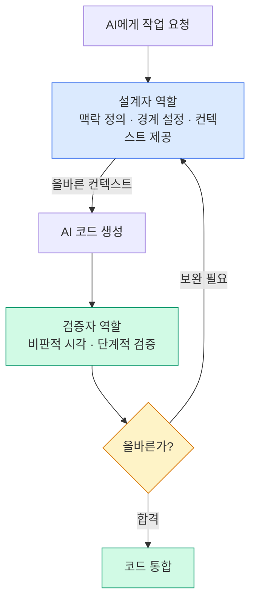

# 설계자와 검증자로서의 개발자

## 설계자: 경계를 그리는 사람

### AI 시대 설계의 핵심

AI는 주어진 맥락 안에서 최선의 코드를 만듭니다. 설계자의 역할은 그 **맥락 자체를 올바르게 정의**하는 것입니다.

**설계자가 결정해야 할 것들:**

1. **무엇을 AI에게 맡길 것인가**
   - 반복적인 CRUD 구현 → AI 적합
   - 도메인 핵심 비즈니스 로직 → 신중한 검토 필요
   - 보안 크리티컬 코드 → 직접 구현 또는 강도 높은 리뷰

2. **어떤 맥락을 AI에게 줄 것인가**
   - 관련 도메인 모델 파일
   - 기존 유사 구현 예시
   - 팀 코딩 관례
   - 품질 요구사항

3. **결과물의 경계를 어디로 설정할 것인가**
   - 이 코드가 어떤 레이어에 속하는가
   - 어떤 인터페이스를 구현해야 하는가
   - 무엇에 의존할 수 있고 없는가

### 추상화 레벨 관리

좋은 설계자는 AI를 **적절한 추상화 레벨**에서 활용합니다.

```
너무 구체적: "이 함수의 이 줄을 고쳐줘"
               → AI의 강점을 활용 못함

적절한 레벨: "이 유스케이스를 이 인터페이스에 맞게 구현해줘"
              → AI의 강점을 잘 활용

너무 추상적: "우리 시스템의 아키텍처를 설계해줘"
              → AI가 컨텍스트 부족으로 낮은 품질 결과
```



## 검증자: 비판적 시각을 유지하는 사람

### Complacency 극복하기

AI가 그럴듯한 코드를 빠르게 내놓을수록, **비판적 시각을 유지하는 것**이 검증자의 핵심 역량입니다.

**검증자의 마인드셋:**

> "이 코드가 맞아 보이는가?" (X)
> "이 코드가 내가 원하는 것을 정확히 하는가?" (O)
> "이 코드가 시스템에 어떤 영향을 주는가?" (O)
> "이 코드에 내가 모르는 엣지 케이스가 있는가?" (O)

### 효과적인 검증 전략

**1. 테스트로 의도 명시**

AI에게 코드를 요청하기 전에 테스트를 먼저 작성합니다. 테스트는 AI에게 주는 **명세(spec)** 입니다.

**2. 단계적 검증**

큰 기능을 한 번에 검증하지 않고, 작은 단위로 나눠 단계적으로 검증합니다.

**3. 다른 AI로 교차 검증**

AI A가 생성한 코드를 AI B에게 "이 코드의 문제점을 찾아줘"라고 요청하는 방식으로 교차 검증합니다.

**4. 경계 조건 집중 검토**

AI는 일반적인 경로는 잘 처리하지만, 경계 조건(null, 빈 배열, 최대값 등)을 놓치는 경우가 많습니다.
