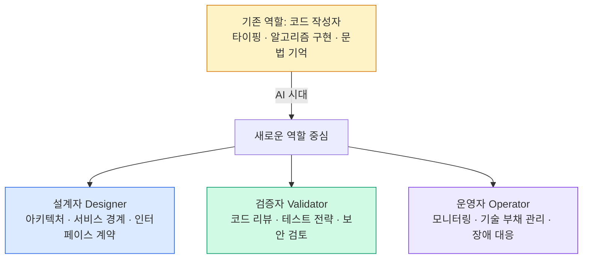

# 개발자의 역할이 "작성자"에서 "설계자·검증자·운영자"로

## 역할 중심의 이동

AI가 코드 작성을 더 많이 맡게 될수록, 개발자는 다음으로 역할 중심이 이동합니다.

| 기존 중심 | AI 시대의 중심 |
|---------|--------------|
| 타이핑 속도 | 문제 정의 |
| 알고리즘 구현 | 품질 기준 설정 |
| 문법 기억 | 경계 설정 |
| 코드 작성 | 리스크 판단 |
| | 결과 검증 |

## 세 가지 새로운 역할

### 설계자 (Designer)

AI가 만든 코드가 통합될 **경계와 구조**를 결정합니다.

- 시스템 아키텍처 설계
- 서비스/모듈 경계 정의
- 인터페이스 계약 설계
- 도메인 모델 설계
- 품질 속성 우선순위 결정

### 검증자 (Validator)

AI 생성 결과물의 **정확성과 적합성**을 판단합니다.

- 코드 리뷰 (비판적 시각 유지)
- 테스트 전략 수립 및 실행
- 보안 취약점 검토
- 아키텍처 준수 여부 확인
- 비즈니스 요구사항 충족 여부 확인

### 운영자 (Operator)

시스템의 **지속 가능한 운영**을 책임집니다.

- 장애 대응 및 근본 원인 분석
- 성능 모니터링 및 최적화
- 기술 부채 관리
- AI 모델 성능 모니터링 (LLMOps)
- 운영 피드백을 설계로 연결

## 타이핑이 줄어들면 무엇이 늘어나는가

AI가 코드를 더 많이 쓸수록, 개발자는 다음에 더 많은 시간을 씁니다.

- 요구사항을 정확히 이해하고 AI에게 전달하는 능력
- AI 결과물을 빠르게 평가하는 판단력
- 여러 AI 접근법 중 최선을 선택하는 트레이드오프 분석
- 시스템 전체 맥락을 유지하는 인지적 역량
