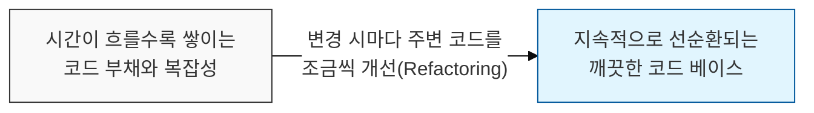
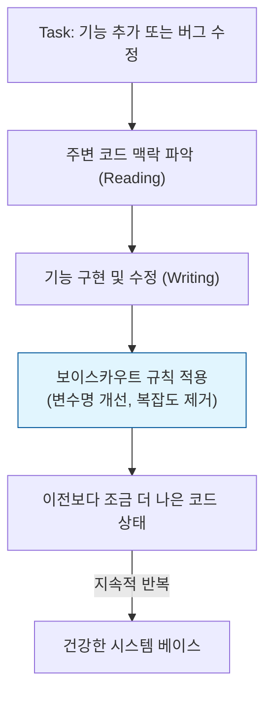

# 발견했을 때보다 더 깨끗하게, 보이스카우트 규칙 (The Boy Scout Rule)

## I. 지속적인 코드 품질 개선의 원칙, 보이스카우트 규칙의 개요

**정의** : "캠프장은 처음 왔을 때보다 더 깨끗하게 해놓고 떠나라"는 보이스카우트의 규율을 소프트웨어 개발에 적용한 것으로, 코드를 수정할 때 주변의 관련 코드를 조금이라도 더 개선하라는 원칙  

**핵심 특징 및 가치** :  
( **점진적 리팩토링** ) 대규모 재개발( **Rewrite** ) 대신, 일상적인 개발 과정에서 작은 개선을 반복하여 시스템의 노후화를 방지  
( **품질의 공동 책임** ) 내가 작성하지 않은 코드라도 발견 즉시 개선함으로써 전체 팀의 코드 소유권과 품질 수준을 상향 평준화  
( **기술 부채 억제** ) 시간이 지남에 따라 엔트로피가 증가하는 소프트웨어의 특성을 거스르고 시스템의 생명력을 연장  
( **클린 코드 실천** ) 명확한 변수명 변경, 중복 코드 제거, 함수 분리 등 작은 실천이 모여 견고한 아키텍처의 기반이 됨  

---

## II. 보이스카우트 규칙의 수행 메커니즘과 보안적 가치

### 가. 품질 개선의 선순환 모델

### 나. 보안 관리 관점에서의 보이스카우트 규칙 적용

| 적용 영역 | 상세 활동 내용 | 보안적 기대 효과 |
|:---:|--------------|--------------|
| **가시성 확보** | 난해한 로직을 명확한 구조로 개선 | 숨겨진 보안 결함( **Logic Flaw** ) 발견 용이 |
| **라이브러리 관리** | 사용되지 않는 의존성( **Dependency** ) 제거 | 공격 표면( **Attack Surface** ) 축소 |
| **에러 핸들링** | 부실한 예외 처리를 표준 방식으로 보완 | 정보 노출 방지 및 시스템 안정성 강화 |
| **설정 최적화** | 하드코딩된 값이나 취약한 설정을 발견 시 수정 | 자격증명 유출 방지 및 보안 설정 준수 |

---

## III. 보이스카우트 규칙 실천 전략 및 고려사항

### 가. 실천을 위한 3단계 접근법

| 단계 | 목표 | 구체적 행동 지침 |
|:---:|------|----------------|
| **1. 관찰** | 개선 포인트 식별 | 읽기 힘든 코드, 중복된 로직, 모호한 명명 규칙 발견 |
| **2. 절제** | 범위 제어 | 현재 작업 중인 도메인을 벗어나지 않는 선에서 최소한의 개선 수행 |
| **3. 검증** | 안정성 보장 | 작은 개선 후 반드시 단위 테스트( **Unit Test** )를 통해 기능 무결성 확인 |

### 나. 실무적 주의사항: 주객전도 방지
- **범위 제한 (Time Boxing)** : 원래 목표였던 기능 개발보다 리팩토링이 길어지지 않도록 주의하며, 큰 변경은 별도의 작업( **Task** )으로 분리
- **변경의 가시성** : 단순 코드 정리와 로직 변경을 가급적 커밋( **Commit** ) 수준에서 분리하여 리뷰어의 혼란 방지
- **테스트 코드 필수** : 테스트 코드가 없는 곳에서 보이스카우트 규칙을 과하게 적용할 경우, 의도치 않은 기능 파손 발생 위험

> **핵심** : **보이스카우트 규칙**은 거창한 혁신이 아니라 **매일의 작은 성실함**을 요구하며, 이러한 습관이 모여 보안 위협에 강하고 유지보수가 용이한 최고의 시스템을 만듦
