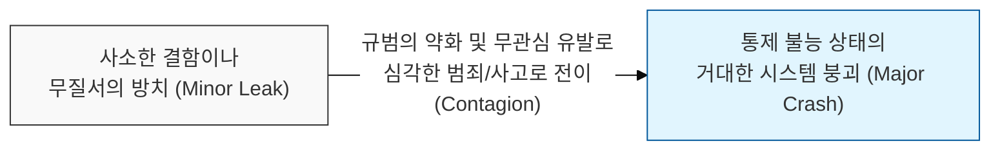
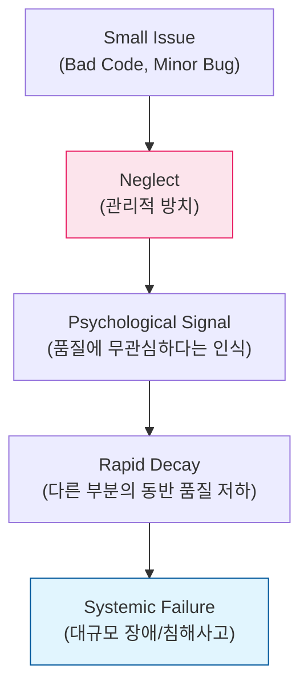

# 사소한 방치가 큰 사고를 만든다, 깨진 유리창 이론 (Broken Windows Theory)

## I. 질서의 붕괴와 잠재적 위협의 상관관계, 깨진 유리창 이론의 개요

**정의** : 건물의 깨진 유리창 하나를 수리하지 않고 방치하면, 그 지점을 중심으로 범죄와 무질서가 확산되어 결국 마을 전체가 슬럼화된다는 이론  

**핵심 특징 및 시사점** :  
( **연쇄 반응의 공포** ) 작은 실수나 규칙 위반이 "누구도 신경 쓰지 않는다"는 신호로 작용하여 더 큰 부정행위를 정당화함  
( **환경의 중요성** ) 시스템의 품질과 보안은 개별 요소의 완벽함보다, 전체적인 질서( **Discipline** )를 유지하는 환경 조성에서 시작됨  
( **조기 조치의 중요성** ) 작은 결함이 발견된 즉시 조치함으로써 문제의 확산을 차단하고 관리자의 통제력을 대내외에 과시  
( **소프트웨어 공학의 적용** ) 지저분한 코드, 경고 메시지 무시, 부실한 문서화 등을 방치할 경우 전체 프로젝트 품질이 급격히 저하됨  

---

## II. 깨진 유리창 이론의 소프트웨어 및 보안적 매커니즘

### 가. 기술 부채와 무질서의 확산 모델

### 나. 보안 관리 관점에서의 '깨진 유리창' 사례

| 보안 분야 | 사소한 유리창 (Broken Window) | 초래될 수 있는 큰 위협 |
|:---:|----------------------------|----------------------|
| **코드 보안** | 테스트를 위한 임시 계정 방치 | 해당 계정을 통한 외부 침투 및 권한 상승 |
| **운영 보안** | 장비의 사소한 에러 로그 무시 | 공격자의 침투 흔적( **IoC** ) 은폐 및 탐지 실패 |
| **권한 관리** | 퇴사자/이동자의 권한 삭제 지연 | 내부 정보 유출 및 **Shadow IT** 발생 |
| **물리 보안** | 잠기지 않은 서버실 뒷문 방치 | 비인가자의 물리적 접근 및 데이터 탈취 |

---

## III. 깨진 유리창 이론 극복을 위한 보안 거버넌스 전략

### 가. 무관용(Zero Tolerance) 원칙과 적용 가이드

| 전략 항목 | 상세 내용 | 보안 및 품질 효과 |
|:---:|----------|------------------|
| **즉각 조치** | 결함 발견 시 '나중에'가 아닌 '즉시' 조치 수행 | 문제의 확산 및 심리적 해이 차단 |
| **자동화 검증** | 린트( **Lint** ), 정적 분석( **SAST** ) 등을 통한 자동 검사 | 인간의 주관적 판단 배제 및 일관된 질서 유지 |
| **가시성 공유** | 현재 시스템의 '깨진 유리창' 개수를 대시보드로 공개 | 전 조직원의 경각심 고취 및 책임감 강화 |
| **포스트모텀** | 작은 사고라도 원인을 철저히 분석하고 기록 | 유사 사례 재발 방지 및 보안 성숙도 향상 |

### 나. 실무적 제언: 보안 문화의 형성
- **작은 것부터 시작** : 복잡한 아키텍처 개선보다 하드코딩된 암호 제거, 부실한 주석 정리 등 작은 질서를 바로잡는 것에서 보안 강화 시작
- **리더의 솔선수범** : 관리자가 사소한 보안 규정을 준수하지 않을 때 구성원들은 보안 체계 전체를 불신하게 됨을 명심
- **보상과 교육 병행** : '깨진 유리창'을 찾아내고 수리한 구성원에게 긍정적 피드백을 제공하여 능동적 참여 유도

> **핵심** : **깨진 유리창 이론**은 보안이 "거대한 성벽"이 아니라 "매일 닦고 조이는 사소한 정성"의 합임을 가르치며, **무관심**이야말로 가장 무서운 취약점임을 상기시킴
