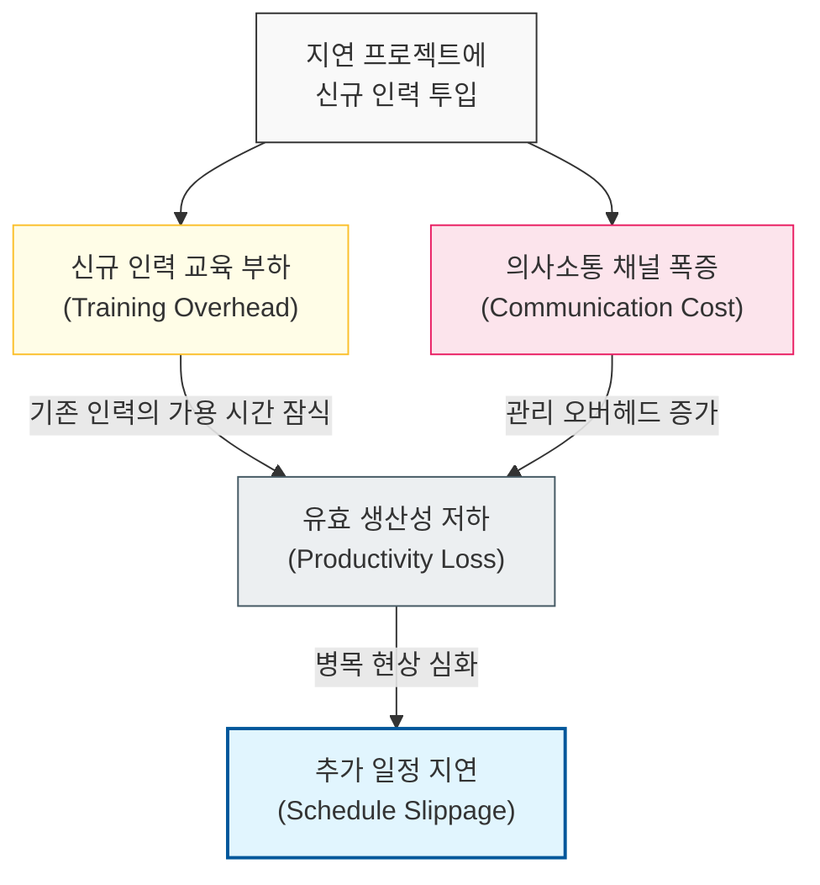

# 지연되는 프로젝트에 인력 투입은 지연을 가속한다, Brooks의 법칙

## I. 인력 투입의 역설, **Brooks**의 법칙 개요

**정의**: 지연되는 소프트웨어 프로젝트에 인력을 추가로 투입하는 것은 오히려 프로젝트를 더 지연시킨다는 소프트웨어 공학의 원칙  

**특징**:  
( **의사소통 오버헤드** ) 인력 증가 시 팀원 간 소통 채널이 기하급수적으로 늘어나 관리에 부하가 발생함  
( **교육 훈련 부하** ) 신규 인력이 업무를 파악하기 위해 기존 인력의 가용 시간을 소모하게 됨  
( **업무 분할의 한계** ) 소프트웨어 개발 업무는 모든 파트를 독립적으로 분할하여 병렬 처리하기 어려움  

## II. **Brooks**의 법칙의 메커니즘과 형상화

### 가. 인력 투입에 따른 지연 가속 구조 모델

### 나. **Brooks**의 법칙이 발생하는 주요 원인
| **구분** | **주요 내용** | **영향성** |
| :--- | :--- | :--- |
| **소통 비용** | `n(n-1)/2` 공식에 따른 의사소통 경로 증가 | 정보 공유 지연 및 불일치 발생 |
| **교육 부하** | 기존 인력이 멘토링을 위해 개발 업무 중단 | 일시적 전체 생산성 저하 불가피 |
| **동기화 지연** | 모듈 간 인터페이스 맞춤 및 통합 비용 상승 | 통합 테스트 단계의 병목 현상 |

## III. **Brooks**의 법칙 극복을 위한 전략

### 가. 기술적/조직적 대응 방안
| **전략** | **상세 내용** | **기대 효과** |
| :--- | :--- | :--- |
| **모듈화 강화** | 인터페이스 중심의 독립적 모듈 설계 | 팀 간 의사소통 필요성 최소화 |
| **자동화 도구** | CI/CD 및 자동화된 테스트 환경 구축 | 수동 커뮤니케이션 및 통합 부하 절감 |
| **작은 팀 구성** | "피자 두 판" 팀(Two-Pizza Teams) 원칙 준수 | 소통 오버헤드 억제 및 기동성 확보 |

### 나. 프로젝트 관리 시 시사점
- **Proactive Planning**: 지연 발생 후 인력을 투입하기보다 초기 설계 단계에서 현실적인 일정을 산정해야 함
- **Brooks's Law Exception**: 완전히 분할 가능하고 소통이 필요 없는 단순 작업의 경우 법칙의 영향이 미미할 수 있음
