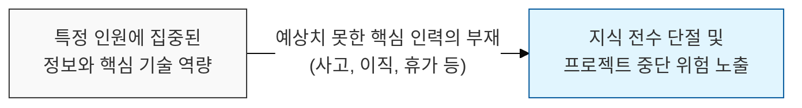
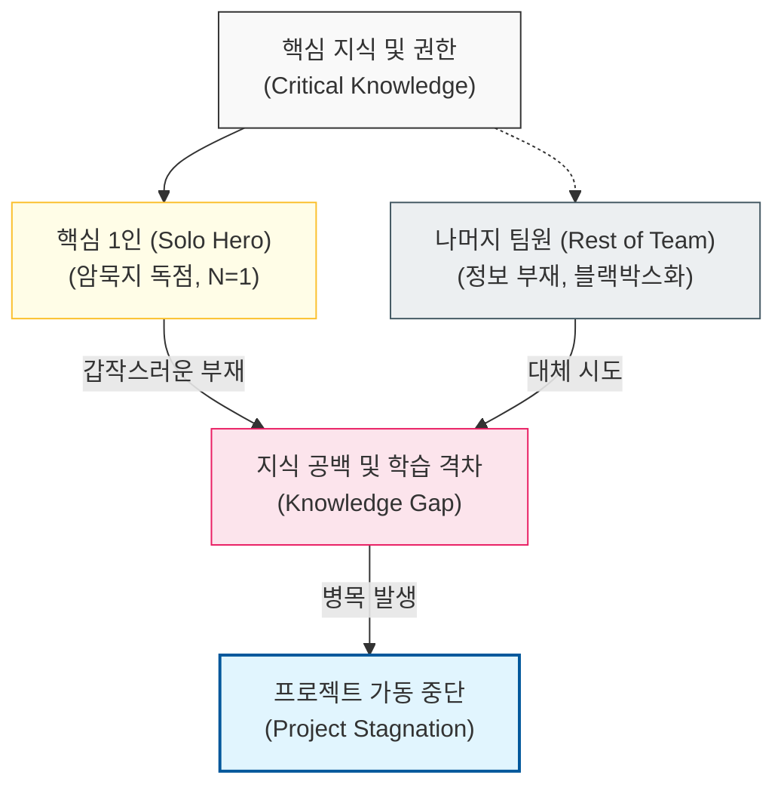

# 지식 독점이 초래하는 프로젝트의 가동 중단 위험, Bus Factor

## I. 프로젝트의 인적 의존도 지표, **Bus Factor** 개요

**정의**: 프로젝트의 핵심 지식을 가진 특정 인원들이 갑자기 사라졌을 때(예: 버스에 치이는 사고 등), 해당 프로젝트가 중단되거나 심각한 타격을 입게 되는 최소 인원수  

**특징**:  
( **리스크 지표** ) **Bus Factor**가 낮을수록(최저 **1**) 소수의 인원에 대한 의존도가 높으며 프로젝트 리스크가 큼  
( **지식의 독점** ) 문서화되지 않은 암묵지나 복잡한 로직의 소유권이 공유되지 않을 때 발생함  
( **관리 효율의 역설** ) 단기적으로는 한 명의 전문가가 전담하는 것이 빠르나, 장기적으로는 조직의 생존성을 위협함  

## II. **Bus Factor**의 메커니즘과 형상화

### 가. 지식 의존성 및 리스크 전이 구조 모델

### 나. **Bus Factor** 수준별 조직의 안정성 비교
| **Bus Factor** | **안정성 상태** | **주요 현상** |
| :--- | :--- | :--- |
| **1** | **매우 위험** | 한 명의 부재가 프로젝트 실패로 직결됨 (지식 독점) |
| **2 ~ 3** | **주의 요망** | 특정 모듈이나 도메인에 대해 백업 인력이 부족함 |
| **N / 2 이상** | **비교적 안전** | 구성원의 절반 이상이 핵심 지식을 공유하고 있음 |

## III. 소프트웨어 팀의 **Bus Factor** 증대 전략 (리스크 완화)

### 가. 지식 공유 및 협업 체계 고도화
| **전략** | **상세 내용** | **기대 효과** |
| :--- | :--- | :--- |
| **Pair Programming** | 두 명의 개발자가 하나의 코드를 함께 작성 | 실시간 지식 전수 및 코드 품질 교차 검증 |
| **Code Review** | 모든 변경 사항을 다른 팀원이 검토하고 승인 | 코드 소유권의 분산 및 설계 의도 공유 |
| **Living Docs** | 최신 코드를 반영하는 지속적인 문서화(ADR 등) | 인적 의존도를 낮추는 시스템적 기반 마련 |

### 나. 프로젝트 관리 시 시사점
- **Intentional Redundancy**: 지식의 중복(Redundancy)은 비용이 아니라 프로젝트 지속 가능성을 위한 필수 투자임
- **Silo Breaking**: 특정인만 아는 '블랙박스' 코드가 생기지 않도록 순환 보직이나 업무 할당 시 도메인 교차를 유도해야 함
