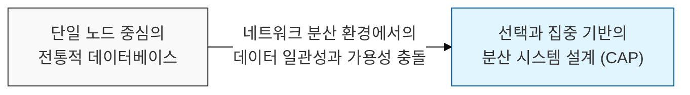
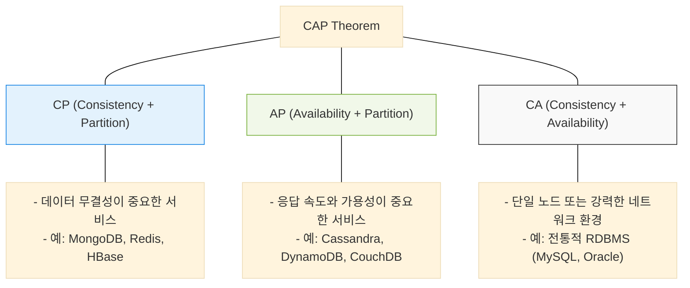

# 분산 시스템의 근본적 제약, CAP 정리 (CAP Theorem)

## I. 분산 데이터베이스의 세 가지 트레이드 오프, CAP 정리의 개요

**정의** : 분산 시스템 환경에서 일관성( **Consistency** ), 가용성( **Availability** ), 단절 내성( **Partition Tolerance** )의 세 가지 속성을 동시에 모두 만족시킬 수 없으며, 최대 두 가지만 선택 가능하다는 이론  

**핵심 특징 및 시사점** :  
( **분산 환경의 숙명** ) 네트워크 장애로 인한 단절( **P** )은 피할 수 없는 현실이므로, 실제 선택은 **CP** (일관성 중시) 또는 **AP** (가용성 중시) 사이의 결정이 됨  
( **설계 가이드라인** ) 서비스의 비즈니스 특성(금융 서비스는 **C** 중시, 소셜 미디어는 **A** 중시)에 맞는 데이터베이스 선정을 위한 핵심 근거 제공  
( **브루어의 정리** ) 에릭 브루어( **Eric Brewer** )에 의해 제안되었으며, 이후 **NoSQL** 데이터베이스의 폭발적 성장을 이끄는 이론적 토대가 됨  
( **확장된 논의** ) **CAP**의 한계를 보완하기 위해 장애가 없는 평상시의 지연 시간( **Latency** )까지 고려한 **PACELC** 이론으로 발전함  

---

## II. CAP의 세 가지 구성 요소 및 조합별 특징

### 가. CAP의 핵심 3요소 정의

| 요 소 | 상세 설명 | 핵심 가치 |
|:---:|----------|----------|
| **Consistency** (일관성) | 모든 노드가 동일한 시간에 동일한 데이터를 보여주어야 함 | 데이터의 정확성과 최신성 |
| **Availability** (가용성) | 일부 노드에 장애가 발생해도 모든 요청에 응답해야 함 | 서비스의 중단 없는 제공 |
| **Partition Tolerance** (단절 내성) | 노드 간 네트워크 단절이 발생해도 시스템이 유지되어야 함 | 네트워크 장애에 대한 회복력 |

### 나. 조합별 시스템 유형 및 사례

---

## III. CAP 정리의 실무적 적용 및 보안 고려사항

### 가. 비즈니스 도메인별 데이터 아키텍처 선택 전략

| 도메인 | 우선순위 | 선택 유형 | 기술적 대응 |
|:---:|:---:|:---:|------------|
| **금융 / 결제** | 데이터 정확성 | **CP** | 분산 트랜잭션, 쿼럼( **Quorum** ) 합의 알고리즘 적용 |
| **SNS / 쇼핑몰** | 서비스 접속 보장 | **AP** | 최종 일관성( **Eventual Consistency** ), 충돌 해결 로직 구현 |
| **단일 관리 시스템** | 관리 편의성 | **CA** | 복제( **Replication** ) 지연 최소화, 고가용성( **HA** ) 구성 |

### 나. 분산 시스템 보안 및 안정성 강화 제언
- **네트워크 가용성 확보** : 단절 내성( **P** )이 발생하더라도 시스템이 안전하게 동작할 수 있도록 다중화된 네트워크 경로 및 자동 장애 조치( **Failover** ) 체계 구축
- **최종 일관성 보안** : **AP** 시스템에서 발생하는 데이터 불일치 기간 동안 잘못된 정보 기반의 부정 거래가 발생하지 않도록 비즈니스 로직 차원의 검증( **Compensating Transaction** ) 필요
- **합의 프로토콜 보호** : **Paxos**, **Raft** 등 노드 간 상태 동기화를 위한 합의 프로토콜 통신에 대해 상호 인증 및 암호화를 적용하여 위변조 방지

> **핵심** : **CAP 정리**는 완벽한 분산 시스템은 존재할 수 없음을 인정하고, 서비스의 목적에 가장 부합하는 **최적의 트레이드 오프** 지점을 찾는 공학적 지혜를 제공함
