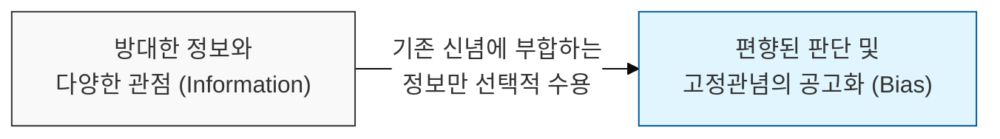
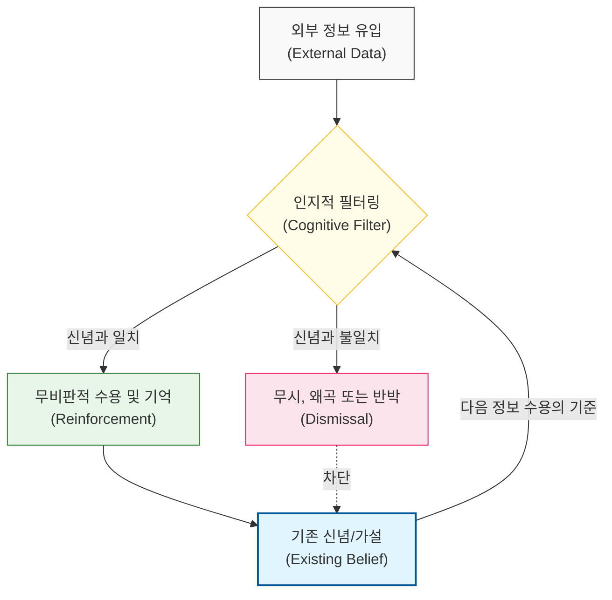

# 보고 싶은 것만 보는 인지적 필터, 확증 편향

## I. 신념의 자기 강화 메커니즘, **확증 편향** 개요

**정의**: 자신의 가설이나 신념을 확인해 주는 정보는 비판 없이 수용하고, 이와 반대되는 정보는 무시하거나 왜곡하여 해석하려는 인지적 편향  

**특징**:  
( **선택적 지각** ) 복잡한 데이터 속에서 자신이 믿고 싶은 증거만을 골라내어 객관적 판단력을 흐림  
( **신념 강화** ) 새로운 정보를 접할수록 기존의 생각이 틀렸음을 인정하기보다 오히려 자신의 신념을 더 확신하게 됨  
( **객관성 상실** ) 논리적 추론보다 감정적 선호가 앞서며, 반대 증거를 '예외'나 '오류'로 치부함  

## II. 확증 편향의 작동 메커니즘과 심리적 구조 모델

### 가. 정보 필터링 및 인지 강화 구조 모델

### 나. 소프트웨어 개발 및 협업에서의 확증 편향 사례
| **상황 구분** | **편향된 행동** | **결과적 부작용** |
| :--- | :--- | :--- |
| **버그 원인 분석** | 자신이 의심하는 특정 모듈만 반복 확인 | 실제 원인이 있는 다른 모듈을 간과하여 지연 |
| **기술 스택 선정** | 선호하는 기술의 장점만 부각하고 단점 무시 | 프로젝트 성격에 맞지 않는 부적절한 도구 도입 |
| **요구사항 정의** | 기획 의도를 자신의 경험에 맞춰 자의적 해석 | 사용자 니즈와 동떨어진 기능 구현 |
| **코드 리뷰** | 평소 신뢰하는 동료의 코드는 검토 없이 승인 | 잠재적인 결함이나 품질 저하 방치 |

## III. **확증 편향** 극복을 위한 비판적 사고 전략

### 가. 조직적 의사결정 보완 전략
| **전략** | **상세 내용** | **기대 효과** |
| :--- | :--- | :--- |
| **Devil's Advocate** | 의도적으로 반대 의견을 내는 역할을 지정 | 집단 사고 방지 및 가설의 허점 식별 |
| **Falsifiability Focus** | "왜 틀렸는가?"를 증명하기 위한 테스트 수행 | 가설의 과학적 타당성 검증 |
| **Data-Driven Review** | 주관적 의견을 배제하고 정량적 지표 기반 회고 | 인지적 필터링을 걷어내고 실체 파악 |

### 나. 개발 시 시사점
- **Test-Driven Thinking**: 성공 케이스뿐만 아니라 반드시 실패해야 하는 케이스(**Negative Test**)를 먼저 설계함으로써 확증 편향의 늪에서 벗어날 수 있음
- **Open-Minded Culture**: 동료의 반대 의견을 개인에 대한 공격이 아닌 시스템 개선을 위한 선물로 받아들이는 문화가 필수적임 (**Hanlon의 면도날** 연계)
- **Beware of Echo Chambers**: 비슷한 생각을 가진 사람들끼리만 협업할 경우 편향이 극대화되므로, 다기능 팀(**Cross-functional Team**) 구성을 통해 시야를 넓혀야 함
