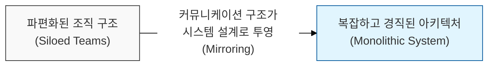
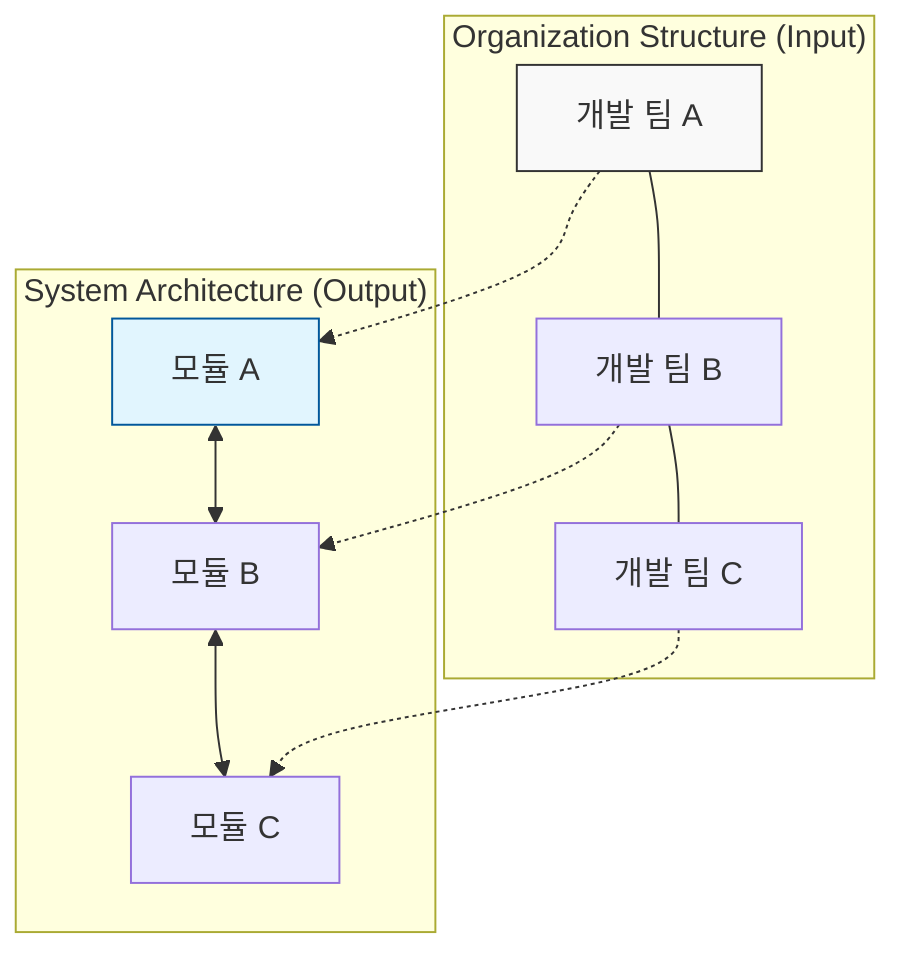

# 조직 구조가 시스템 아키텍처를 결정한다, 콘웨이의 법칙 (Conway's Law)

## I. 조직의 커뮤니케이션 구조와 시스템 설계의 상관관계, 콘웨이의 법칙 개요

**정의** : "시스템을 설계하는 조직은 그 조직의 커뮤니케이션 구조를 복제한 설계를 만들 수밖에 없다"는 원칙으로, 1967년 멜빈 콘웨이( **Melvin Conway** )가 제안한 소프트웨어 공학의 핵심 법칙  

**핵심 특징 및 시사점** :  
( **상호 작용의 투영** ) 팀 간의 의사소통 경로가 소프트웨어 모듈 간의 인터페이스와 결합도를 결정하게 됨  
( **구조적 제약** ) 조직이 기술적으로는 분산 시스템을 원하더라도, 조직 구조가 중앙 집중형이라면 결국 거대한 단일 시스템( **Monolith** )이 생성됨  
( **비용 및 효율성** ) 조직 구조와 맞지 않는 아키텍처를 강제할 경우, 막대한 커뮤니케이션 비용과 마찰이 발생하여 프로젝트 실패 확률 증가  
( **전략적 도구** ) 아키텍처 개선을 위해 조직 구조를 먼저 변경하는 '역 콘웨이 전략'의 근거로 활용됨  

---

## II. 콘웨이의 법칙의 작동 메커니즘과 역 콘웨이 전략

### 가. 조직 구조와 시스템 아키텍처의 일치(Alignment)

### 나. 역 콘웨이 전략 (Reverse Conway Maneuver)

| 단계 | 활동 내용 | 기대 효과 |
|:---:|----------|----------|
| **1. 목표 아키텍처 설정** | 달성하고자 하는 시스템 구조(예: **MSA** )를 먼저 설계 | 기술적 지향점 명확화 |
| **2. 조직 구조 재편** | 아키텍처의 경계( **Bounded Context** )에 맞춰 팀을 재구성 | 커뮤니케이션 경로 최적화 |
| **3. 자율 권한 부여** | 팀별로 독립적인 의사결정 및 배포 권한 부여 ( **DevSecOps** ) | 아키텍처의 유연성 확보 |
| **4. 시스템 구현** | 재편된 조직의 구조에 따라 자연스럽게 시스템 개발 진행 | 조직과 시스템의 선순환 구조 형성 |

---

## III. 콘웨이의 법칙과 현대적 개발 패러다임의 연계

### 가. 모놀리식(Monolithic) vs 마이크로서비스(MSA) 관점의 비교

| 비교 항목 | 모놀리식 (Monolithic) | 마이크로서비스 (MSA) |
|:---:|----------------------|----------------------|
| **조직 구조** | 중앙 집중형 대규모 팀 (계층 구조) | 소규모 자율 팀 ( **Two-Pizza Teams** ) |
| **커뮤니케이션** | 전사적인 동기화 및 잦은 회의 필요 | 팀 내부 협업 중심, 팀 간 최소 접점( **API** ) |
| **변경 영향도** | 전체 시스템 재배포 및 테스트 필요 | 해당 서비스만 독립적으로 배포 및 확장 |
| **보안 모델** | 경계 기반의 거대한 성벽 모델 | 서비스 간 상호 인증 기반 제로 트러스트 |

### 나. DevSecOps와 콘웨이의 법칙 활용 전략
- **교차 기능 팀 (Cross-functional Team)** : 개발, 운영, 보안 인력을 하나의 팀으로 묶어 커뮤니케이션 지연을 제거하고 보안 활동을 개발 파이프라인에 내재화
- **느슨한 결합 (Loose Coupling)** : 조직 간의 의존성을 최소화하여 시스템 간의 복잡한 얽힘을 방지하고 보안 사고 발생 시 영향 범위( **Blast Radius** )를 축소
- **API 중심의 소통** : 팀 간의 의사소통을 명확한 기술 문서( **Contract** )와 **API**로 대체하여 인적 오류를 줄이고 보안 검증 자동화 기반 마련

> **핵심** : 최고의 아키텍처는 최신 기술의 도입보다 **조직의 커뮤니케이션 구조**를 아키텍처의 지향점에 맞게 최적화하는 것에서 시작됨을 명심해야 함
