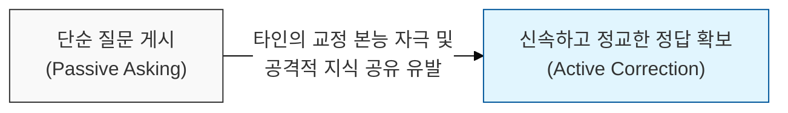
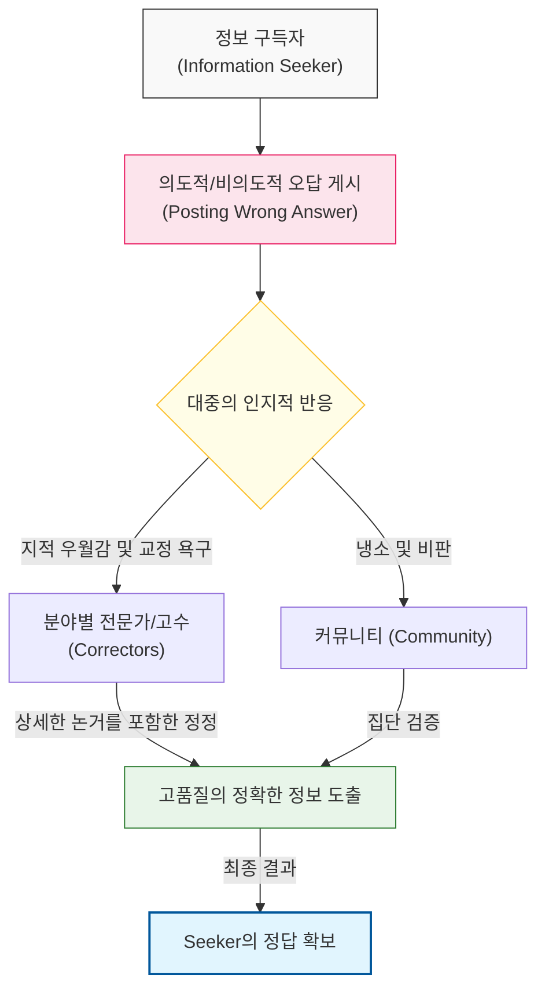

# 정답을 얻으려면 오답을 게시하라, Cunningham의 법칙

## I. 정보 인출의 역설적 경로, **Cunningham**의 법칙 개요

**정의**: "인터넷에서 올바른 답을 얻는 가장 좋은 방법은 질문을 하는 것이 아니라, 틀린 답을 올리는 것이다"라는 인터넷 문화의 행동 지침이자 심리적 법칙  

**특징**:  
( **교정 본능 활용** ) 사람들은 질문에 답하는 것보다 타인의 오류를 바로잡는 데 훨씬 더 강력한 지적 동기를 느낌  
( **정보의 정교화** ) 오답을 비판하는 과정에서 전문가들은 단순 답변보다 훨씬 상세하고 깊이 있는 지식을 쏟아내는 경향이 있음  
( **집단 지성 가속** ) 커뮤니티의 소극적인 태도를 적극적인 개입으로 전환시켜 문제 해결의 속도를 획기적으로 높임  

## II. Cunningham의 법칙의 작동 메커니즘과 형상화

### 가. 타인의 인지적 개입 유도 및 정보 획득 모델

### 나. 질문하기 vs 오답 게시하기 비교
| **비교 항목** | **전통적 질문 (Asking)** | **Cunningham의 법칙 (Wrong Answer)** |
| :--- | :--- | :--- |
| **참여 동기** | 순수한 도움/이타심 의존 | 교정 본능 및 지적 과시욕 자극 |
| **정보의 깊이** | 질문의 수준에 맞춘 단편적 정보 | 오답을 반박하기 위한 심층적 논거 포함 |
| **반응 속도** | 상대적으로 느림 (관심 부족) | 매우 빠름 (즉각적인 반발심 유발) |
| **리스크** | 무응답 리스크 | 비난 및 평판 저하 리스크 (가명성 필요) |

## III. 소프트웨어 생태계에서의 **Cunningham**의 법칙 적용 전략

### 가. 오픈소스 및 기술 커뮤니티 활용 방안
| **적용 영역** | **상세 내용** | **기대 효과** |
| :--- | :--- | :--- |
| **Stack Overflow** | "이 방법이 최선입니다"라고 효율 낮은 코드 게시 | 고수들의 리팩토링 및 성능 최적화 코드 유도 |
| **Open Source** | 불완전하지만 작동하는 **Draft PR** 제출 | 메인테이너들의 구체적인 설계 가이드라인 확보 |
| **Tech Design** | 회의 시 "이렇게 설계하면 완벽하죠?"라고 도발 | 팀원들의 숨겨진 엣지 케이스 및 반대 논거 도출 |

### 나. 실무적 적용 시사점
- **Ethical Boundary**: 의도적인 기만보다는 "내가 알기로는 이렇다"는 식의 자신감 있는 가설 제시 형식을 취하여 커뮤니티의 피로도를 낮춰야 함
- **Rubber Ducking Extension**: 혼자서 고민할 때보다 타인에게 '설명'하거나 '주장'할 때 자신의 논리적 허점이 더 명확히 드러남
- **Psychological Safety**: 팀 내에서 커닝햄의 법칙이 작동하려면, 틀린 의견을 내더라도 비난받지 않는 **심리적 안전감**이 선행되어야 함 (**Hanlon의 면도날** 연계)
