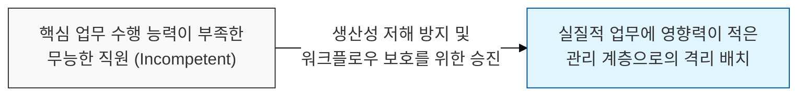
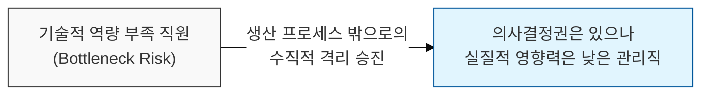

# 무능한 직원이 관리자로 승진하는 기업의 역설, Dilbert 원칙

## I. 생산성 보호를 위한 무능력자의 격리, **Dilbert** 원칙 개요

**정의**: 기업이 생산성을 유지하기 위해 가장 무능한 직원을 시스템에 해를 끼치지 않는 관리직으로 우선 승진시킨다는 풍자적 법칙  

**특징**:  
( **역설적 승진** ) 유능한 사람은 실무에 남겨두고, 무능한 사람을 실무에서 배제하기 위해 관리자로 보냄  
( **생산성 보호** ) 핵심 엔지니어링 및 생산 라인이 무능한 이들에 의해 방해받지 않도록 격리하는 기제로 작용함  
( **피터 원칙과의 차이** ) 승진 '결과'로 무능해지는 피터 원칙과 달리, 처음부터 '무능해서' 승진시킨다는 점이 다름  

## II. **Dilbert** 원칙의 메커니즘과 형상화

### 가. 무능력자의 관리직 배치 및 생산성 유지 메커니즘

### 나. **Dilbert** 원칙 vs **Peter** 원칙 비교 분석
| **비교 항목** | **Dilbert** 원칙 | **Peter** 원칙 |
| :--- | :--- | :--- |
| **승진의 이유** | 무능해서 (실무에서 빼기 위해) | 유능해서 (성과에 대한 보상으로) |
| **무능의 시점** | 승진 전부터 이미 무능함 | 승진 후 새로운 직무에서 무능해짐 |
| **조직적 의도** | 실무 생산성 보호 및 격리 | 성과 보상 및 계층 이동 |
| **발생 배경** | 고도의 전문성이 필요한 현대 기업 | 전통적인 관료제 계층 구조 |

## III. 소프트웨어 조직에서의 **Dilbert** 원칙의 시사점과 대응

### 가. 조직 건강성 진단 및 대응 전략
| **전략** | **상세 내용** | **기대 효과** |
| :--- | :--- | :--- |
| **역량 기반 선발** | 관리자 임명 시 '배제'가 아닌 '관리 역량'을 기준으로 선발 | 무능한 관리자에 의한 의사결정 리스크 제거 |
| **실무자 권위 강화** | 실무 전문가(IC)가 관리자보다 높은 영향력을 갖는 문화 | 유능한 인재의 실무 유지 동기 부여 |
| **Flat Organization** | 불필요한 관리 계층을 축소하고 수평적 소통 강화 | 무능력자가 숨어들 수 있는 관료적 틈새 제거 |

### 나. 프로젝트 관리 시 시사점
- **Impact Awareness**: 관리자의 결정이 실무 생산성을 저해하고 있다면, 해당 조직이 딜버트 원칙의 함정에 빠져 있는지 점검해야 함
- **Technological Leadership**: 기술 중심 조직에서는 관리자 또한 일정 수준 이상의 기술적 문해력을 갖추어야 조직 전체의 신뢰가 유지됨
