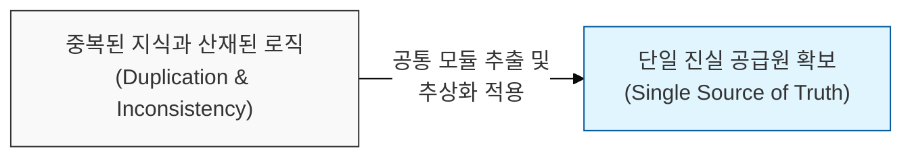
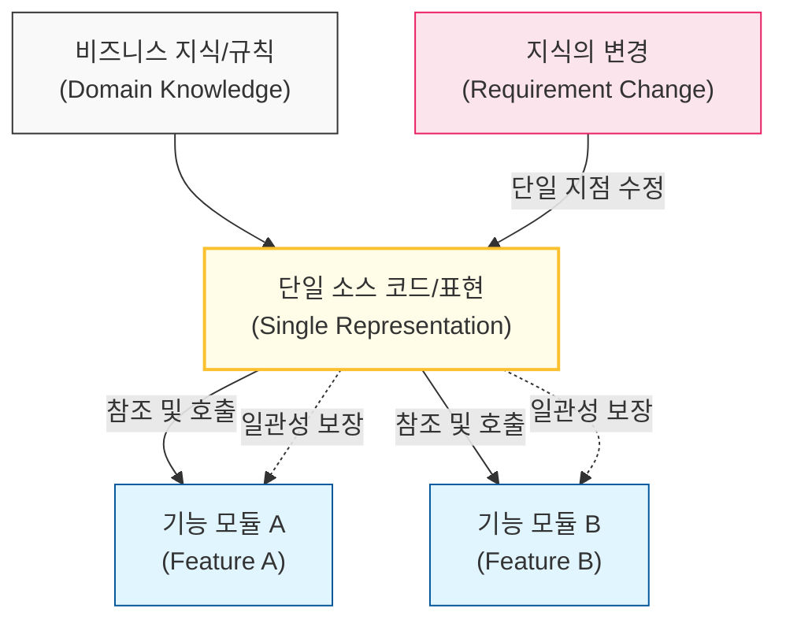

# 모든 지식은 시스템 내에서 단일한 표현을 가져야 한다, DRY 원칙

## I. 중복 제거를 통한 유지보수 혁신, **DRY** 원칙 개요

**정의**: "모든 지식의 파편은 시스템 내에서 단일하고, 명확하며, 신뢰할 수 있는 표현을 가져야 한다"는 소프트웨어 개발의 핵심 원칙  

**특징**:  
( **유지보수성 향상** ) 비즈니스 로직 변경 시 단 한 곳만 수정하면 되므로 수정 누락에 따른 버그를 방지함  
( **데이터 정관성** ) 동일한 지식이 여러 곳에 존재함에 따라 발생하는 데이터 불일치 리스크를 근본적으로 제거함  
( **추상화 가속** ) 중복을 식별하고 제거하는 과정에서 코드의 본질적인 구조를 파악하고 더 높은 수준의 추상화가 가능해짐  

## II. **DRY** 원칙의 메커니즘과 형상화

### 가. 지식의 파편화 방지 및 단일 표현 구조 모델

### 나. **DRY** 원칙 적용 대상과 범위
| **구분** | **주요 대상** | **적용 방법** |
| :--- | :--- | :--- |
| **코드 (Code)** | 중복된 알고리즘, 유틸리티 로직 | 함수 추출, 공통 라이브러리화 |
| **데이터 (Data)** | 데이터베이스 스키마, 설정값 | 정규화(**Normalization**), 중앙 집중식 환경 설정 |
| **문서 (Docs)** | 소스 코드와 분리된 별도의 명세서 | 주석 기반 문서 생성(예: **Swagger**, **JSDoc**) |
| **프로세스** | 수동 배포, 반복적인 테스트 작업 | **CI/CD** 자동화 파이프라인 구축 |

## III. **DRY** 원칙의 오용 경계: 성급한 추상화 방지 전략

### 가. **DRY** vs **WET** (Write Everything Twice) 비교
| **비교 항목** | **DRY** (Don't Repeat Yourself) | **AHA** (Avoid Hasty Abstraction) |
| :--- | :--- | :--- |
| **핵심 가치** | 중복 최소화 및 결합도 허용 | 유연성 확보 및 성급한 결합 방지 |
| **적용 시점** | 중복이 확실히 식별된 경우 | 미래 예측이 불확실한 초기 단계 |
| **위험 요소** | 잘못된 추상화로 인한 강한 결합 | 코드 비대화 및 유지보수 파편화 |
| **권장 전략** | **3**번 이상 반복될 때 추출 (**Rule of Three**) | 도메인이 다르면 중복을 허용 (**Decoupling**) |

### 나. 개발 시 시사점
- **Knowledge vs Code**: **DRY**는 단순히 코드의 텍스트 중복을 줄이는 것이 아니라, **지식(Knowledge)**의 중복을 줄이는 것임. 같은 코드라도 도메인적 의미가 다르면 별도로 유지해야 함
- **Balance is Key**: 과도한 **DRY**는 가독성을 해치고 시스템을 복잡하게 만들 수 있으므로, '가독성'과 '중복 제거' 사이의 균형이 필수적임
