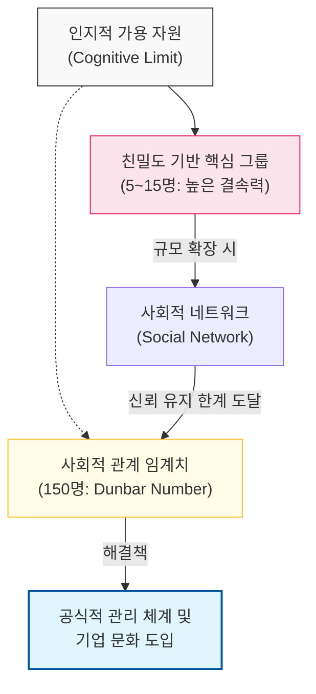

# 안정적인 관계 유지를 위한 인지적 한계, Dunbar의 수

## I. 조직 규모의 인지적 임계치, **Dunbar**의 수 개요

**정의**: 개인이 각 구성원과 사회적 관계를 맺고 안정적으로 유지할 수 있는 인지적 한계치(약 **150**명)를 의미하는 인류학적 법칙  

**특징**:  
( **인지적 한계** ) 인간의 뇌(신피질) 용량에 따라 관리 가능한 사회적 네트워크의 크기가 제한됨  
( **신뢰의 임계점** ) 약 **150**명을 기점으로 상호 신뢰 기반의 통제력이 약화되고 공식적 규범이 필요해짐  
( **계층적 구조** ) 관계의 밀도에 따라 **5**명, **15**명, **50**명, **150**명 단위의 동심원 구조를 형성함  

## II. **Dunbar**의 수의 메커니즘과 형상화

### 가. 관계 밀도와 규모에 따른 계층적 네트워크 모델

### 나. 규모별 조직의 특성 변화
| **규모** | **관계의 성격** | **조직 관리 방식** |
| :--- | :--- | :--- |
| **5~15**명 | 매우 친밀한 유대감 | 고도의 자율성과 즉각적인 의사소통 |
| **50**명 | 상호 업무 파악 가능 | 부분적 역할 분담 및 정기적 공유 필요 |
| **150**명 | 안면식 및 평판 유지 한계 | **공식적인 프로세스**, 계층 구조, 문화적 장치 도입 |
| **500**명+ | 지인(Acquaintances) 수준 | 체계적인 인사 관리 및 전사적 시스템 필수 |

## III. 소프트웨어 개발 조직에서의 **Dunbar**의 수 활용 전략

### 가. 효율적인 조직 설계 전략
| **전략** | **상세 내용** | **기대 효과** |
| :--- | :--- | :--- |
| **Cell 조직화** | 큰 조직을 **150**명 이하의 독립적 단위로 분할 | 소속감 고취 및 의사결정 속도 유지 |
| **Two-Pizza Teams** | 핵심 개발 단위를 **10**명 내외로 유지 | 의사소통 오버헤드 최소화 (Brooks의 법칙 보완) |
| **Tribes & Squads** | Spotify 모델처럼 유대감 유지가 가능한 단위로 그룹핑 | 자율성과 정렬(Alignment)의 균형 확보 |

### 나. 조직 운영 시 시사점
- **Scaling Paradox**: 조직이 커질수록 생산성이 낮아지는 이유는 기술적 문제보다 인지적/사회적 관계 유지 비용의 급증에 기인함
- **Culture as a Glue**: 인지적 한계를 넘어서는 규모에서는 강력한 **기업 문화**와 **공유 가치**가 개별적 관계를 대신하는 결속 장치로 작용함
