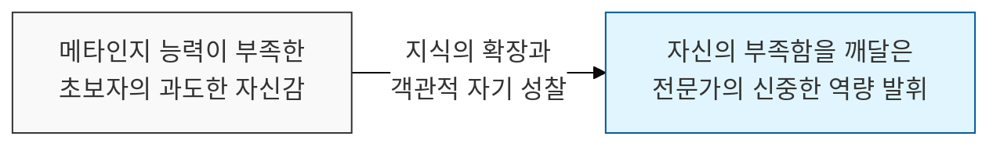
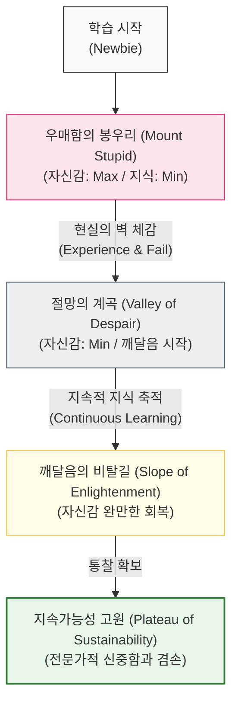

# 모를수록 용감하고 알수록 겸손해진다, 더닝-크루거 효과

## I. 숙련도와 자신감의 역설적 상관관계, **Dunning-Kruger** 효과 개요

**정의**: 능력이 없는 사람은 자신의 실력을 실제보다 높게 평가하는 반면, 능력이 있는 사람은 자신의 실력을 과소평가하거나 타인도 자신만큼 할 것이라 착각하는 인지 편향 현상  

**특징**:  
( **메타인지의 결여** ) 자신이 무엇을 모르는지조차 모르는 상태에서 발생하는 논리적 오류임  
( **우매함의 봉우리** ) 아주 적은 지식만을 가졌을 때 자신감이 최고조에 달하는 현상을 보임 (**Mount Stupid**)  
( **자기 객관화 실패** ) 자신의 역량을 객관적으로 판단할 수 있는 기준이 부족하여 발생함  

## II. **Dunning-Kruger** 효과의 메커니즘과 형상화

### 가. 숙련도에 따른 인지적 성숙도 추이 모델

### 나. 성숙도 단계별 인지적 특성 분석
| **단계** | **주요 현상** | **소프트웨어 개발 사례** |
| :--- | :--- | :--- |
| **초기** | 근거 없는 자신감 충만 | "언어 하나 떼는 건 일주일이면 충분하죠" |
| **중기** | 거대한 복잡성에 대한 경외심 | "알면 알수록 제가 아는 게 아무것도 없네요" |
| **성숙기** | 실력에 대한 회의 또는 신중함 | "이 코드가 완벽하다고 장담할 수 없습니다" |
| **전문가** | 타인의 역량을 과대평가 | "이 정도 구현은 누구나 금방 하는 거 아닌가요?" |

## III. **더닝-크루거** 효과 극복을 위한 조직 및 개인의 전략

### 가. 메타인지 향상을 위한 피드백 전략
| **전략** | **상세 내용** | **기대 효과** |
| :--- | :--- | :--- |
| **Code Review** | 상호 코드 검토를 통한 다양한 관점 공유 | 우매함의 봉우리에서 조기 하강 유도 |
| **Continuous Feedback** | 정기적인 1:1 면담 및 성과 측정 | 객관적인 자기 객관화 지표 제공 |
| **Learning Culture** | "모르는 것을 모른다"고 말할 수 있는 문화 | 절망의 계곡을 빠르게 통과하는 심리적 안전감 확보 |

### 나. 개발 팀 운영 시 시사점
- **Humility as a Skill**: 기술적 역량만큼이나 **겸손(Humility)**을 중요한 소프트 스킬로 간주하고 장려해야 함
- **Mentoring**: 시니어 개발자는 주니어가 '우매함의 봉우리'에 오래 머물지 않도록 도전적인 과제와 건설적인 비판을 병행해야 함
- **Imposter Syndrome**: 전문가들이 빠지기 쉬운 '가면 증후군'(자신의 실력을 믿지 못하는 현상)을 경계하고 이들의 역량을 적절히 인정해 주어야 함
