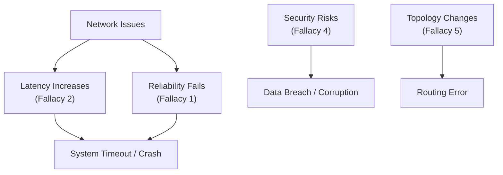

# 분산 시스템 설계의 8가지 함정, 분산 컴퓨팅의 오류 (Fallacies of Distributed Computing)

## I. 이상적 네트워크에 대한 환상과 실제, 분산 컴퓨팅 오류의 개요

**정의** : 분산 시스템을 처음 설계하는 개발자들이 네트워크의 물리적 특성을 간과하고 범하기 쉬운 8가지 잘못된 가정( **Fallacies** )  

**핵심 특징 및 시사점** :  
( **물리적 한계 인정** ) 네트워크는 결코 완벽하지 않으며, 지연, 단절, 대역폭 제한 등 현실적인 제약 조건을 설계의 상수로 취급해야 함  
( **장애 내성 설계** ) "네트워크는 항상 믿을 수 있다"는 가정을 버리고, 장애 발생을 전제로 한 서킷 브레이커( **Circuit Breaker** ) 등 방어적 설계 적용  
( **L. Peter Deutsch의 통찰** ) 썬 마이크로시스템즈의 엔지니어들이 제안한 이 원칙은 현대 클라우드 네이티브 아키텍처와 **MSA** 설계의 필수 지침이 됨  
( **보안 및 신뢰성 직결** ) 네트워크의 불투명성과 위협을 인정하는 것에서부터 제로 트러스트( **Zero Trust** ) 보안 모델이 시작됨  

---

## II. 분산 컴퓨팅의 8가지 오류 상세 분석

### 가. 8가지 오류 리스트 및 현실적 반론

| 순번 | 개발자의 잘못된 가정 (The Fallacy) | 현실에서의 실체 (The Reality) |
|:---:|---------------------------------|------------------------------|
| **1** | 네트워크는 신뢰할 수 있다. | 패킷은 유실되며, 연결은 예고 없이 끊긴다. |
| **2** | 지연 시간(Latency)은 0이다. | 데이터 전송에는 반드시 물리적 시간이 소요된다. |
| **3** | 대역폭(Bandwidth)은 무한하다. | 네트워크 자원은 한정되어 있으며 병목이 발생한다. |
| **4** | 네트워크는 안전하다. | 데이터는 도청, 변조될 수 있으며 위협에 노출되어 있다. |
| **5** | 토폴로지(Topology)는 변하지 않는다. | 노드는 추가/삭제되며 네트워크 경로는 동적으로 변한다. |
| **6** | 관리자는 한 명이다. | 다수의 관리자와 정책이 충돌하며 통제가 어렵다. |
| **7** | 운송 비용(Transport Cost)은 0이다. | 데이터 직렬화, 역직렬화 및 전송에 자원이 소모된다. |
| **8** | 네트워크는 균일하다(Homogeneous). | 다양한 프로토콜, 장비, 성능의 노드가 혼재한다. |

### 나. 오류 간의 상호 작용 및 영향도

---

## III. 분산 컴퓨팅 오류 극복을 위한 엔지니어링 전략

### 가. 오류 대응을 위한 기술적 해결책 비교

| 극복 전략 | 관련 오류 항목 | 구체적 구현 기술 |
|:---:|:---:|----------------|
| **재시도 및 타임아웃** | 1, 2 | **Exponential Backoff**, **Retry Policy** |
| **비동기 통신** | 2, 3 | **Message Queue (Kafka, RabbitMQ)**, **Pub/Sub** |
| **상호 인증 및 암호화** | 4 | **mTLS**, **TLS 1.3**, **IPsec** |
| **서비스 디스커버리** | 5, 8 | **Kubernetes Service**, **Consul**, **Istio** |
| **데이터 압축/최적화** | 3, 7 | **gRPC (Protocol Buffers)**, **Avro**, **MessagePack** |

### 나. 실무적 설계 가이드라인
- **관측 가능성(Observability) 확보** : 네트워크 지연과 오류를 실시간으로 모니터링하여 가정이 틀렸음을 데이터로 확인( **Prometheus**, **Jaeger** )
- **네트워크 불신(Trust No One)** : 네트워크 내부라도 결코 안전하지 않다는 전제하에 모든 통신에 대해 인증과 인가 수행( **Zero Trust** )
- **시스템 독립성 유지** : 특정 관리자나 특정 장비의 존재에 의존하지 않도록 느슨한 결합( **Decoupling** ) 및 표준 프로토콜 지향

> **핵심** : **분산 컴퓨팅의 오류**를 이해하는 것은 분산 시스템 설계의 첫걸음이며, **네트워크의 불확실성**을 소프트웨어 로직으로 극복할 때 비로소 진정한 클라우드 네이티브 시스템이 완성됨
