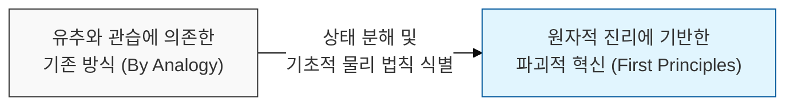
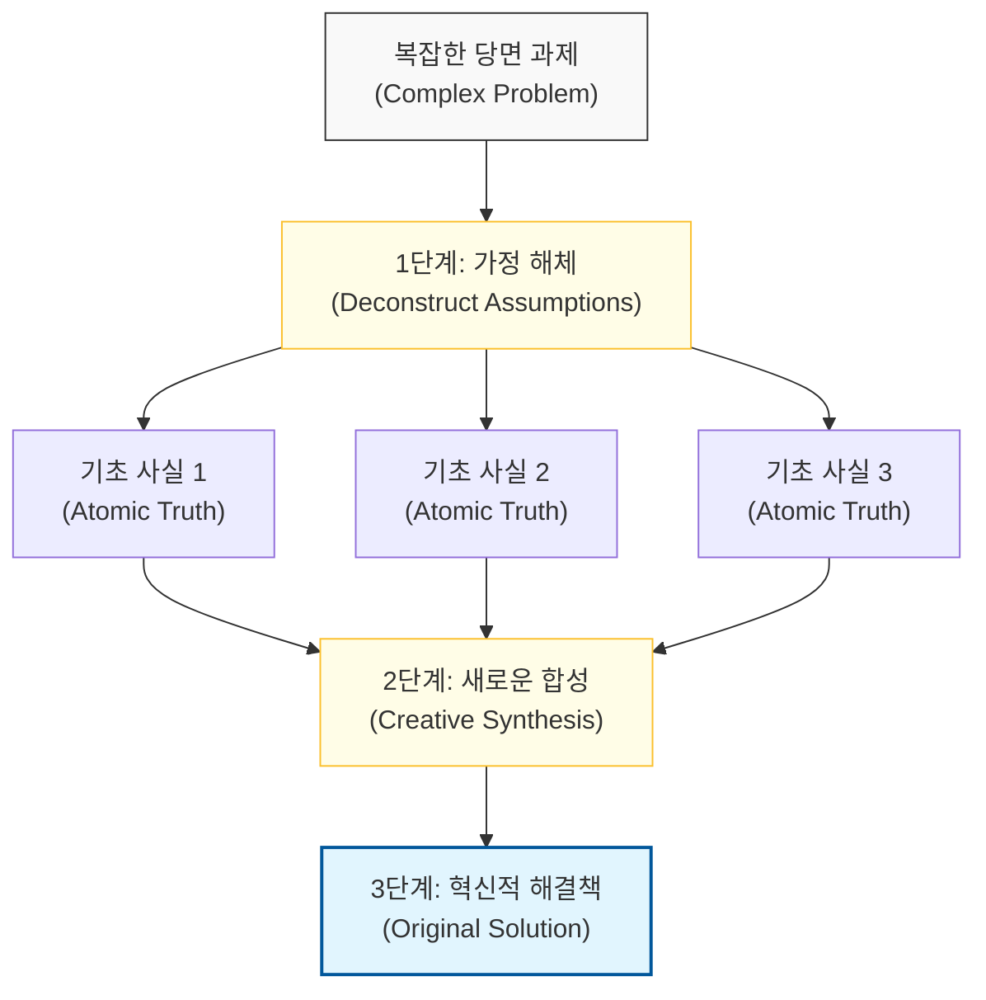

# 복잡성을 본질로 분해하여 혁신을 창출한다, 제1원리 사고

## I. 근본적 진리로부터의 재구성, 제1원리 사고 개요

**정의**: 복잡한 문제를 가장 기초적인 원자 단위의 사실(**Basic Truths**)로 분해한 뒤, 이를 바탕으로 아무런 선입견 없이 새로운 해결책을 쌓아 올리는 사고 방식  

**특징**:  
( **유추 거부** ) "남들도 그렇게 하니까" 또는 "과거에 이랬으니까"와 같은 관습적 유추(**Thinking by Analogy**)를 철저히 배제함  
( **원자적 분해** ) 더 이상 쪼갤 수 없는 근본적인 물리적, 논리적 한계치까지 문제를 해체하여 본질을 식별함  
( **창의적 합성** ) 식별된 기초 사실들을 조합하여 기존의 경로와는 전혀 다른 혁신적이고 효율적인 경로를 재설계함  

## II. 제1원리 사고의 작동 메커니즘과 형상화

### 가. 근본 진리 분해 및 합성 구조 모델

### 나. 제1원리 사고의 3단계 프로세스
| **단계** | **주요 활동** | **핵심 질문** |
| :--- | :--- | :--- |
| **1. 가정의 식별** | 기존 방식의 전제 조건과 당연시되는 관습 나열 | "우리는 왜 이 방식이 최선이라고 믿는가?" |
| **2. 기본 원리로의 분해** | 문제를 더 이상 쪼갤 수 없는 기초 사실로 해체 | "이 문제에서 절대적으로 변하지 않는 사실은 무엇인가?" |
| **3. 근본에서의 재구성** | 기초 사실들을 바탕으로 제로 베이스에서 대안 설계 | "이 재료들로 만들 수 있는 가장 효율적인 방법은 무엇인가?" |

## III. 소프트웨어 공학에서의 제1원리 사고 적용 전략

### 가. 혁신적 설계와 문제 해결 전략
| **적용 영역** | **전통적 사고 (Analogy)** | **제1원리 사고 (First Principles)** |
| :--- | :--- | :--- |
| **비용 최적화** | "유사 프로젝트의 평균 비용 산출" | "컴퓨팅 자원 및 대역폭의 원가 단위 분석" |
| **아키텍처** | "유행하는 프레임워크/패턴 도입" | "데이터 흐름과 트랜잭션의 본질적 요구사항 분석" |
| **성능 개선** | "서버 하드웨어 사양 업그레이드" | "알고리즘의 시간 복잡도 및 메모리 참조 효율 분해" |

### 나. 개발 시 시사점
- **Question Everything**: 당연하다고 생각되는 베스트 프랙티스(Best Practice)조차 제1원리 사고 앞에서는 검증의 대상이 되어야 함
- **Cost of Components**: 일론 머스크가 배터리 팩 가격을 분해하여 혁신을 이룬 것처럼, 소프트웨어 개발자도 라이브러리나 서비스의 '기능적 원가'를 분석할 줄 알아야 함
- **Creative Freedom**: 기존의 틀에 얽매이지 않으므로, **KISS** 원칙이나 **Occam의 면도날**을 적용하여 가장 우아하고 단순한 진리에 도달할 수 있음
