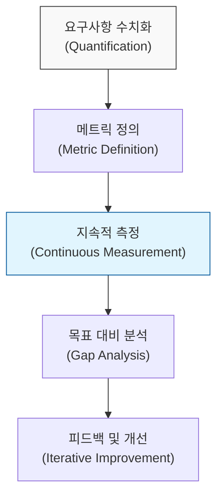

# 측정할 수 없으면 관리할 수 없다, 길브의 법칙 (Gilb's Law)

## I. 정량적 측정 기반의 시스템 관리 원칙, 길브의 법칙 개요

**정의** : "측정할 수 없는 것은 제어할 수 없다(Any system you don't measure, you can't control)"는 원칙으로, 톰 길브( **Tom Gilb** )가 제안한 소프트웨어의 신뢰성과 정량적 품질 관리의 중요성을 강조하는 법칙  

**핵심 특징 및 시사점** :  
( **정량화의 필수성** ) 모든 요구사항은 숫자로 표현되어야 하며, 측정되지 않는 품질 목표는 단순한 소망에 불과함  
( **신뢰성 설계** ) 신뢰할 수 없는 시스템은 자신이 무엇을 만들고 있는지 모르는 사람들에 의해 만들어지며, 신뢰성은 나중에 추가할 수 있는 속성이 아님  
( **가시성 확보** ) 시스템의 현재 상태를 메트릭( **Metrics** )으로 가시화함으로써 잠재적 위험을 조기에 발견하고 대응 가능  
( **목표 지향적 관리** ) 명확한 수치 목표( **Target** )를 설정함으로써 개발과 운영 팀 간의 의사소통을 객관화하고 책임 소재를 명확히 함  

---

## II. 길브의 신뢰성 법칙과 측정 프레임워크

### 가. 길브의 비신뢰성 법칙 (Laws of Unreliability)

길브는 시스템이 왜 신뢰받지 못하는지에 대해 역설적인 법칙들을 통해 경고합니다.

| 법칙 구분 | 주요 내용 | 교훈 및 대응 전략 |
|:---:|----------|------------------|
| **제1법칙** | 컴퓨터는 신뢰할 수 없지만, 사람은 더욱 신뢰할 수 없다. | 자동화된 검증 및 감시 체계 구축 |
| **제2법칙** | 측정되지 않는 시스템은 결코 통제될 수 없다. | **SLA**, **SLO** 등 정량적 지표 설정 |
| **제3법칙** | 신뢰성은 개발 마지막 단계에서 '추가'할 수 없다. | **Shift-Left** 기반의 초기 품질 설계 |
| **제4법칙** | 모든 시스템은 예기치 못한 상황에서 반드시 실패한다. | **Chaos Engineering**, 복구 탄력성 확보 |

### 나. 정량적 품질 관리 프로세스

---

## III. 길브의 법칙과 현대적 보안/운영 관리의 연계

### 가. SRE 및 보안 메트릭 활용 비교

| 비교 항목 | 사이트 신뢰성 공학 (SRE) | 보안 관제 및 관리 (Sec) |
|:---:|-------------------------|------------------------|
| **핵심 지표** | **SLI** (지표), **SLO** (목표) | **MTTD** (탐지시간), **MTTR** (대응시간) |
| **측정 대상** | 응답 시간, 가용성, 오류율 | 취약점 개수, 침투 성공률, 패치 준수율 |
| **관리 도구** | **Prometheus**, **Grafana** | **SIEM**, **SOAR**, **RAV** |
| **길브의 법칙 적용** | "가용성 99.9%를 달성하기 위해 실시간 측정" | "탐지 시간을 1시간 이내로 단축하기 위해 자동화" |

### 나. 실무적 적용 전략: 측정 기반의 보안 고도화
- **데이터 기반의 의사결정** : "우리 시스템은 안전하다"는 정성적 주장을 버리고, **CVSS** 점수 분포나 **RAV** 지표를 통해 현재의 보안 성숙도를 증명
- **에러 버짓 (Error Budget) 도입** : 신뢰성 목표를 초과하지 않는 범위 내에서만 새로운 기능을 배포하도록 강제하여 품질과 속도의 균형 유지
- **자동화된 대시보드 구축** : 모든 보안 활동의 결과(스캔 결과, 차단 이력 등)를 실시간으로 수치화하여 조직 내 보안 가시성 공유

> **핵심** : **길브의 법칙**은 시스템 관리의 핵심이 **데이터**에 있음을 시사하며, 보안 역시 정량적 측정을 통해 통제 가능한 영역으로 끌어올릴 때 비로소 완성됨
