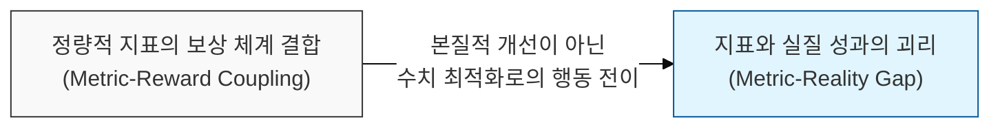

# 측정 지표가 목표가 되는 순간, 지표로서의 가치는 사라진다, Goodhart의 법칙

## I. 측정 지표의 유효성 상실, **Goodhart**의 법칙 개요

**정의**: 어떤 측정 지표가 목표가 되는 순간, 사람들은 그 지표를 달성하기 위해 시스템을 조작하거나 본질과 어긋난 행동을 하게 되어 해당 지표가 더 이상 좋은 측정 수단이 되지 못한다는 법칙  

**특징**:  
( **지표의 왜곡** ) 사람들은 시스템을 실질적으로 개선하기보다 지표 수치를 좋게 만드는 데 자원을 집중함  
( **역인센티브** ) 잘못된 지표 설정이 의도치 않은 부정적 행동과 부작용을 유발함  
( **본질과 수단의 전도** ) 성과 측정을 위한 수단(Measure)이 조직의 궁극적 목표(Goal)를 대체하는 현상이 발생함  

## II. **Goodhart**의 법칙의 메커니즘과 형상화

### 가. 지표 최적화를 위한 행동 전이 및 가치 괴리 메커니즘

### 나. 소프트웨어 개발에서의 지표 왜곡 사례
| **측정 지표** | **왜곡된 행동 (Gaming)** | **결과적 부작용** |
| :--- | :--- | :--- |
| **코드 라인 수 (LOC)** | 불필요하게 코드를 길게 작성하거나 중복 코드 방치 | 가독성 저하 및 유지보수 비용 급증 |
| **버그 수정 개수** | 쉬운 버그만 수정하거나, 수정 후 다시 발생하는 버그 양산 | 시스템의 근본적인 안정성 개선 저해 |
| **코드 커버리지** | 로직 검증 없이 단순 실행만 하는 테스트 코드 작성 | 테스트 신뢰도 하락 및 실제 결함 미발견 |
| **벨로시티 (Velocity)** | 스토리 포인트를 의도적으로 높게 산정 | 진척도 관리 체계 무력화 및 데이터 신뢰 상실 |

## III. **Goodhart**의 법칙 극복을 위한 성과 관리 전략

### 가. 다각적이고 본질적인 측정 체계 구축
| **전략** | **상세 내용** | **기대 효과** |
| :--- | :--- | :--- |
| **Balanced Metrics** | 하나의 지표가 아닌 상충하는 여러 지표를 함께 측정 (예: 속도 vs 품질) | 한 쪽으로 치우친 왜곡 행위의 상호 견제 |
| **Proxy Metric 제고** | 지표가 실제 가치와 얼마나 정렬(Align)되어 있는지 주기적 검토 | 지표의 유효성 유지 및 목적성 재확인 |
| **Qualitative Analysis** | 정량적 수치 뒤에 숨은 맥락을 파악하기 위한 정성적 평가 병행 | 지표 수치만으로는 알 수 없는 실질적 성과 파악 |

### 나. 개발 팀 운영 시 시사점
- **Focus on Value, Not Numbers**: 숫자를 맞추는 것이 아니라 고객에게 전달하는 **가치**가 무엇인지 지속적으로 소통해야 함
- **No Blame Culture**: 지표가 낮게 나왔을 때 처벌하기보다, 시스템적 문제를 해결하기 위한 신호로 받아들이는 문화가 필요함
