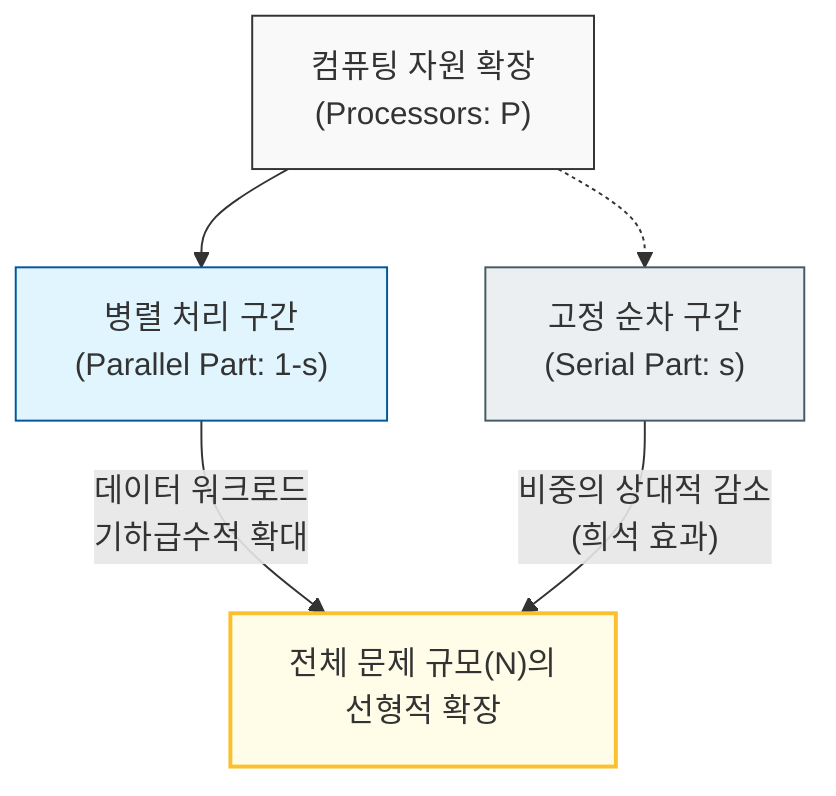

# 병렬 처리를 통한 문제 규모의 확장 가능성, Gustafson의 법칙

## I. 가변 규모의 병렬 처리 원리, **Gustafson**의 법칙 개요

**정의**: 대규모 데이터 처리가 필요한 문제에서 병렬 프로세서 수를 늘리면, 실행 시간을 늘리지 않고도 더 큰 규모의 문제를 처리할 수 있다는 병렬 컴퓨팅의 법칙  

**특징**:  
( **Scaled Speedup** ) 문제의 크기를 고정하지 않고 자원 증가에 맞춰 규모를 키울 때의 성능 향상(확장성)에 주목함  
( **순차 실행의 희석** ) 데이터 규모가 커질수록 전체 실행 시간에서 순차 처리 부분(**Serial Part**)이 차지하는 비중이 상대적으로 작아짐  
( **긍정적 관점** ) 병렬화가 불가능한 부분이 성능의 절대적 한계를 결정한다는 암달(**Amdahl**)의 법칙보다 낙관적이고 실무적인 시각을 제공함  

## II. **Gustafson**의 법칙의 메커니즘과 형상화

### 가. 데이터 규모와 병렬 처리의 구조적 확장 모델

### 나. **Gustafson**의 법칙 vs **Amdahl**의 법칙 비교
| **비교 항목** | **Amdahl**의 법칙 (고정 규모) | **Gustafson**의 법칙 (가변 규모) |
| :--- | :--- | :--- |
| **관점** | 하드웨어 성능의 절대적 한계 강조 | 하드웨어 확장을 통한 문제 해결 능력 강조 |
| **핵심 전제** | 문제의 크기(**Problem Size**)가 고정됨 | 실행 시간(**Execution Time**)이 고정됨 |
| **속도 향상** | 순차 실행 부분에 의해 상한선이 결정됨 | 프로세서 수에 따라 선형적으로 증가 가능 |
| **주요 활용** | 알고리즘의 병렬화 효율성 평가 | 빅데이터, 수퍼컴퓨팅, 클라우드 확장성 설계 |

## III. 소프트웨어 설계에서의 **Gustafson**의 법칙 활용 전략

### 가. 시스템 확장성(Scalability) 최적화 방안
| **전략** | **상세 내용** | **기대 효과** |
| :--- | :--- | :--- |
| **Horizontal Scaling** | 고성능 장비 교체보다 저사양 장비의 대량 병렬화 | 비용 효율적인 대규모 워크로드 처리 |
| **Data Partitioning** | 데이터를 독립적인 단위로 쪼개어 분산 처리 | 자원 추가 시 처리 가능한 데이터 용량 즉각 확대 |
| **Distributed Computing** | Spark, Flink 등 분산 처리 프레임워크 활용 | 암달의 한계를 넘어선 테라바이트급 데이터 분석 |

### 나. 개발 시 시사점
- **Scaling for Insight**: 단순히 빠르게 실행하는 것보다, 동일한 시간 내에 더 정밀하고 방대한 데이터를 분석하여 인사이트의 질을 높이는 데 초점을 맞춰야 함
- **Cloud Native Design**: 클라우드 환경에서는 자원(Node) 추가가 용이하므로, Gustafson의 법칙을 적용하여 비즈니스 성장에 따른 시스템 확장 구조를 미리 설계해야 함
