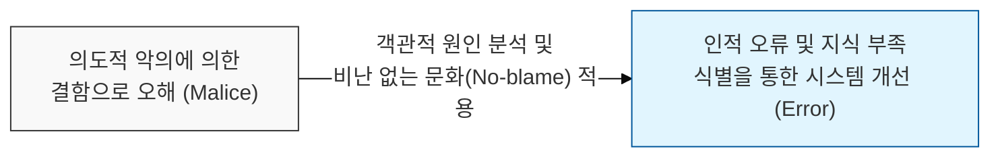
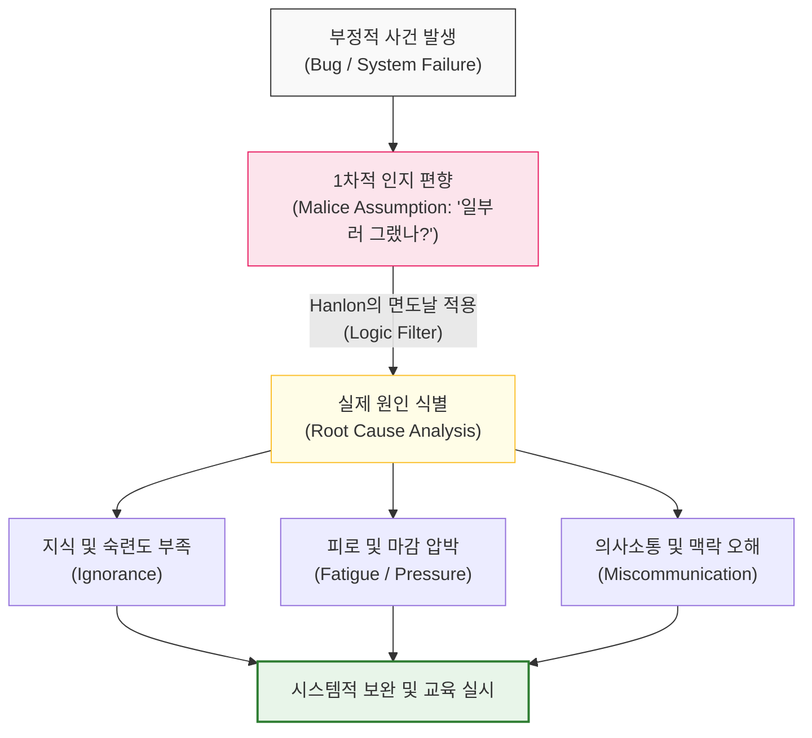

# 악의로 오해하지 마라, Hanlon의 면도날

## I. 감정적 소모 방지를 위한 사고의 도구, **Hanlon**의 면도날 개요

**정의**: "능력 부족이나 부주의로 충분히 설명될 수 있는 일을 악의 탓으로 돌리지 마라"는 사고의 원칙으로, 복잡한 현상을 판단할 때 불필요한 가정을 배제하는 논리적 도구  

**특징**:  
( **감정 노동 배제** ) 타인의 실수를 고의적인 공격으로 해석하지 않음으로써 팀 내 불필요한 갈등과 스트레스를 최소화함  
( **커뮤니케이션 최적화** ) 비난보다 해결책에 집중하게 하여 동료 간의 신뢰를 유지하고 협업 효율을 높임  
( **시스템 중심 사고** ) 문제의 원인을 사람의 성품이 아닌 **프로세스**, **교육**, **환경**의 미비에서 찾으려 노력함  

## II. **Hanlon**의 면도날 작동 메커니즘과 판단 구조 모델

### 가. 인지 편향 제거 및 비난 없는 원인 분석 모델

### 나. **Hanlon**의 면도날 주요 판단 기준
| **판단 요소** | **악의로 보일 때 (False Malice)** | **실제 원인 (True Cause)** |
| :--- | :--- | :--- |
| **코드 품질** | "나를 괴롭히려고 짠 코드인가?" | 도메인 지식 부족 또는 기술 부채의 누적 |
| **리뷰 피드백** | "내 실력을 깎아내리려 하는가?" | 코드 품질 향상을 위한 건설적 제언 |
| **장애 발생** | "일부러 시스템을 망가뜨렸나?" | 테스트 케이스 누락 또는 비결정적 환경 변수 |
| **일정 지연** | "나태함 때문에 늦어지는가?" | **Hofstadter의 법칙**에 따른 산정 오류 |

## III. 소프트웨어 팀의 **Hanlon**의 면도날 실천 전략

### 가. 심리적 안전감 확보를 위한 조직적 대응
| **전략** | **상세 내용** | **기대 효과** |
| :--- | :--- | :--- |
| **Blameless Post-mortem** | 장애 발생 시 사람을 탓하지 않는 회고 수행 | 근본 원인 도출 및 재발 방지 대책 확보 |
| **Assume Good Intent** | 모든 구성원이 최선을 다하고 있다는 기본 가정 | 팀 내 심리적 안전감(**Psychological Safety**) 증진 |
| **Context Sharing** | 결정의 배경과 맥락을 투명하게 공유 | 오해의 소지를 원천 차단하고 정렬(Alignment) 강화 |

### 나. 개발 시 시사점
- **Empathy in Code Review**: 코드 리뷰 시 "왜 이렇게 했나요?" 대신 "이 부분은 이런 리스크가 있을 것 같은데 어떻게 생각하시나요?"와 같이 중립적인 언어를 선택해야 함
- **Systematic Safeguard**: 인간의 실수는 필연적이므로, 이를 악의나 나태함으로 치부하기보다 **Lint**, **CI**, **Auto-testing** 등 시스템적인 방어선을 구축하는 데 집중해야 함
