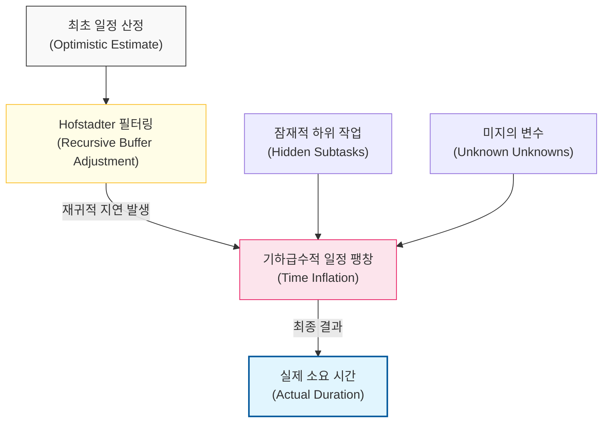

# 계획보다 항상 더 오래 걸린다, Hofstadter의 법칙

## I. 일정 산정의 재귀적 역설, **Hofstadter**의 법칙 개요

**정의**: 어떤 일을 하는 데 드는 시간은 항상 예상보다 오래 걸리며, 심지어 **Hofstadter**의 법칙을 고려하더라도 그렇다는 자기 참조적 법칙  

**특징**:  
( **재귀적 특성** ) 일정이 늦어질 것을 대비해 여유를 두더라도, 그 여유조차 부족하게 만드는 예기치 못한 변수가 항상 발생함  
( **복잡성 과소평가** ) 인간은 인지적으로 작업의 세부 단계를 모두 예측하지 못하며, 특히 통합 과정의 변수를 간과함  
( **낙관적 편향** ) "이번에는 다를 것"이라는 기대와 달리, 소프트웨어 개발의 비결정적 요소가 일정 산정을 방해함  

## II. **Hofstadter**의 법칙의 메커니즘과 형상화

### 가. 재귀적 일정 팽창 및 리스크 누적 모델

### 나. 일정 지연을 유발하는 주요 심리적/기술적 요인
| **구분** | **핵심 내용** | **상세 영향** |
| :--- | :--- | :--- |
| **계획 오류** | 과거의 실패 경험보다 낙관적인 시나리오에 집중 | 현실과 동떨어진 마감 시한 설정 |
| **Unknown Unknowns** | 존재 자체를 몰랐던 기술적 난관의 출현 | 분석 및 설계 단계에서 누락된 리스크의 현재화 |
| **의존성 복잡도** | 모듈 간 상호작용이 늘어날수록 문제 해결 시간 급증 | 한 부분의 수정이 전체 시스템에 파급 효과 유발 |

## III. **Hofstadter**의 법칙에 대응하는 프로젝트 관리 전략

### 가. 유연하고 현실적인 일정 관리 방안
| **전략** | **상세 내용** | **기대 효과** |
| :--- | :--- | :--- |
| **Evidence-based Scheduling** | 과거의 실제 데이터를 기반으로 통계적 일정 산정 | 주관적 낙관주의를 배제한 객관적 지표 확보 |
| **Decomposition** | 작업을 최소 단위로 쪼개어 세부 리스크 노출 | 'Unknown' 영역을 구체적인 작업으로 변환 |
| **Buffer Multiplication** | 산정된 시간에 일정 배수(예: **1.5~2**배)를 곱하여 확정 | 법칙의 재귀적 지연에 대한 물리적 대비책 마련 |

### 나. 개발 팀 운영 시 시사점
- **Embrace Uncertainty**: 일정 지연은 무능함이 아닌 소프트웨어 개발의 본질적 속성임을 인정하고, 유연한 소통 문화를 구축해야 함
- **Small Steps, Fast Feedback**: 한 번에 큰 계획을 세우기보다 짧은 주기로 결과를 확인하며 계획을 수정하는 애자일(**Agile**) 방식이 효과적임
