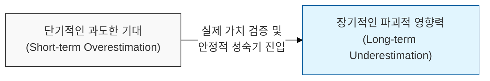
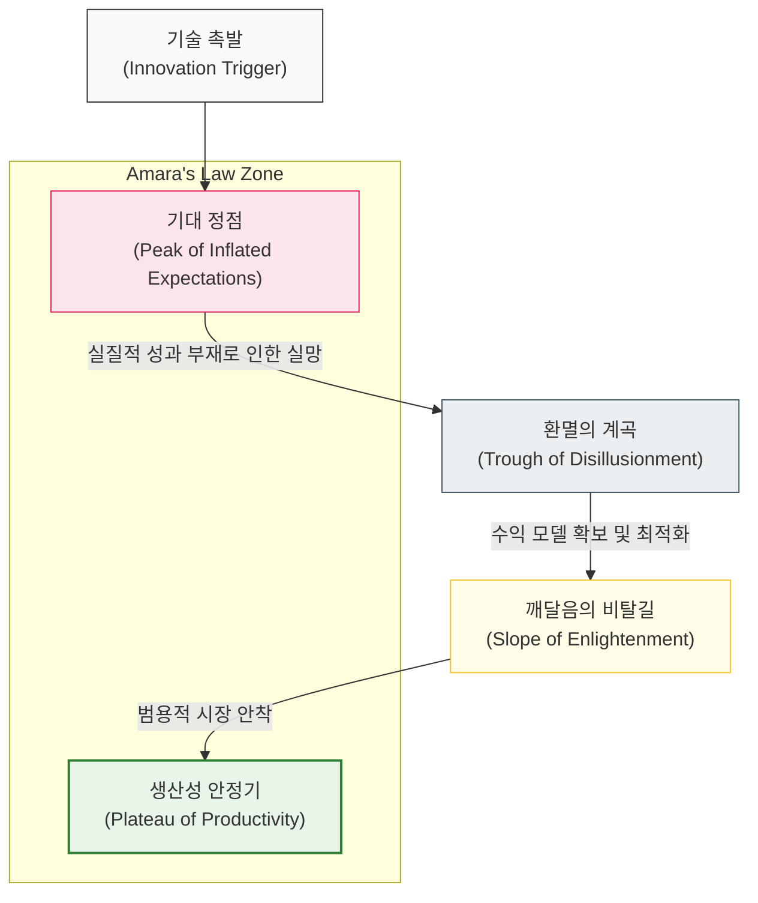

# 기술의 단기적 과열과 장기적 혁신, Hype Cycle과 Amara의 법칙

## I. 기술 수용의 비선형적 역학, **Hype Cycle**과 **Amara**의 법칙 개요

**정의**: 기술에 대한 인간의 기대치가 시간에 따라 어떻게 변화하는지를 설명하는 모델로, 단기적인 거품과 환멸을 거쳐 장기적인 실질적 성과로 이어지는 과정을 의미함  

**특징**:  
( **Amara의 법칙** ) "우리는 기술의 단기적 효과를 과대평가하고, 장기적 효과는 과소평가하는 경향이 있다"는 로이 아마라(**Roy Amara**)의 원칙  
( **기대치와 현실의 괴리** ) 새로운 기술 등장 시 초기에는 실제 성능보다 장밋빛 전망이 앞서며, 이후 냉정한 평가를 거쳐 재도약함  
( **비선형적 성장** ) 기술의 발전 속도는 선형적이지 않으며, 인프라와 생태계가 갖춰지는 임계점을 넘어서야 폭발적인 가치를 창출함  

## II. 기술 성숙도 단계와 인지적 전이 모델

### 가. **Gartner Hype Cycle** 및 기대치 변화 곡선 모델

### 나. **Hype Cycle**의 5단계 상세 분석
| **단계** | **주요 현상** | **소프트웨어 분야 사례** |
| :--- | :--- | :--- |
| **1. 기술 촉발** | 프로토타입 공개 및 미디어의 높은 관심 | 초기 단계의 양자 컴퓨팅, 차세대 **AI** 모델 |
| **2. 기대 정점** | 성공 사례 위주 홍보 및 비현실적 전망 | 버블기의 암호화폐, 초기 메타버스 광풍 |
| **3. 환멸의 계곡** | 기술적 한계 직면 및 투자 감소 | 거품이 빠진 이후의 **Web 3.0** 등 |
| **4. 깨달음의 비탈길** | 실제 비즈니스 가치 증명 및 도구 개선 | 클라우드 네이티브 아키텍처의 안정적 정착 |
| **5. 생산성 안정기** | 기술의 범용화 및 안정적인 수익 창출 | **SaaS**, 모바일 어플리케이션 개발 환경 |

## III. **Hype Cycle**을 극복하기 위한 전략적 기술 도입 방안

### 가. 기술 도입 시점별 대응 전략
| **전략** | **상세 내용** | **기대 효과** |
| :--- | :--- | :--- |
| **Early Adopter** | 기대 정점 이전의 실험적 도입 및 **R&D** | 기술 선점 효과 및 초기 시장 장악력 확보 |
| **Prudent Fast-Follower** | 환멸의 계곡을 지나는 시점의 실용적 도입 | 기술적 리스크 제거 및 검증된 가치 획득 |
| **Platform Standard** | 생산성 안정기 기술의 표준화 및 자산화 | 조직 전체의 개발 효율성 및 운영 안정성 극대화 |

### 나. 개발 시 시사점
- **Look Beyond the Hype**: 새로운 도구나 프레임워크가 등장했을 때, 미디어의 열광보다는 실제 우리 프로젝트의 병목을 해결할 수 있는 '본질적 기능'에 집중해야 함 (**Occam의 면도날** 연계)
- **Prepare for the Long Run**: 아마라의 법칙에 따라 단기적 성과가 미미하더라도, 해당 기술이 가져올 10년 뒤의 파괴적 변화를 예측하고 인프라를 준비해야 함
- **Avoid Premature Scaling**: 기대 정점에서의 과도한 투자는 '조기 최적화'와 같은 기술 부채를 양산할 수 있으므로, 단계적인 확장이 필요함
