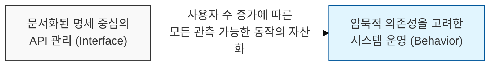
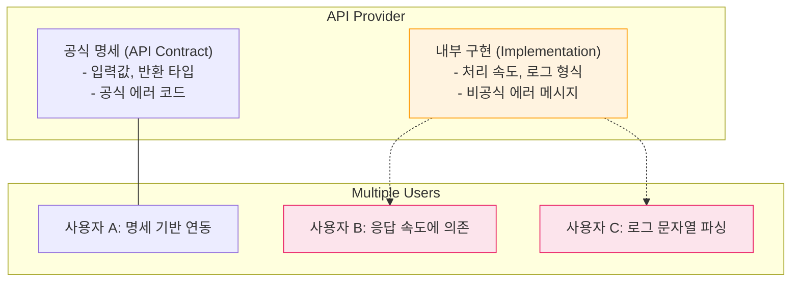

# 명세보다 중요한 것은 관측된 동작이다, 하이럼의 법칙 (Hyrum's Law)

## I. API 생태계의 암묵적 의존성 원리, 하이럼의 법칙 개요

**정의** : "API의 사용자가 충분히 많아지면, API 명세( **Contract** )에 무엇을 약속했는지는 중요하지 않다. 시스템의 모든 관측 가능한 동작( **Observable Behavior** )은 누군가에 의해 의존된다"는 법칙  

**핵심 특징 및 시사점** :  
( **암묵적 인터페이스** ) 공식 문서에는 없지만 실제 동작 방식(예: 에러 메시지 순서, 응답 시간 등)이 사용자에게는 실질적인 인터페이스가 됨  
( **변경의 난해함** ) 버그 수정이나 성능 개선조차 누군가에게는 '동작의 변화'로 인식되어 기존 시스템을 망가뜨릴 수 있음( **Breaking Change** )  
( **대규모 시스템의 숙명** ) 구글( **Google** )의 소프트웨어 엔지니어 하이럼 라이트( **Hyrum Wright** )가 제안했으며, 대규모 인프라와 라이브러리 관리의 어려움을 대변함  
( **엔트로피 증가** ) 시스템이 오래되고 사용자 기반이 넓어질수록, 하이럼의 법칙에 의한 의존성 때문에 아키텍처는 점점 더 경직됨  

---

## II. 하이럼의 법칙이 발생하는 메커니즘과 관리 방안

### 가. 명세와 실제 동작의 간극 (Gap between Interface & Implementation)

### 나. 하이럼의 법칙에 대응하는 엔지니어링 전략

| 전략 항목 | 상세 내용 | 보안 및 안정성 효과 |
|:---:|----------|------------------|
| **유지보수 정책** | 명세에 없는 동작은 언제든 변할 수 있음을 사전 고지 | 무분별한 암묵적 의존성 방지 |
| **철저한 테스트** | 변경 시 기존 사용자들의 실사용 패턴을 반영한 회귀 테스트 수행 | 의도치 않은 서비스 중단 방지 |
| **추상화 및 은닉** | 내부 구현의 세부 사항이 외부로 노출되지 않도록 엄격히 제한 | 정보 유출 방지 및 변경 유연성 확보 |
| **단계적 배포** | **Canary** 배포 등을 통해 변경의 영향을 점진적으로 확인 | 대규모 장애( **Blast Radius** ) 최소화 |

---

## III. 하이럼의 법칙과 보안 관리의 연계

### 가. 보안 패치와 하이럼의 법칙의 충돌

| 구분 | 일반적인 보안 업데이트 | 하이럼의 법칙 관점의 위험 |
|:---:|----------------------|------------------------|
| **에러 처리** | 상세 에러 정보 차단 (보안 강화) | 에러 메시지 형식에 의존하던 앱의 오작동 |
| **타임아웃** | 자원 고갈 방지를 위해 단축 | 기존 네트워크 지연을 허용하던 시스템 장애 |
| **프로토콜** | 취약한 알고리즘( **TLS 1.1** 등) 제거 | 해당 알고리즘만 지원하는 레거시 장비 단절 |

### 나. 실무적 적용 제언: 하이럼의 법칙을 고려한 API 설계
- **명시적 비결정성 (Explicit Non-determinism)** : 결과의 순서가 중요하지 않다면 의도적으로 무작위성을 부여하여 사용자가 특정 순서에 의존하지 못하게 함
- **강력한 캡슐화** : 내부 상태나 부수 효과( **Side Effect** )가 관측되지 않도록 설계하여 하이럼의 법칙이 적용될 여지를 최소화
- **변화의 가시성** : 하이럼의 법칙을 인정하고, 모든 변경 사항을 메트릭으로 측정하여 어떤 사용자가 어떤 부수 효과에 의존하고 있는지 사전에 파악

> **핵심** : **하이럼의 법칙**은 시스템이 성장할수록 **완벽한 추상화는 불가능함**을 시사하며, 이를 관리하기 위해서는 기술적 명세뿐만 아니라 **사용자의 실제 이용 행태**에 대한 통찰이 필수적임
