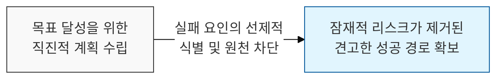
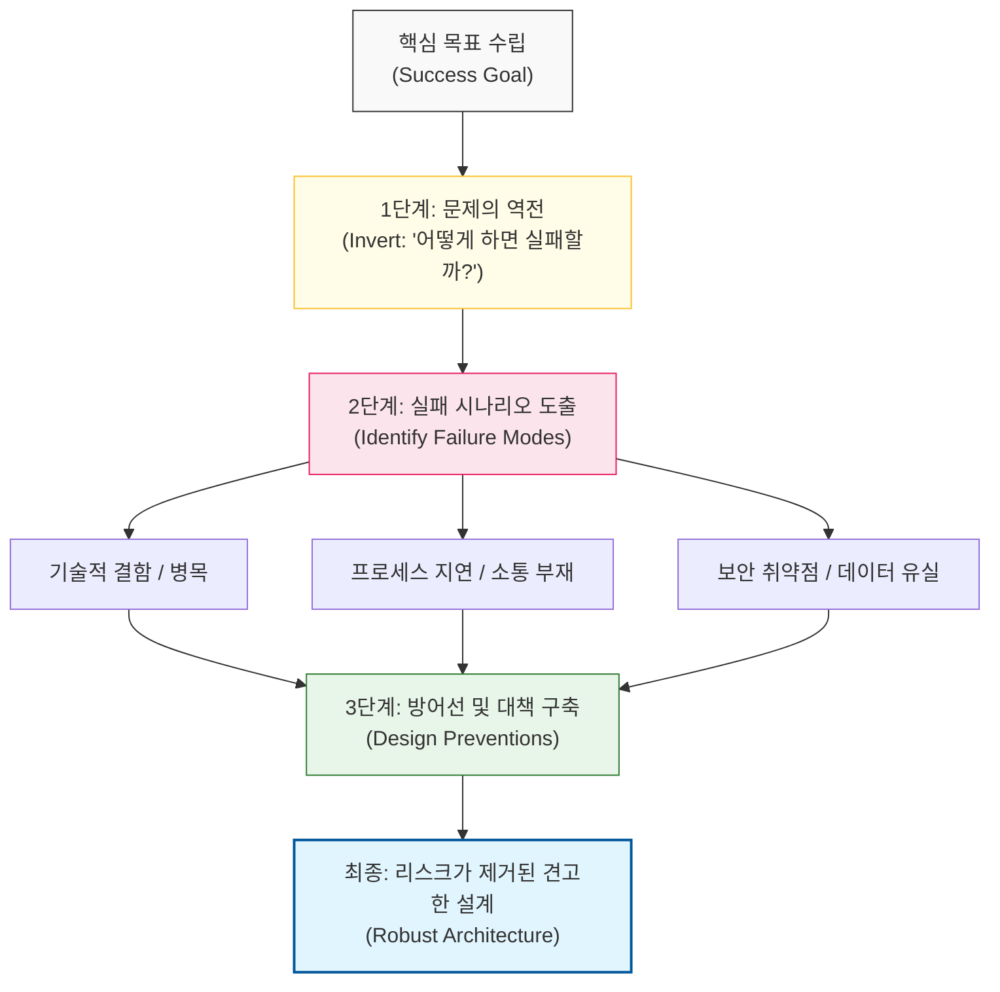

# 실패하지 않는 방법을 찾아 성공을 확보한다, 역전 사고

## I. 실패로부터 역산하는 문제 해결, 역전 사고 개요

**정의**: "뒤집어라, 항상 뒤집어서 생각하라"(Invert, always invert)는 찰리 멍거(**Charlie Munger**)의 원칙으로, 목표 달성 방법을 찾는 대신 실패를 초래할 요인들을 먼저 정의하고 이를 제거하여 해답에 도달하는 사고 방식  

**특징**:  
( **실패 요인 우선** ) 무엇이 프로젝트를 망칠지 리스트업하고, 해당 상황이 발생하지 않도록 설계를 조정함  
( **복잡성 역전** ) 긍정적인 해결책이 너무 복잡할 때, 부정적인 결과를 만드는 명확한 경로를 찾아 이를 반전시킴으로써 단순함을 회복함  
( **회복 탄력성 확보** ) 발생 가능한 최악의 시나리오(**Worst-case Scenario**)를 상정하여 시스템의 방어 기제를 강화함  

## II. 역전 사고의 작동 메커니즘과 형상화

### 가. 문제의 역전 및 실패 방어 구조 모델

### 나. 소프트웨어 개발에서의 역전 사고 적용 사례
| **적용 대상** | **순방향 사고 (Forward)** | **역전 사고 (Inversion)** |
| :--- | :--- | :--- |
| **코드 품질** | "어떻게 하면 깔끔한 코드를 짤까?" | "어떻게 하면 읽기 어렵고 버그가 많은 코드가 될까? -> 그것을 하지 말자" |
| **프로젝트 관리** | "어떻게 마감일을 지킬까?" | "무엇이 우리 일정을 지연시킬까? (인력 부족, 기술 난이도) -> 리스크 선제 대응" |
| **시스템 보안** | "어떻게 데이터를 보호할까?" | "해커가 우리 데이터를 훔친다면 어떤 경로를 쓸까? -> 침투 경로 원천 봉쇄" |
| **성능 최적화** | "어떻게 응답 속도를 높일까?" | "무엇이 시스템을 가장 느리게 만드는가? -> 핵심 병목 지점 제거" |

## III. 역전 사고의 전략적 실천 도구

### 가. 리스크 관리를 위한 구체적 방법론
| **실천 도구** | **상세 내용** | **기대 효과** |
| :--- | :--- | :--- |
| **Pre-mortem** | 프로젝트 시작 전 '실패했다'고 가정하고 원인 추적 | 집단 사고 방지 및 잠재적 결함 조기 발견 |
| **Anti-patterns** | 하지 말아야 할 설계 패턴을 먼저 학습 | 검증되지 않은 아키텍처 도입 리스크 최소화 |
| **Chaos Engineering** | 의도적으로 장애를 유발하여 시스템 약점 식별 | 프로덕션 환경의 내결함성 및 안정성 강화 |

### 나. 개발 시 시사점
- **Focus on the 'Not'**: 유능한 개발자는 '무엇을 할지'만큼 '무엇을 하지 않을지'를 명확히 결정함 (**KISS**, **YAGNI** 원칙과 맥락을 같이함)
- **Defensive Programming**: 역전 사고를 코드 수준에 적용하면, 발생 가능한 에러 상황을 먼저 처리하고 핵심 로직을 전개하는 안정적인 코드가 됨
- **Cultural Shift**: 실패를 논의하는 것이 금기시되는 문화에서는 역전 사고가 작동하기 어려우므로, **Hanlon의 면도날**과 같은 심리적 안전감이 전제되어야 함
