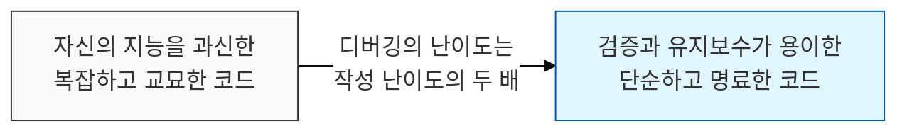
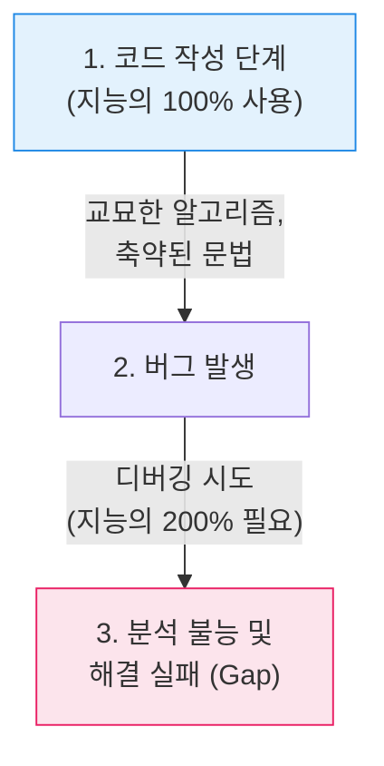

# 디버깅의 한계와 단순함의 가치, 커니핸의 법칙 (Kernighan's Law)

## I. 지능의 한계와 코드 복잡성의 상관관계, 커니핸의 법칙 개요

**정의** : "디버깅은 코드를 작성하는 것보다 두 배는 더 어렵다. 따라서 당신이 가진 지능을 모두 짜내어 교묘하게 코드를 작성한다면, 당신은 그 코드를 디버깅할 만큼 충분히 똑똑하지 못한 셈이다"라는 원칙  

**핵심 특징 및 시사점** :  
( **디버깅의 역설** ) 브라이언 커니핸( **Brian Kernighan** )이 제안한 법칙으로, 코드를 작성할 때 자신의 인지 능력을 최대치로 사용하면 나중에 발생할 버그를 잡을 여력이 남지 않음을 경고  
( **단순함의 미학** ) '똑똑해 보이는 코드'보다 '읽기 쉬운 코드'가 더 우수한 코드이며, 가독성( **Readability** )이 시스템의 생존 가능성을 결정함  
( **유지보수성 직결** ) 복잡한 로직은 작성자 본인조차 시간이 흐르면 이해하기 어려워지며, 이는 필연적으로 기술 부채와 결함으로 이어짐  
( **보안 감사 가능성** ) 코드가 단순할수록 보안 취약점을 식별하기 쉬워지며, 교묘하게 꼬인 코드는 공격자에게 은신처를 제공하는 것과 같음  

---

## II. 커니핸의 법칙 작동 메커니즘과 지능의 한계 모델

### 가. 코드 작성 vs. 디버깅에 필요한 지능 지수 (IQ)

### 나. 교묘한 코드(Clever Code)의 부작용

| 구분 | 교묘한 코드의 특성 | 초래되는 문제점 |
|:---:|-------------------|--------------|
| **가독성** | 한 줄에 너무 많은 로직 집약 | 동료 개발자의 코드 리뷰 및 협업 저해 |
| **의존성** | 언어의 특이한 문법이나 부수 효과( **Side Effect** ) 활용 | 컴파일러/런타임 버전 변경 시 예측 불가능한 오류 발생 |
| **추상화** | 과도하고 복잡한 디자인 패턴 적용 | 로직의 흐름을 추적하기 위해 과도한 인지 부하 발생 |
| **보안** | 로직 속에 숨겨진 조건문과 예외 처리 | 보안 감사( **Audit** ) 시 취약점 탐지 누락 가능성 증대 |

---

## III. 커니핸의 법칙과 보안 코딩 및 아키텍처 전략

### 가. 단순성 유지를 위한 설계 원칙 비교

| 비교 항목 | 교묘한 지향 (Cleverness) | 단순함 지향 (Simplicity) |
|:---:|-----------------------|-----------------------|
| **코드 철학** | "최소한의 줄로 화려하게" | "누가 봐도 이해할 수 있게" ( **KISS** ) |
| **버그 발견** | 디버깅 및 분석에 며칠 소요 | 코드 가시성 확보로 조기 발견 |
| **보안성** | 복잡성 속에 취약점 은닉 가능 | 명확한 데이터 흐름으로 우회 차단 |
| **확장성** | 기존 로직 파악이 힘들어 확장 난해 | 모듈화된 구조로 안전한 기능 추가 |

### 나. 실무적 적용 제언: 지능을 아껴 쓰는 코딩 습관
- **KISS 원칙 준수** : **Keep It Simple, Stupid!** 복잡한 방법 대신 가장 원론적이고 명확한 방법을 우선적으로 선택할 것
- **보안 코드 리뷰 강화** : 리뷰어가 코드의 의도를 한눈에 파악할 수 없다면, 그 코드는 '작성자의 지능 과시'로 간주하고 단순화를 요구할 것
- **자기 방어적 프로그래밍** : 미래의 나를 '나보다 덜 똑똑한 사람'으로 가정하고, 친절한 주석과 명확한 변수명을 통해 미래의 디버깅 부하를 선제적으로 경감할 것

> **핵심** : **커니핸의 법칙**은 소프트웨어 공학의 진정한 정수가 기술적 화려함이 아닌 **절제된 단순함**에 있음을 시사하며, 단순함이야말로 **보안과 신뢰성**을 지키는 최후의 보루임
