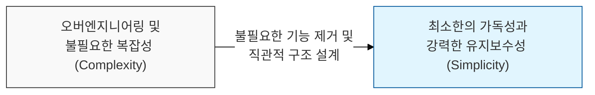
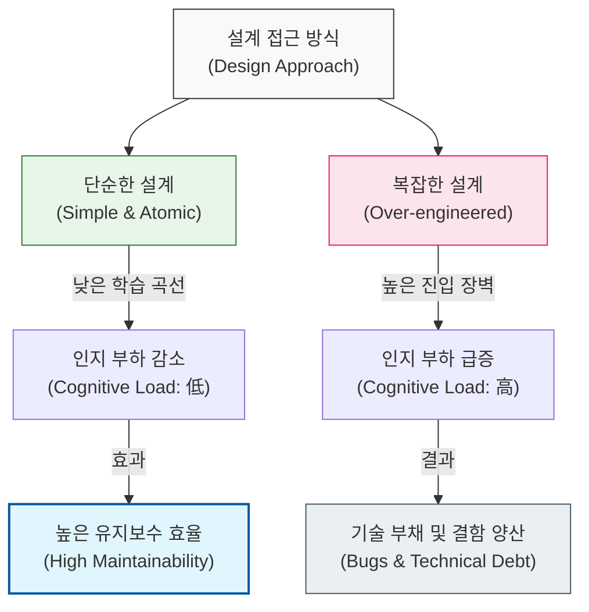

# 단순함이 복잡함을 이긴다, KISS 원칙

## I. 설계의 본질적 단순함, **KISS** 원칙 개요

**정의**: "단순하게 유지하라, 멍청아(Keep It Simple, Stupid)"의 약자로, 시스템 설계에서 불필요한 복잡성을 피하고 가능한 한 단순하게 유지해야 한다는 원칙  

**특징**:  
( **가독성 우선** ) 코드는 기계가 아닌 사람이 읽기 위해 작성되므로, 누구나 이해할 수 있는 명확한 구조를 지향함  
( **유지보수 용이성** ) 시스템이 단순할수록 버그 발생 확률이 낮아지고, 문제 발생 시 원인 파악과 수정이 빨라짐  
( **오버엔지니어링 경계** ) 미래에 발생할지 모르는 요구사항을 미리 대비하여 설계를 복잡하게 만드는 행위를 지양함  

## II. **KISS** 원칙의 메커니즘과 형상화

### 가. 설계 복잡도와 인지 부하의 상관관계 모델

### 나. **KISS** 원칙 실천을 위한 체크리스트
| **구분** | **점검 항목** | **실천 지침** |
| :--- | :--- | :--- |
| **기능 수준** | 이 기능이 정말 사용자에게 필요한가? | **MVP** 중심의 핵심 기능에 집중 |
| **코드 수준** | 표준 라이브러리로 해결 가능한가? | 검증된 내장 도구 및 외부 라이브러리 활용 |
| **아키텍처** | 시스템 계층이 너무 세분화되어 있지는 않은가? | 불필요한 추상화 레이어 통합 및 단순화 |
| **소통 수준** | 신입 개발자가 이 코드를 바로 이해할 수 있는가? | 직관적인 명명 규칙 및 명확한 로직 전개 |

## III. **KISS** 원칙의 전략적 가치: 복잡성 관리 전략

### 가. 단순성 유지를 위한 설계 전략 비교
| **전략** | **핵심 내용** | **KISS 원칙과의 연관성** |
| :--- | :--- | :--- |
| **YAGNI** | "정말 필요할 때까지 만들지 마라" | 미래의 복잡성을 현재로 끌어오지 않음 |
| **Occam's Razor** | "가장 단순한 가설/해결책이 정답일 확률이 높다" | 문제 해결의 최단 경로를 선택함 |
| **Separation of Concerns** | "관심사를 분리하여 개별 단위를 단순화하라" | 모듈별 복잡성을 격리하여 전체 단순성 확보 |

### 나. 개발 시 시사점
- **Smart is not Complex**: 진정으로 똑똑한 개발자는 복잡한 문제를 단순하게 풀 줄 아는 개발자임. 자신의 실력을 증명하기 위해 어려운 기술을 남용하는 것을 경계해야 함
- **Evolutionary Design**: 처음부터 완벽하고 거대한 시스템을 설계하려 하기보다, 작동하는 단순한 시스템에서 점진적으로 발전시켜 나가는 것이 유리함 (갈의 법칙과 연계)
