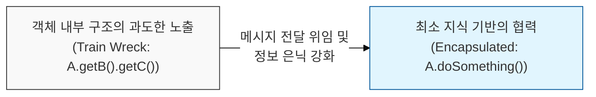
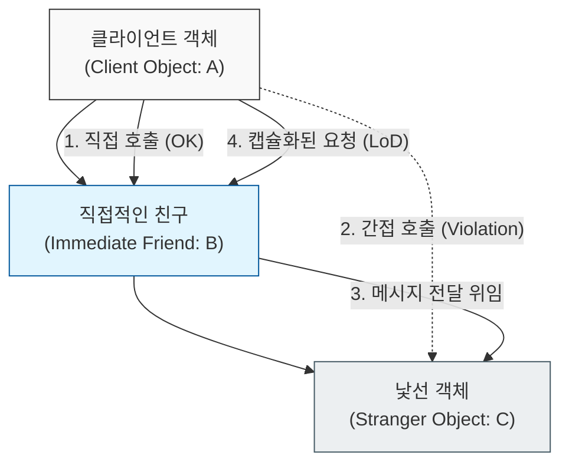

# 직접적인 친구하고만 대화하라, 디미터 법칙

## I. 객체 간의 거리 두기, **디미터** 법칙 개요

**정의**: 객체 지향 설계에서 객체는 자신이 협력하는 직접적인 객체의 내부 구조를 몰라야 하며, "최소 지식 원칙"(Principle of Least Knowledge)을 준수해야 한다는 법칙  

**특징**:  
( **느슨한 결합** ) 객체 간의 의존 범위를 최소화하여 특정 객체의 내부 구현 변경이 전체 시스템으로 확산되는 것을 방지함  
( **기차 충돌 방지** ) 여러 개의 도트(` . `)를 연결하여 멀리 있는 객체에 접근하는 '기차 충돌'(Train Wreck) 코드를 경계함  
( **위임의 미학** ) 객체에게 데이터를 물어보지 말고, 원하는 작업을 수행하도록 '명령'(Tell, Don't Ask)하는 설계를 지향함  

## II. **디미터** 법칙의 메커니즘과 형상화

### 가. 객체 탐색 제한 및 캡슐화 위임 모델

### 나. **디미터** 법칙에서 허용하는 4가지 통신 대상
| **대상 구분** | **상세 내용** | **예시** |
| :--- | :--- | :--- |
| **객체 자신** | 객체 내부의 메서드나 필드 접근 | `this.method()` |
| **매서드 인자** | 매개변수로 전달받은 객체와의 통신 | `function(Object arg) { arg.run() }` |
| **생성 객체** | 메서드 내부에서 직접 생성한 객체 | `new Object().action()` |
| **구성 요소** | 객체의 인스턴스 변수(필드)로 보유한 객체 | `this.component.execute()` |

## III. **디미터** 법칙 적용의 트레이드오프 및 대응 전략

### 가. 법칙 준수와 위임 메서드 폭증의 관계
| **비교 항목** | **디미터 법칙 위반** | **과도한 디미터 법칙 준수** |
| :--- | :--- | :--- |
| **가독성** | 도트 체이닝으로 인한 로직 파악 난해 | 위임 메서드(Wrapper)의 과도한 생성 |
| **응집도** | 클라이언트가 너무 많은 것을 앎 | 래퍼 객체 비대화로 인한 응집도 저하 |
| **해결 전략** | 적절한 인터페이스 추출 | 구조적 설계를 통한 도메인 모델 정립 |

### 나. 실무적 적용 시사점
- **Tell, Don't Ask**: 객체로부터 상태를 읽어와서 로직을 처리하지 말고, 객체에게 로직 처리를 맡기는 것이 디미터 법칙의 본질임
- **DTO vs Domain Model**: 자료 구조(Data Structure)인 **DTO**의 경우 내부 데이터를 노출하는 것이 본연의 목적이므로, 디미터 법칙을 강격하게 적용할 필요가 없음
