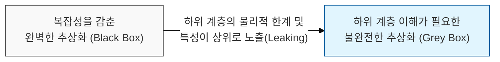
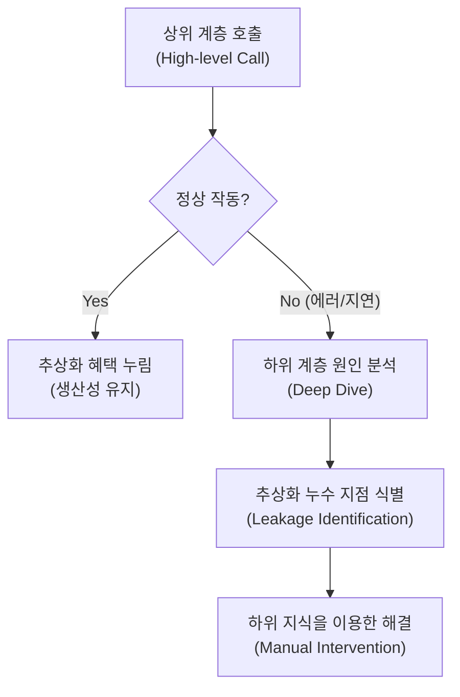

# 완벽한 추상화는 존재하지 않는다, 누수 추상화의 법칙 (The Law of Leaky Abstractions)

## I. 추상화 계층의 불완전성과 하위 계층 노출, 누수 추상화의 법칙 개요

**정의** : "모든 의미 있는 추상화는 어느 정도 누수( **Leaky** )된다"는 원칙으로, 조엘 스폴스키( **Joel Spolsky** )가 제안한 소프트웨어 복잡성 관리에 대한 핵심 통찰  

**핵심 특징 및 시사점** :  
( **복잡성 은닉의 한계** ) 추상화는 복잡한 내부 동작을 감춰 생산성을 높여주지만, 특정 상황(에러, 성능 저하 등)에서는 하위 계층의 문제가 상위로 드러남  
( **학습의 필연성** ) 고수준 도구나 라이브러리를 사용하더라도, 문제가 발생했을 때 이를 해결하기 위해서는 하위 계층( **Low-level** )의 동작 원리를 알아야 함  
( **생산성 역설** ) 추상화 계층이 늘어날수록 개발 속도는 빨라지지만, 시스템이 오동작할 때 원인 분석에 필요한 지식의 양은 오히려 늘어남  
( **성능 및 신뢰성 결함** ) 추상화에 가려진 하위 계층의 물리적 특성(네트워크 지연, 메모리 한계 등)을 무시할 경우 예측 불가능한 시스템 장애 발생 가능  

---

## II. 누수 추상화의 주요 사례 및 메커니즘

### 가. 기술 계층별 추상화 누수 사례

| 계층 분야 | 추상화 도구 (Abstraction) | 누수 현상 (Leakage) | 원인 및 영향 |
|:---:|-------------------------|-------------------|------------|
| **네트워크** | **TCP/IP** (신뢰성 있는 통신) | 네트워크 단절, 패킷 손실, 지연 | 물리적 케이블/인프라 한계 노출 |
| **데이터베이스** | **SQL** (선언적 데이터 조회) | 쿼리 성능 저하 ( **Full Scan** ) | 내부 인덱싱/디스크 I/O 구조 노출 |
| **파일 시스템** | 파일 입출력 (가상화된 공간) | 디스크 용량 부족, 쓰기 지연 | 물리적 저장 장치 속성 노출 |
| **프로그래밍** | 가비지 컬렉션 ( **GC** ) | 메모리 부족, **Stop-the-world** | 물리적 메모리 관리 한계 노출 |

### 나. 추상화 누수에 따른 문제 해결 프로세스

---

## III. 누수 추상화의 법칙과 보안 및 아키텍처 전략

### 가. 추상화 기반 보안 모델의 취약점 (Security Leakage)

| 보안 분야 | 추상화된 보안 모델 | 누수 발생 시 위협 (Security Leak) |
|:---:|-------------------|--------------------------------|
| **인증/인가** | 프레임워크 기반 인증 처리 | 우회 공격 ( **Bypass** ), 설정 오류 노출 |
| **암호화** | 암호화 라이브러리 ( **AES** 등) | 부채널 공격 ( **Side-channel** ), 성능 병목 |
| **클라우드** | 서버리스( **Serverless** ) 인프라 | 하위 테넌트 간 자원 간섭, 은닉 통신 |
| **API** | **REST API** 추상화 | 내부 데이터 구조 노출 ( **BOLA** 취약점) |

### 나. 실무적 대응 및 관리 전략
- **기초 교육 강화** : 고수준 프레임워크를 사용하더라도 네트워크, OS, 알고리즘 등 컴퓨터 과학의 기초 지식을 병행 학습하여 대응 역량 확보
- **방어적 추상화 설계** : 하위 계층의 예외 상황이 발생할 것을 전제로 에러 핸들링과 서킷 브레이커( **Circuit Breaker** ) 등을 적용
- **관측 가능성(Observability) 확보** : 추상화 계층 아래에서 어떤 일이 벌어지는지 실시간 모니터링하여 누수 발생 시 즉각 대응 체계 마련

> **핵심** : **누수 추상화의 법칙**은 우리에게 "편리함에 매몰되지 말라"고 경고하며, 시스템의 진정한 주인은 **추상화 아래의 진실**을 볼 줄 아는 엔지니어임을 상기시킴
