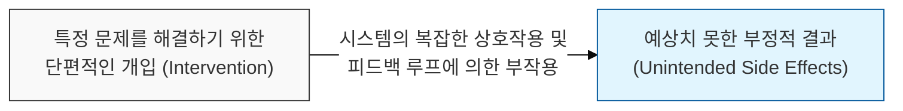
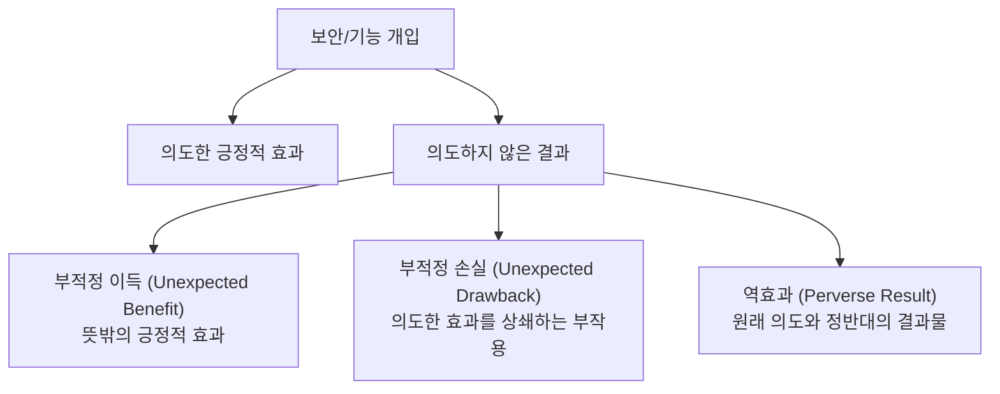

# 해결책이 만드는 새로운 문제, 의도하지 않은 결과의 법칙 (Law of Unintended Consequences)

## I. 복잡한 시스템의 예측 불가능한 연쇄 반응, 의도하지 않은 결과의 법칙 개요

**정의** : 사회, 경제 또는 기술적 시스템에 대한 특정 개입이 원래 의도했던 목표 외에 예상하지 못한 부수적인 결과를 초래하게 된다는 원칙  

**핵심 특징 및 발생 원인** :  
( **상호 의존성** ) 시스템 구성 요소들이 복잡하게 얽혀 있어, 한 곳의 변경이 전혀 관련 없는 곳에 영향을 미침  
( **지연된 피드백** ) 개입의 효과가 즉각적이지 않고 시간이 지난 후에 나타나 원인 파악과 대응을 어렵게 함  
( **인간의 적응 행위** ) 보안 통제가 강화되면 사용자는 편리함을 위해 이를 우회하는 새로운 위험 행동( **Shadow IT** 등)을 수행  
( **선형적 사고의 한계** ) 복잡한 비선형 시스템을 단순한 인과관계로 파악하여 대처할 때 발생하는 필연적 산물  

---

## II. 소프트웨어 및 보안 분야의 의도하지 않은 결과 사례

### 가. 보안 및 개발 단계의 주요 사례 분석

| 개입 행위 (Action) | 의도한 결과 (Intended) | 의도하지 않은 결과 (Unintended) | 원인 분석 |
|:---:|----------------------|-------------------------------|----------|
| **복잡한 암호 정책** | 계정 보안 강화 | 비밀번호를 포스트잇에 적어 모니터에 부착 | 사용자의 인지적 한계 및 편의성 추구 |
| **보안 패치 강제** | 취약점 즉시 제거 | 패치로 인한 시스템 호환성 문제 및 가용성 중단 | 소프트웨어 간의 복잡한 의존성 누락 |
| **엄격한 내부망 분리** | 외부 침투 원천 차단 | 업무 효율 저하로 인한 비인가 테더링/USB 사용 | 폐쇄적 환경에 대한 사용자의 우회 시도 |
| **코드 리팩토링** | 가독성 및 성능 향상 | 숨겨져 있던 암묵적 의존성 파괴로 인한 버그 발생 | **하이럼의 법칙(Hyrum's Law)** 작용 |

### 나. 시스템적 부작용의 유형

---

## III. 의도하지 않은 결과의 최소화를 위한 대응 전략

### 가. 분석 프레임워크 기반의 접근법 비교

| 전략 항목 | 상세 내용 | 보안 및 안정성 가치 |
|:---:|----------|------------------|
| **시스템 사고 (Systems Thinking)** | 개별 요소가 아닌 전체 시스템의 관계망 관점에서 변경 영향 분석 | 전체론적( **Holistic** ) 보안 가시성 확보 |
| **위협 모델링 (Threat Modeling)** | 변경 도입 전 발생 가능한 오남용 시나리오 선제적 도출 | 잠재적 보안 누수 지점 사전 차단 |
| **단계적 롤아웃 (Canary)** | 소규모 그룹에 먼저 적용하여 부작용을 모니터링 후 확대 | 장애 영향 범위( **Blast Radius** ) 최소화 |
| **관측 가능성 (Observability)** | 변경 후 시스템의 모든 지표를 실시간 측정 및 분석 | 부작용의 조기 탐지 및 신속한 롤백 |

### 나. 실무적 제언: 보안 관리자의 자세
- **인간 중심의 보안 설계** : 보안 통제가 사용자의 업무 흐름을 방해하지 않는지 확인하고, 우회 욕구를 줄이는 **사용자 경험(UX)** 고려
- **심층 방어와 가용성 조화** : 보안 강화가 시스템 가용성을 해치지 않도록 이중화 및 장애 복구 시나리오를 반드시 병행 검증
- **지속적 학습 및 피드백** : 발생한 의도하지 않은 결과를 기록( **Post-mortem** )하고, 이를 다음 설계의 위협 인텔리전스로 활용

> **핵심** : **의도하지 않은 결과의 법칙**은 시스템 설계자에게 **겸손함**을 요구하며, 완벽한 통제보다 **유연한 대응과 지속적 관찰**이 더 중요함을 시사함
