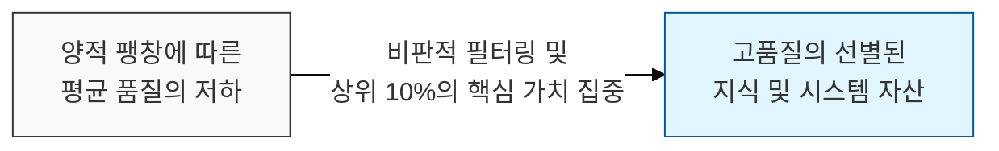
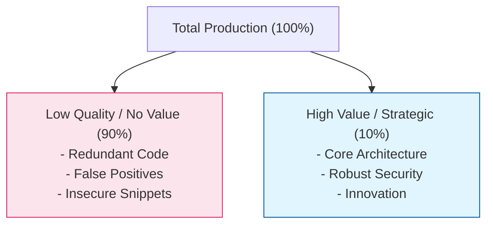

# 품질에 대한 냉철한 통찰, 스터전의 법칙 (Sturgeon's Law)

## I. 절대 다수의 평범함과 소수의 탁월함, 스터전의 법칙 개요

**정의** : "어떤 분야든 그 결과물의 90%는 쓰레기(Ninety percent of everything is crap)이다"라는 냉소적이면서도 현실적인 통찰을 담은 원칙  

**핵심 특징 및 시사점** :  
( **양적 팽창의 결과** ) 정보나 소프트웨어가 폭발적으로 생산되는 환경에서 대다수의 결과물은 낮은 품질을 가질 수밖에 없음을 시사  
( **희소한 고품질** ) 진정으로 가치 있는 상위 10%를 선별해내는 능력이 전문가와 일반인을 가르는 핵심 역량이 됨  
( **비판적 사고 촉구** ) "공개된 것이니 믿을 수 있다"거나 "최신 기술이니 좋다"는 맹신을 버리고, 결과물의 본질을 파악하라는 경고  
( **시어도어 스터전의 답변** ) SF 작가 시어도어 스터전( **Theodore Sturgeon** )이 SF 장르의 질 저하 비판에 대해 "모든 분야가 마찬가지다"라고 반박하며 제안  

---

## II. 스터전의 법칙이 적용되는 소프트웨어 및 보안 영역

### 가. 기술 자산의 품질 분포 모델

### 나. 보안 및 개발 분야의 구체적 사례

| 적용 분야 | 90%의 쓰레기 (Low Quality) | 10%의 핵심 가치 (High Value) |
|:---:|---------------------------|---------------------------|
| **보안 위협 탐지** | 수만 건의 단순 경고 및 오탐( **FP** ) | 실제 침해 사고로 이어지는 유의미한 이상 징후 |
| **오픈소스 (SCA)** | 취약하거나 관리가 안 되는 수많은 라이브러리 | 검증되고 안정적인 표준 프레임워크 |
| **AI 생성 코드** | 문법은 맞으나 보안성이 결여된 코드 조각 | 로직의 무결성이 보장된 최적화된 아키텍처 |
| **데이터 분석** | 의미 없는 중복 데이터( **Redundant Data** ) | 인사이트를 제공하는 고품질 데이터 세트 |

---

## III. 스터전의 법칙을 활용한 보안 거버넌스 강화 전략

### 가. 노이즈 제거와 통찰 확보 전략 비교

| 전략 항목 | 상세 내용 | 기대 효과 |
|:---:|----------|----------|
| **필터링 자동화** | **AI/ML** 기반의 오탐 제거 및 우선순위화 | 보안 분석가의 업무 부하( **Burnout** ) 방지 |
| **표준화 (Curation)** | 승인된 고품질 라이브러리/패턴만 사용하도록 강제 | 시스템 전반의 보안 상향 평준화 |
| **비판적 코드 리뷰** | "작동하니까 통과"가 아닌 "최적인가"를 질문 | 잠재적 기술 부채 및 취약점 선제적 제거 |
| **핵심 자산 집중** | 90%의 비중요 자산보다 10%의 핵심 자산 보호 | 보안 투자 대비 성과( **ROI** ) 극대화 |

### 나. 실무적 제언: 고품질 중심의 엔지니어링 문화
- **가시성 확보** : 우리 시스템의 코드와 로그 중 '가치 없는 90%'가 무엇인지 식별하고 과감히 정리( **Cleanup** )할 것
- **전문성 존중** : 방대한 정보 속에서 상위 10%의 정수를 뽑아낼 수 있는 숙련된 엔지니어의 통찰력을 보안 의사결정의 핵심으로 삼을 것
- **품질 지향적 태도** : 단순히 '완성'하는 것에 만족하지 말고, 스터전의 법칙을 상기하며 결과물을 끊임없이 다듬어 상위 10%로 끌어올리는 노력을 경주할 것

> **핵심** : **스터전의 법칙**은 우리가 맞닥뜨리는 수많은 정보와 기술 중 진정으로 가치 있는 것은 **극소수**임을 상기시키며, 이를 선별하고 가꾸는 노력이 **보안 성숙도**의 본질임을 가르쳐줌
