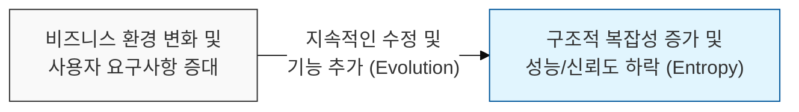
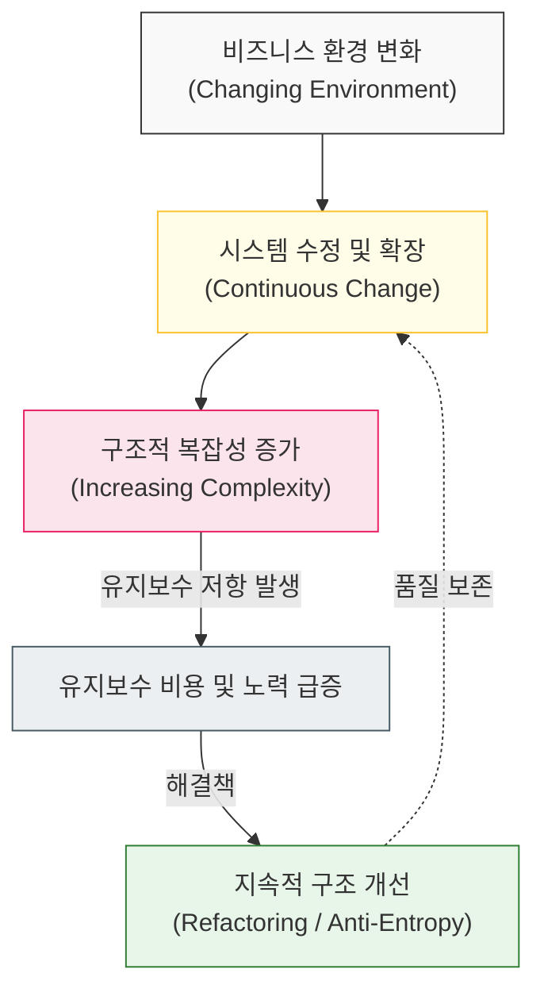

# 소프트웨어는 끊임없이 진화하거나 도태된다, Lehman의 진화 법칙

## I. 시스템 진화의 불가피성, **Lehman**의 법칙 개요

**정의**: 소프트웨어 시스템은 배포된 이후에도 환경의 변화에 맞춰 지속적으로 수정되어야 하며, 이 과정에서 복잡성이 증가하고 품질이 저하된다는 소프트웨어 유지보수의 원칙  

**특징**:  
( **지속적 변화** ) 실제 환경에서 사용되는 소프트웨어는 유용성을 유지하기 위해 끊임없이 변화해야 함  
( **엔트로피 증가** ) 수정이 반복될수록 시스템의 내부 구조는 초기 설계와 멀어지며 무질서(복잡성)가 증가함  
( **자기 조절** ) 시스템의 진화 속도는 조직의 역량과 아키텍처의 한계에 의해 스스로 조절되는 경향을 보임  

## II. 소프트웨어 진화의 8가지 법칙과 메커니즘

### 가. 지속적 변화와 복잡성 증가의 역학 구조 모델

### 나. **Lehman**의 소프트웨어 진화 주요 법칙
| **법칙 명칭** | **핵심 내용** | **공학적 시사점** |
| :--- | :--- | :--- |
| **1. 지속적 변화** | 유용한 시스템은 계속 변화해야 함 | 변화를 거부하는 설계는 도태됨 |
| **2. 복잡성 증가** | 변화할수록 구조적 복잡성은 증가함 | 지속적인 리팩토링 투자가 필수적임 |
| **3. 자기 조절** | 진화 프로세스는 스스로 제약됨 | 일방적인 인력 투입은 한계가 있음 (**Brooks** 연계) |
| **4. 조직적 안정성** | 개발 활동의 생산성은 일정하게 유지됨 | 급격한 속도 향상은 품질 저하를 초래함 |
| **5. 친숙성 보존** | 변경되는 양은 점진적으로 일정해야 함 | 과도한 대규모 변경은 리스크를 폭증시킴 |
| **6. 지속적 성장** | 기능적 역량은 지속적으로 확대되어야 함 | 정체된 소프트웨어는 가치를 상실함 |

## III. 소프트웨어 진화 관리를 위한 전략적 대응

### 가. 기술 부채 및 구조적 노후화 방지 전략
| **전략** | **상세 내용** | **기대 효과** |
| :--- | :--- | :--- |
| **Anti-Entropy Work** | 기능 추가 없이 구조적 개선만을 위한 작업 수행 | 복잡성 증가 속도 제어 및 가독성 확보 |
| **Modularization** | 영향 범위를 최소화하는 독립적 모듈 설계 | 변경의 파급 효과 차단 및 확장성 강화 |
| **Automated Regression** | 진화 과정에서 발생하는 결함의 즉각적 식별 | 시스템의 기능적 신뢰성 및 친숙성 유지 |

### 나. 개발 및 관리 시 시사점
- **Evolutionary Architecture**: 소프트웨어는 고정된 건축물이 아닌 살아있는 유기체와 같음. 변화를 수용할 수 있는 유연한 아키텍처 설계가 생존의 핵심임
- **Refactoring is not Optional**: 리팩토링은 선택이 아닌 진화를 위한 필수 비용임. 이를 게을리할 경우 **Lehman**의 법칙에 따라 시스템은 결국 붕괴함
- **Software Aging Awareness**: 모든 시스템은 늙어가며 노후화됨. 정기적인 건강 검진(코드 리뷰, 성능 측정)을 통해 기술 부채를 상시 관리해야 함
