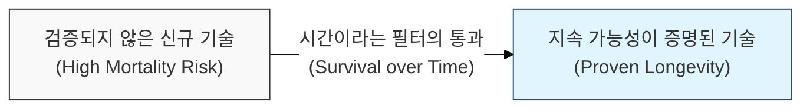
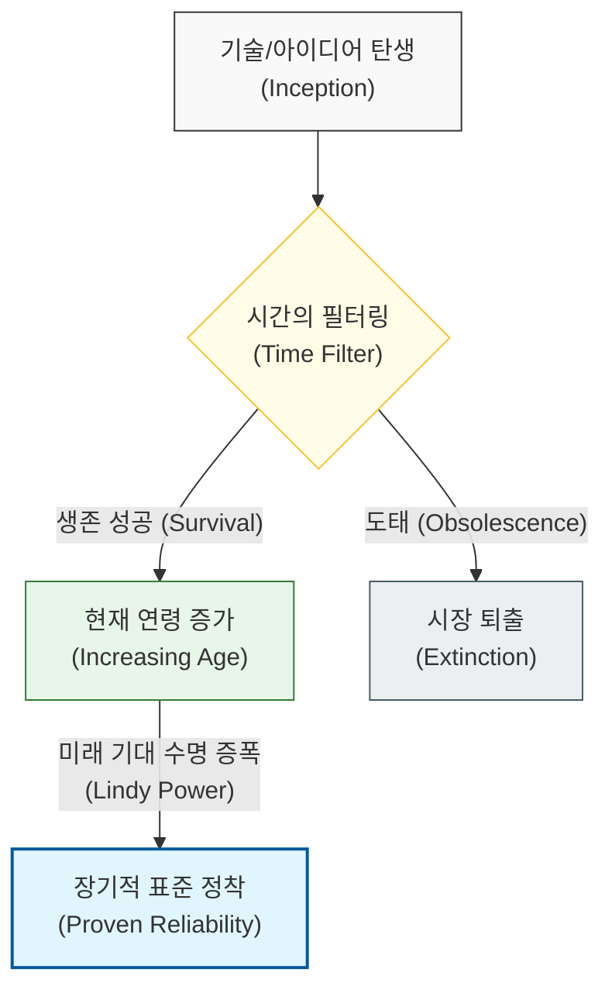

# 시간이 증명한 가치의 생존 법칙, Lindy 효과

## I. 비소모적 자산의 수명 역설, **Lindy** 효과 개요

**정의**: 정보, 아이디어, 기술과 같이 썩지 않는 비소모성 자산의 미래 기대 수명은 현재까지 살아남은 기간에 비례한다는 생존 법칙  

**특징**:  
( **시간의 필터** ) 오래된 기술일수록 수많은 위기와 변화 속에서 그 유용성과 견고함이 증명되었음을 의미함  
( **비소모성** ) 음식이나 생물과 달리, 지식과 소프트웨어는 소모되지 않으며 사용될수록 오히려 생태계가 공고해짐  
( **기대 수명의 비례** ) 오늘 **10**년 된 기술은 앞으로 **10**년 더 쓰일 확률이 높고, 이제 막 나온 기술은 사라질 리스크가 큼  

## II. **Lindy** 효과의 작동 메커니즘과 형상화

### 가. 시간 경과에 따른 생존 신뢰도 축적 모델

### 나. 소프트웨어 공학에서의 **Lindy** 효과 적용 사례
| **구분** | **Lindy 기술 (Survivor)** | **특징 및 생존 이유** |
| :--- | :--- | :--- |
| **언어** | **C**, **SQL**, **Java** | 수십 년간 엔터프라이즈 환경에서 검증된 안정성 |
| **데이터베이스** | **RDBMS** (**PostgreSQL**, **MySQL**) | 데이터 정관성 및 신뢰도에 대한 압도적 레퍼런스 |
| **도구** | **Vim**, **Git**, **Shell Script** | 단순하면서도 본질적인 기능을 제공하여 대체 불가능 |
| **아키텍처** | **Client-Server**, **Layered** | 복잡한 변화 속에서도 변하지 않는 설계 원칙 |

## III. **Lindy** 효과를 활용한 기술 선정 전략

### 가. 최신 기술과 검증된 기술의 전략적 배분
| **비교 항목** | **신규 기술 (Cutting-edge)** | **Lindy 기술 (Boring Tech)** |
| :--- | :--- | :--- |
| **핵심 가치** | 고속 성장 및 일시적 효율성 | 장기 안정성 및 유지보수 용이성 |
| **리스크** | 기술 중단 및 커뮤니티 소멸 위험 | 레거시화 및 인력 수급의 어려움 |
| **권장 비중** | 혁신이 필요한 실험적 기능 (**20**%) | 핵심 비즈니스 로직 및 인프라 (**80**%) |

### 나. 개발 시 시사점
- **Choose Boring Technology**: "지루한 기술"이 가장 안전한 선택일 때가 많음. 생태계가 이미 성숙한 기술은 문제 해결을 위한 자료와 도구가 풍부함
- **Beware of Fashion**: 유행하는 기술은 하이프 사이클의 정점에서 사라질 확률이 높음. 린디 효과를 고려하여 기술의 '근본'이 무엇인지 파악해야 함
- **Architecture over Tools**: 특정 도구의 수명보다 아키텍처 원칙의 수명이 훨씬 김. 도구에 종속되기보다 원칙 중심의 설계를 지향해야 함 (**SOLID**, **KISS** 연계)
