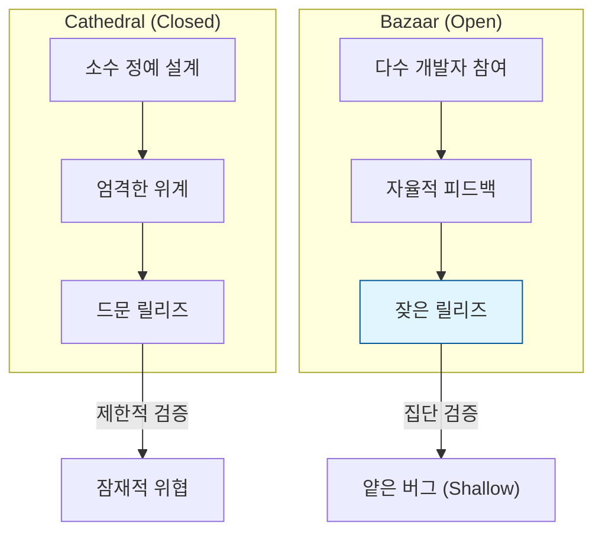

# 집단 지성을 통한 보안 강화, 리누스의 법칙 (Linus's Law)

## I. 다수의 눈이 보장하는 코드의 투명성, 리누스의 법칙 개요

**정의** : "충분히 많은 눈(Eyeballs)만 있다면, 모든 버그는 표면 위로 드러나기 마련이다(Given enough eyeballs, all bugs are shallow)"는 원칙으로, 오픈 소스 소프트웨어의 보안성과 품질 우위를 설명하는 핵심 법칙  

**핵심 특징 및 시사점** :  
( **오픈 소스의 철학** ) 에릭 레이먼드( **Eric S. Raymond** )가 자신의 저서 《성당과 시장》에서 리누스 토발즈( **Linus Torvalds** )의 개발 방식을 요약하며 제안  
( **병렬적 디버깅** ) 전 세계의 수많은 개발자가 동시에 코드를 검토함으로써, 특정 개인이나 소수 팀이 발견하지 못한 난해한 결함도 신속히 식별 가능  
( **투명성 기반 보안** ) 소스 코드를 숨기는 '은닉을 통한 보안( **Security by Obscurity** )'보다 공개를 통한 검증이 장기적으로 더 강력한 보안을 구축함  
( **공격자보다 빠른 패치** ) 다수의 선량한 기여자가 공격자보다 먼저 취약점을 발견하고 수정할 확률이 높다는 전제에 기반  

---

## II. 리누스의 법칙 작동 메커니즘과 한계점

### 가. 커뮤니케이션 및 리뷰 모델: 성당 vs. 시장

### 나. 리누스의 법칙이 직면한 현실적 한계 (The Paradox)

단순히 소스 코드를 공개한다고 해서 자동으로 보안이 강화되는 것은 아니며, 다음과 같은 조건이 필요합니다.

| 한계 요인 | 상세 내용 | 보안적 영향 |
|:---:|----------|----------|
| **검토자의 부재** | 코드는 공개되어 있으나 실제 중요 로직을 검토하는 전문가가 부족함 | **Heartbleed**, **Log4j** 사태의 근본 원인 |
| **복잡성 증가** | 하이럼의 법칙( **Hyrum's Law** ) 등으로 인해 시스템이 비대해져 분석 난해 | 소수의 기여자만 이해하는 암묵적 코드 발생 |
| **방관자 효과** | "누군가 보겠지"라는 생각으로 아무도 심층 검토를 수행하지 않음 | 치명적 결함이 수년간 방치될 위험 |

---

## III. 리누스의 법칙을 보완하는 현대적 오픈 소스 보안 전략

### 가. 폐쇄형(Closed) vs. 개방형(Open) 보안 모델 비교

| 비교 항목 | 은닉을 통한 보안 (Closed) | 리누스의 법칙 (Open) |
|:---:|-------------------------|-------------------|
| **철학** | "알지 못하면 공격할 수 없다" | "모두 알면 더 빨리 고칠 수 있다" |
| **신뢰 기반** | 조직 내 소수 전문가 신뢰 | 전 세계 커뮤니티의 집단 지성 신뢰 |
| **패치 속도** | 조직 내 일정 및 자원에 종속 | 발견 즉시 전 세계 동시 대응 가능 |
| **대표 사례** | 상용 소프트웨어 (Windows 등) | 리눅스 커널, 아파치, 쿠버네티스 |

### 나. 실무적 적용 및 발전 방향
- **공급망 보안 (SCA) 강화** : 리누스의 법칙이 항상 작동하지 않음을 인정하고, 사용하는 오픈 소스 라이브러리에 대해 정기적인 취약점 스캔( **Snyk**, **Trivy** ) 수행
- **현상금 제도 (Bug Bounty)** : '충분히 많은 눈'이 내 코드에 머물게 하기 위해 금전적 보상을 제공하여 공격자보다 먼저 취약점 수집
- **재단 중심의 관리** : **Linux Foundation**, **Cloud Native Computing Foundation (CNCF)** 등 공신력 있는 기관을 통해 핵심 코드에 대한 체계적인 보안 리뷰 지원

> **핵심** : **리누스의 법칙**은 오픈 소스의 강력한 잠재력을 대변하지만, 진정한 보안은 소스 공개 그 자체가 아니라 **활발한 커뮤니티의 관심과 체계적인 검증 노력**이 병행될 때 완성됨
