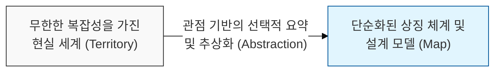
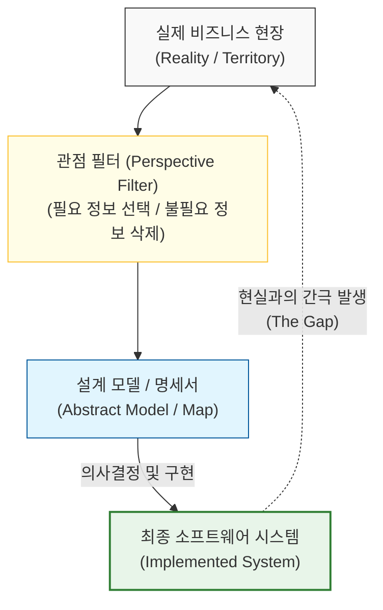

# 모델은 현실의 단순화된 요약일 뿐이다, 지도는 영토가 아니다

## I. 추상화의 본질적 한계, 지도는 영토가 아니다 개요

**정의**: "지도는 영토가 아니다"(The Map Is Not the Territory)는 알프레드 코르지브스키(**Alfred Korzybski**)가 제안한 원칙으로, 사물에 대한 우리의 추상적 모델이나 상징이 실제 사물 그 자체와는 다르다는 인식의 원리  

**특징**:  
( **추상화의 숙명** ) 모델(지도)은 유용성을 위해 반드시 현실(영토)의 정보를 누락하고 단순화해야만 함  
( **관점의 주관성** ) 어떤 지도를 만드느냐는 제작자의 의도와 관점에 따라 달라지며, 완벽한 중립적 모델은 존재하지 않음  
( **모델의 노후화** ) 현실 세계는 끊임없이 변화하지만, 한 번 고정된 모델은 현실의 변화를 즉각적으로 반영하기 어려움  

## II. 추상화 필터링과 현실-모델 간의 괴리 메커니즘

### 가. 현실 데이터의 모델 변환 및 정보 손실 구조 모델

### 나. 소프트웨어 공학에서의 '지도'와 '영토' 사례
| **구분** | **지도 (The Map / Abstraction)** | **영토 (The Territory / Reality)** |
| :--- | :--- | :--- |
| **요구사항** | 기획서, 사용자 스토리, **UML** 도식 | 사용자의 실제 문제와 숨겨진 니즈 |
| **아키텍처** | 아키텍처 다이어그램, 클래스 구조도 | 런타임에서 발생하는 실제 데이터 흐름 |
| **품질** | 테스트 케이스 커버리지 수치 | 운영 환경에서 발생하는 실제 사용자 경험 |
| **진척도** | 간트 차트, 번다운 차트 수치 | 팀원들의 실제 업무 부하와 기술적 난관 |

## III. '지도는 영토가 아니다' 원칙의 전략적 활용

### 가. 모델의 유효성 유지를 위한 대응 전략
| **전략** | **상세 내용** | **기대 효과** |
| :--- | :--- | :--- |
| **Iterative Refinement** | 현실의 피드백을 받아 지도를 지속적으로 갱신 | 모델과 현실 간의 간극 최소화 |
| **Context Awareness** | 모델이 생략한 맥락(**Context**)을 별도로 관리 | 추상화에 가려진 핵심 리스크 조기 식별 |
| **Multi-dimensional View** | 하나의 지도가 아닌 다각도의 관점(View) 활용 | 특정 모델의 편향성 보완 및 입체적 이해 |

### 나. 개발 시 시사점
- **Abstractions Leak**: 모든 추상화는 결국 내부 구현을 노출하게 됨(**누수 추상화의 법칙** 연계). 모델이 현실을 완벽하게 감출 수 없음을 인정해야 함
- **Documentation is not Code**: 문서는 코드를 설명하는 지도일 뿐임. 실제 작동하는 소프트웨어(영토)만이 진실을 말해줌을 명심해야 함
- **Beware of Dogmatism**: 모델(지도)에만 집착하여 현실(영토)의 신호를 무시하는 '모델의 함정'을 경계해야 함
