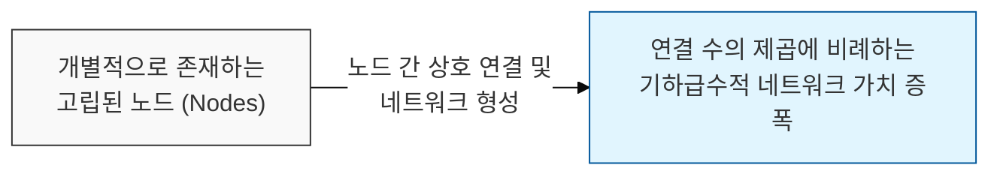
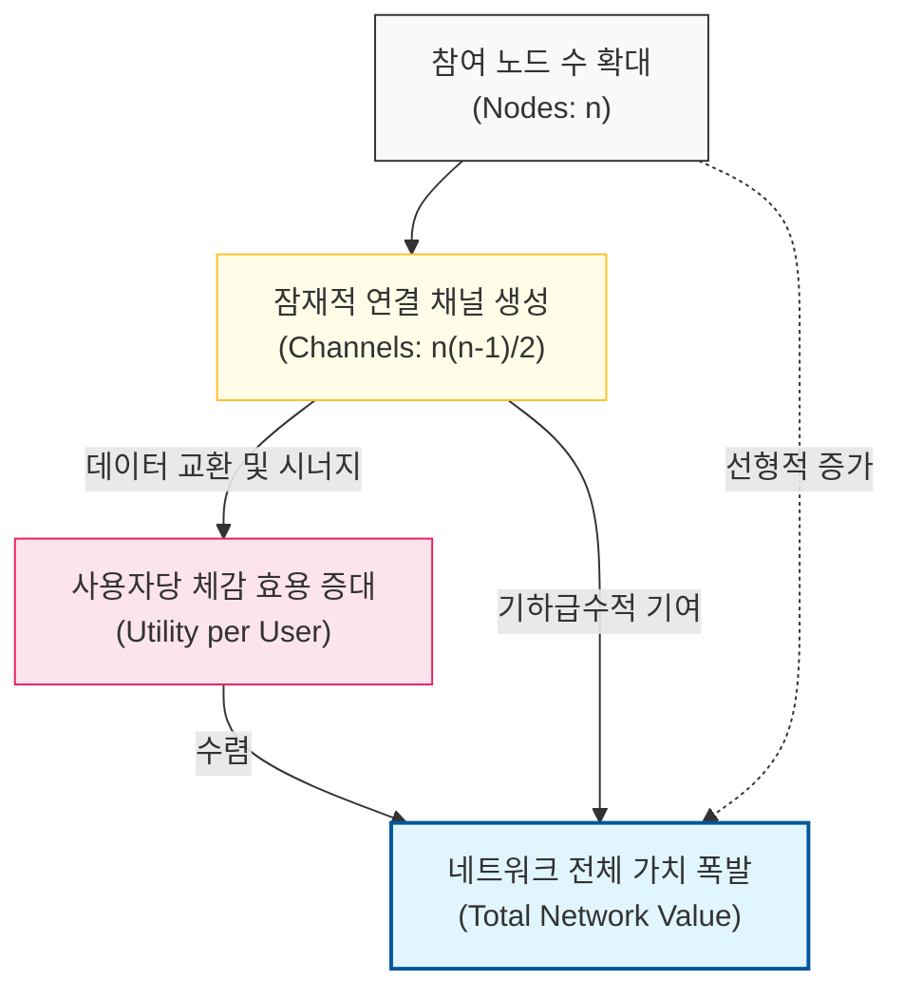

# 네트워크의 가치는 연결의 제곱에 비례한다, Metcalfe의 법칙

## I. 연결의 경제학, **Metcalfe**의 법칙 개요

**정의**: 네트워크의 가치는 해당 네트워크에 연결된 사용자(노드) 수의 제곱에 비례하며, 연결이 늘어날수록 가치가 폭발적으로 증가한다는 법칙  

**특징**:  
( **네트워크 효과** ) 사용자가 많아질수록 기존 사용자가 얻는 효용이 커지는 선순환 구조를 형성함  
( **비선형적 성장** ) 노드 수의 증가는 선형적이지만, 그로 인한 가치는 `n(n-1)/2`의 채널 수에 따라 기하급수적으로 성장함  
( **임계 질량** ) 특정 규모(**Critical Mass**)를 넘어서는 순간 가치가 비용을 압도하며 시장 지배력을 확보함  

## II. **Metcalfe**의 법칙의 메커니즘과 형상화

### 가. 연결 수 증폭에 따른 네트워크 가치 구조 모델

### 나. 노드 수(n)에 따른 연결 채널 및 가치의 변화
| **노드 수 (n)** | **연결 채널 수** | **가치 성장 추이** | **시사점** |
| :--- | :--- | :--- | :--- |
| **2** | **1** | 매우 낮음 | 네트워크로서의 효용 미미 |
| **5** | **10** | 완만한 상승 | 소규모 그룹 내 협업 가치 형성 |
| **12** | **66** | 가속 구간 | 본격적인 네트워크 효과 발생 |
| **100** | **4,950** | 폭발적 성장 | 시장 지배적 플랫폼 지위 확보 가능 |

## III. 소프트웨어 산업에서의 **Metcalfe**의 법칙 활용 전략

### 가. 플랫폼 및 생태계 확장 전략
| **전략** | **상세 내용** | **기대 효과** |
| :--- | :--- | :--- |
| **Open API 제공** | 외부 서비스와의 연결 접점을 극대화하여 노드 확장 | 자사 플랫폼 중심의 거대 생태계 구축 |
| **Interoperability** | 서로 다른 시스템 간의 호환성 및 연동 강화 | 네트워크 간 연결을 통한 통합 가치 창출 |
| **User Acquisition** | 초기 손실을 감수하더라도 임계 질량 달성 집중 | 선점 효과를 통한 강력한 전환 비용(**Lock-in**) 형성 |

### 나. 개발 및 아키텍처 시사점
- **Microservices Complexity**: 서비스(Node)가 늘어날수록 관리해야 할 접점(Channel)이 제곱으로 늘어나므로, 서비스 메시(**Service Mesh**)와 같은 정교한 거버넌스 체계가 필수적임
- **Data Value**: 데이터 또한 서로 연결되고 결합될 때 메칼프의 법칙에 따라 그 가치가 기하급수적으로 커짐을 인지해야 함
