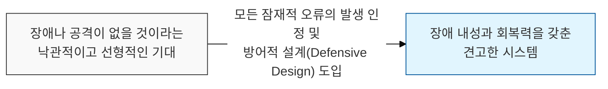
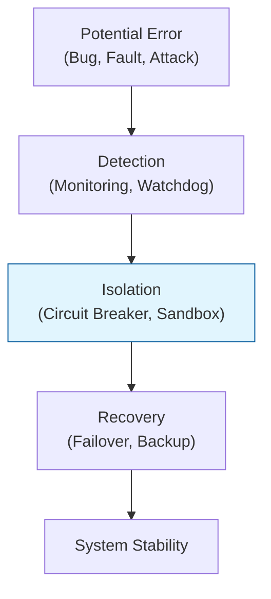

# 일어날 수 있는 일은 반드시 일어난다, 머피의 법칙 (Murphy's Law)

## I. 실패를 대비하는 방어적 태도, 머피의 법칙의 개요

**정의** : "잘못될 가능성이 있는 일은 결국 잘못된다(Anything that can go wrong will go wrong)"는 원칙으로, 시스템 설계 시 발생 가능한 모든 오류 상황을 사전에 고려해야 함을 강조  

**핵심 특징 및 시사점** :  
( **장애의 필연성** ) 아무리 낮은 확률의 오류라도 충분한 시간이 흐르면 반드시 발생하며, 특히 가장 좋지 않은 시점에 발생함  
( **방어적 설계 촉구** ) 인간의 실수( **Human Error** )나 하드웨어 고장을 예외가 아닌 상수로 취급하여 시스템을 구축해야 함  
( **보안 사고의 상설화** ) "침해를 완전히 막을 수 있다"는 환상을 버리고, 침해 발생을 전제로 한 탐지 및 대응 체계 수립의 근거가 됨  
( **신뢰성 보장** ) 최악의 시나리오를 대비함으로써 시스템의 가용성과 회복 탄력성( **Resilience** )을 극대화  

---

## II. 머피의 법칙 대응을 위한 기술적 메커니즘

### 가. 오류 발생 및 전파 억제 모델

### 나. 머피의 법칙에 기반한 보안 및 운영 전략

| 전략 항목 | 상세 내용 | 기대 효과 |
|:---:|----------|----------|
| **심층 방어** | 단일 보안 장비에 의존하지 않고 다층적 방어벽 구축 | 특정 지점 실패 시 전체 시스템 붕괴 방지 |
| **장애 조치(Failover)** | 주 시스템 장애 시 예비 시스템으로 즉시 전환 | 서비스 가동성( **Uptime** ) 유지 |
| **오류 격리** | 마이크로서비스( **MSA** ) 등을 통해 오류의 영향 범위 제한 | 전체 시스템으로의 장애 전이 차단 |
| **카오스 엔지니어링** | 의도적으로 시스템에 장애를 주입하여 복구 능력 검증 | 실제 사고 발생 시의 대응 숙련도 향상 |

---

## III. 머피의 법칙과 보안 관리의 접점

### 가. 보안 설계 시 '최악의 시나리오' 고려 사항

| 보안 분야 | 머피의 법칙이 적용된 최악의 상황 | 대응 기술 및 전략 |
|:---:|-------------------------------|------------------|
| **인증** | 최고 관리자 계정 탈취 | **MFA**, 조건부 액세스, 행위 기반 탐지 |
| **네트워크** | 외부 경계 방화벽 무력화 | **Zero Trust**, 마이크로 세그멘테이션 |
| **데이터** | 암호화 키 유출 | **HSM**, 키 순환( **Key Rotation** ), 다중 서명 |
| **백업** | 메인 시스템과 백업이 동시 파괴 | 소산 백업, 에어갭( **Air-gap** ), 불변 스토리지 |

### 나. 실무적 적용 제언: 비관적 설계와 낙관적 사용자 경험
- **비관적 설계 (Pessimistic Design)** : 내부 로직과 인프라 수준에서는 모든 구성 요소를 불신하고 항상 실패를 대비하는 보수적 접근 취함
- **사용자 경험의 보호** : 백엔드에서 복잡한 장애 조치가 일어나더라도 사용자는 이를 인지하지 못하도록 부드러운 서비스 저하( **Graceful Degradation** ) 구현
- **지속적 위협 헌팅** : 머피의 법칙에 따라 공격자는 이미 내부에 있을 수 있다는 가정하에 정기적인 위협 헌팅 수행

> **핵심** : **머피의 법칙**은 시스템 설계자에게 **경건함**을 가르치며, "운이 좋기를 바라는 것"이 아닌 "잘못되더라도 안전하게 멈추거나 회복하는 것"이 진정한 공학적 해결책임을 상기시킴
