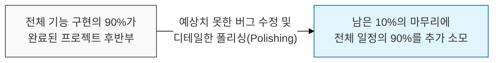
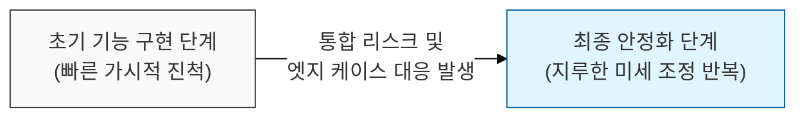

# 마지막 10%의 작업이 전체 시간의 90%를 소모한다, 90-90 법칙

## I. 프로젝트 후반부의 시간 팽창 역설, **90-90** 법칙 개요

**정의**: 코드의 처음 **90**%는 전체 개발 시간의 **90**%를 차지하고, 나머지 **10**%의 코드를 완성하는 데 다시 전체 시간의 **90**%가 소요된다는 위트 섞인 관찰 법칙  

**특징**:  
( **일정 산정의 오류** ) 개발자는 기능 구현(Happy Path) 위주로 진척도를 산정하여, 후반부 예외 처리와 안정화 비용을 과소평가함  
( **완성도의 함정** ) "다 됐다(Done)"라고 말하는 시점과 "배포 가능하다(Shippable)"는 시점 사이에는 거대한 시간적 간극이 존재함  
( **비선형적 노력** ) 프로젝트가 마무리에 가까워질수록 복잡한 의존성 해결과 통합 테스트로 인해 투입 노력 대비 진척도가 급격히 둔화됨  

## II. **90-90** 법칙의 메커니즘과 형상화

### 가. 개발 단계별 소요 시간과 가시적 진척도의 불일치 메커니즘

### 나. **90-90** 법칙이 발생하는 주요 원인
| **구분** | **핵심 내용** | **발생 현상** |
| :--- | :--- | :--- |
| **낙관적 편향** | 기술적 난관이 없을 것이라 가정하고 일정 산정 | 프로젝트 후반부의 급격한 일정 지연 발생 |
| **통합 오버헤드** | 개별 모듈 완성보다 모듈 간 결합 및 동기화에 더 큰 비용 발생 | 전체 시스템의 런타임 오류 및 성능 저하 식별 |
| **폴리싱(Polishing)** | 사용자 피드백 반영, UI/UX 미세 조정, 문서화 작업의 과소평가 | "마지막 10%"가 무한히 반복되는 느낌 유발 |

## III. **90-90** 법칙 극복을 위한 소프트웨어 공학적 전략

### 가. 진척도 관리 및 품질 우선 전략
| **전략** | **상세 내용** | **기대 효과** |
| :--- | :--- | :--- |
| **Definition of Done** | '완료'에 대한 엄격하고 구체적인 기준(테스트 포함) 설정 | 기능 구현과 품질 확보 사이의 간극 최소화 |
| **Continuous Integration** | 개발 초기부터 빈번한 통합과 자동화 테스트 수행 | 후반부에 몰리는 통합 리스크를 전 단계로 분산 |
| **Buffer Management** | 전체 일정의 **20~30**%를 안정화 및 예외 처리를 위해 비워둠 | 후반부 시간 팽창에 대비한 현실적인 일정 확보 |

### 나. 프로젝트 관리 시 시사점
- **The Last Mile is the Longest**: 프로젝트의 마지막 단계가 가장 험난함을 인지하고, 후반부 인력 소모와 사기 저하에 미리 대비해야 함
- **Feature Freeze**: 마감 직전까지 새로운 기능을 추가하는 것을 경계하고, 후반부에는 안정성과 완성도 제고에만 집중해야 함
