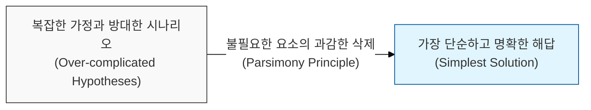
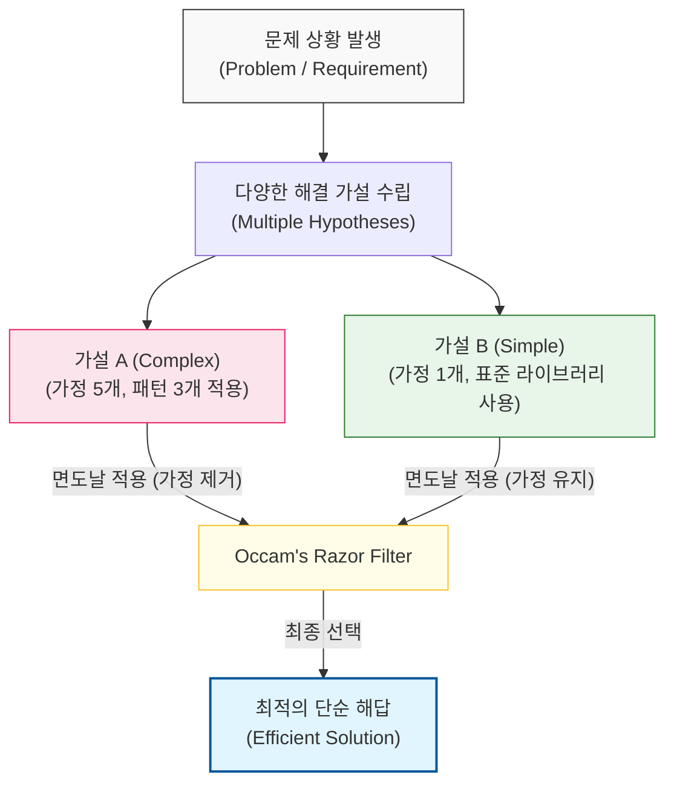

# 불필요한 가정을 베어내라, Occam의 면도날

## I. 단순성의 경제학, **Occam**의 면도날 개요

**정의**: "경제성의 원칙"(Law of Parsimony)으로도 불리며, 어떤 현상을 설명할 때 불필요한 가정을 늘리지 말고 가장 단순한 설명을 선택해야 한다는 사고의 원칙  

**특징**:  
( **가정의 최소화** ) 증명되지 않은 전제나 시나리오가 적을수록 해당 해결책이 정답일 확률이 높다고 판단함  
( **설계의 직관성** ) 소프트웨어 설계 시 복잡한 패턴을 도입하기 전, 가장 기초적이고 단순한 접근법으로 해결 가능한지 우선 검토함  
( **검증 용이성** ) 단순한 모델일수록 테스트와 검증이 쉬우며, 예기치 못한 부작용(**Side Effect**)이 발생할 가능성이 낮음  

## II. **Occam**의 면도날 작동 메커니즘과 선택 구조 모델

### 가. 가설 경쟁 및 최적 해결책 식별 모델

### 나. 설계 시 **Occam**의 면도날 적용 기준
| **평가 항목** | **복잡한 접근 (Avoid)** | **단순한 접근 (Choose)** |
| :--- | :--- | :--- |
| **의존성** | 다수의 외부 라이브러리 및 프레임워크 도입 | 언어 표준 및 내장 기능 우선 활용 |
| **추상화** | 미래를 대비한 **3**단계 이상의 상속/인터페이스 | 구체적인 구현체 중심의 직관적 코드 |
| **로직 전개** | 예외의 예외를 고려한 다중 분기 처리 | 핵심 비즈니스 흐름(**Happy Path**) 중심 설계 |
| **데이터 모델** | 모든 가능성을 열어둔 유연한 가변 스키마 | 현재 요구사항을 충실히 반영한 고정 스키마 |

## III. **Occam**의 면도날과 소프트웨어 공학의 정렬

### 가. 연관 원칙과의 상호작용 전략
| **연관 원칙** | **공통 가치** | **시너지 효과** |
| :--- | :--- | :--- |
| **KISS** | 단순함 유지 | 설계의 가독성 및 직관성 극대화 |
| **YAGNI** | 불필요한 기능 배제 | 개발 자원의 효율적 배분 및 낭비 제거 |
| **조기 최적화 방지** | 추측 기반 최적화 경계 | 데이터 기반의 실질적 성능 개선 집중 |

### 나. 개발 시 시사점
- **Pruning the Design**: 설계 과정에서 "이것이 정말 필요한가?"라는 질문을 반복하여 불필요한 추상화 레이어를 베어내는 '가지치기' 작업이 필수적임
- **Elegance is Simplicity**: 우아한 코드는 화려한 기술의 집합이 아니라, 복잡한 문제를 가장 단순하게 풀어낸 결과물임을 명심해야 함
- **Beware of Simplication**: 단, 본질적인 복잡성(**Essential Complexity**)까지 제거하여 시스템의 기능을 훼손하지 않도록 주의해야 함 (**테슬러의 법칙**과 균형 유지)
