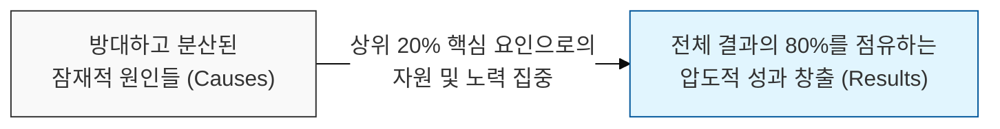
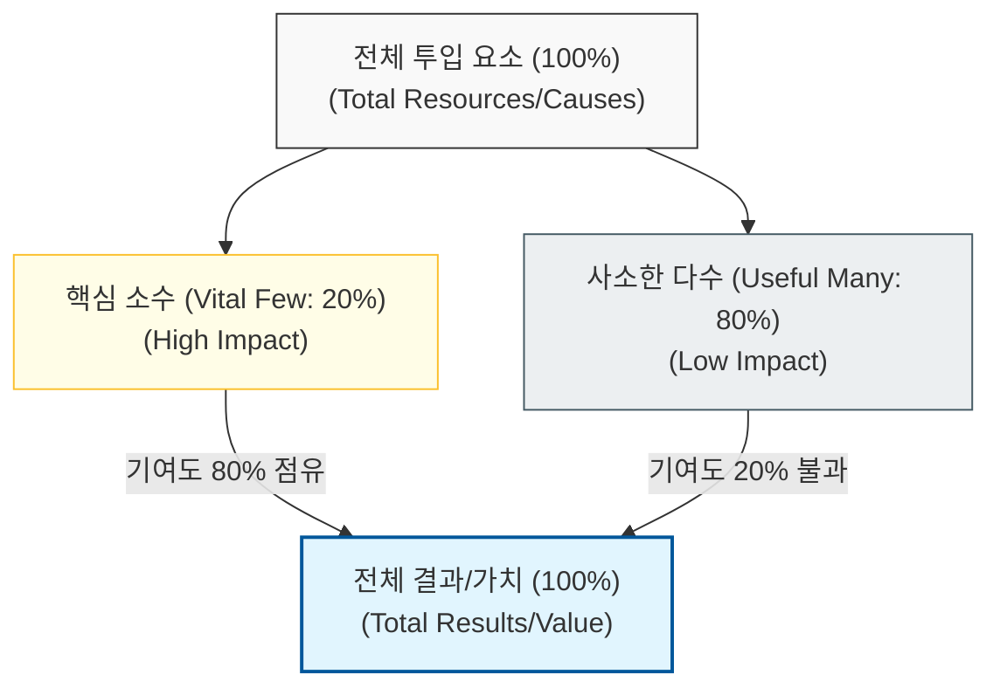

# 적은 수의 핵심이 대부분의 결과를 만든다, 파레토 원칙

## I. 불균형의 경제학, **파레토** 원칙 개요

**정의**: 전체 결과의 **80**%가 전체 원인의 **20**%에서 비롯된다는 법칙으로, "중요한 소수"(Vital Few)의 원리에 집중해야 함을 강조하는 원칙  

**특징**:  
( **원인의 불균형** ) 노력이나 투입 자원이 결과로 이어지는 과정은 선형적이지 않으며, 특정 핵심 요소에 가치가 집중됨  
( **선택과 집중** ) 유한한 자원을 모든 곳에 공평하게 배분하기보다, 영향력이 가장 큰 **20**%의 영역에 우선 투입하여 효율을 극대화함  
( **보편적 적용성** ) 소프트웨어 결함, 사용자 요구사항, 시스템 성능 등 공학 전반의 다양한 병목 현상을 설명하는 기본 모델로 활용됨  

## II. **파레토** 원칙의 작동 메커니즘과 형상화

### 가. 투입 대비 산출의 비선형성 및 핵심 요인 집중 모델

### 나. 소프트웨어 공학에서의 **80/20** 적용 사례
| **분야** | **핵심 20% (Vital Few)** | **영향받는 80% (Results)** |
| :--- | :--- | :--- |
| **버그 및 품질** | 소수의 복잡한 모듈 또는 특정 결함 | 전체 시스템 장애 및 고객 불만의 대다수 |
| **코드 성능** | 전체 실행 시간의 대부분을 차지하는 루프/함수 | 시스템의 전체 응답 속도 및 자원 소모량 |
| **요구사항** | 사용자가 매일 사용하는 핵심 기능 (**MVP**) | 사용자가 느끼는 서비스의 전체 가치와 효용 |
| **유지보수** | 변경이 잦고 복잡도가 높은 레거시 코드 | 전체 유지보수 비용 및 기술 부채의 원인 |

## III. **파레토** 원칙을 활용한 효율적 개발 전략

### 가. 영역별 최적화 및 우선순위 전략
| **전략** | **상세 내용** | **기대 효과** |
| :--- | :--- | :--- |
| **80/20 Debugging** | 가장 많이 발생하는 상위 **20**%의 에러를 먼저 수정 | 최소 노력으로 시스템 안정성 **80**% 조기 확보 |
| **Feature Pruning** | 사용 빈도가 낮은 **80**%의 부가 기능 구현 보류 | **YAGNI** 원칙 실현 및 개발 생산성 제고 |
| **Hot Path Tuning** | 프로파일링을 통해 소요 시간 상위 **20**% 코드 최적화 | 가독성 훼손 최소화 및 최대 성능 향상 (**Knuth** 연계) |

### 나. 개발 및 관리 시 시사점
- **Focus on the Vital Few**: 모든 일을 잘하려 하기보다, 어떤 일이 '가장 중요한 20%'인지 식별하는 능력이 엔지니어의 핵심 역량임
- **Diminishing Returns**: 나머지 **20**%의 성과를 내기 위해 **80**%의 노력을 쏟는 '완벽주의의 함정'을 경계해야 함 (**90-90 법칙** 연계)
- **Dynamic Equilibrium**: 핵심 **20**%는 고정되어 있지 않으며, 비즈니스 상황과 시스템 성숙도에 따라 지속적으로 변화하므로 주기적인 재평가가 필요함
