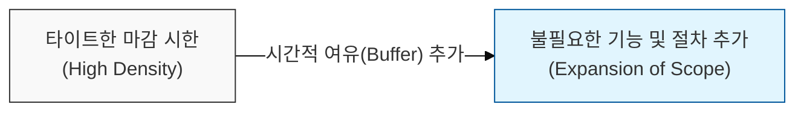

# 업무는 주어진 가용 시간을 채우기 위해 팽창한다, Parkinson의 법칙

## I. 시간과 업무량의 상관관계, **Parkinson**의 법칙 개요

**정의**: 어떤 업무든 주어진 가용 시간을 모두 채울 때까지 그 업무의 중요성과 복잡성이 팽창한다는 법칙  

**특징**:  
( **시간의 자기 팽창** ) 마감 시한이 넉넉할수록 업무를 효율적으로 끝내기보다 불필요한 디테일에 집착하거나 속도를 늦추게 됨  
( **심리적 여유의 역설** ) 여유 시간이 많아지면 업무가 더 쉬워지는 것이 아니라, 오히려 그 시간을 채우기 위한 부수적 작업이 추가됨  
( **관료주의의 확대** ) 업무량과 관계없이 공무원이나 관리자의 수는 매년 일정 비율로 증가하려는 경향과도 관련됨  

## II. **Parkinson**의 법칙의 메커니즘과 형상화

### 가. 시간 할당량에 따른 업무 밀도 및 범위의 변화 메커니즘

### 나. **Parkinson**의 법칙이 초래하는 비효율의 유형
| **구분** | **핵심 내용** | **발생 현상** |
| :--- | :--- | :--- |
| **시간적 팽창** | 마감 직전까지 업무를 미루거나 속도 조절 | 학생 증후군(Student Syndrome) 발생 |
| **범위의 팽창** | 필요 이상의 기능이나 장식을 추가함 | 골드 플레이팅(Gold Plating) 현상 유발 |
| **인적 팽창** | 업무 효율보다 조직의 크기를 키우는 데 집중 | 실무자보다 관리자가 많아지는 역전 현상 |

## III. 소프트웨어 프로젝트 관리에서의 **Parkinson**의 법칙 대응 전략

### 가. 효율적인 일정 및 자원 관리 전략
| **전략** | **상세 내용** | **기대 효과** |
| :--- | :--- | :--- |
| **Timeboxing** | 작업 단위별 엄격하고 짧은 고정 시간 할당 | 업무의 본질에 집중 및 불필요한 팽창 억제 |
| **Iterative Delivery** | 짧은 주기의 스프린트(Sprint)와 잦은 배포 | 피드백 루프 단축 및 실질적인 진척도 확인 |
| **Scope Management** | MVP(Minimum Viable Product) 중심의 핵심 기능 우선순위화 | 가용 시간 증가에 따른 요구사항 부풀리기 방지 |

### 나. 개발 팀 운영 시 시사점
- **Critical Path Focus**: 여유 시간(Slack)이 모든 작업에 골고루 분산되지 않도록 하고, 전체 프로젝트 리스크를 관리하는 버퍼로 통합 관리해야 함
- **Small is Better**: 인력과 시간을 넉넉히 투입하기보다, 약간의 긴장감을 유지할 수 있는 최적의 자원 배분이 생산성을 높임
