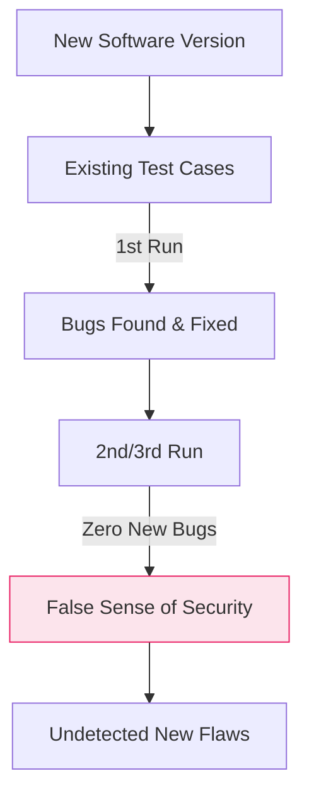

# 반복되는 테스트의 한계, 살충제 역설 (Pesticide Paradox)

## I. 동일한 테스트의 결함 발견 능력 저하, 살충제 역설의 개요

**정의** : 동일한 테스트 케이스로 동일한 테스트 과정을 반복하면 더 이상 새로운 결함을 찾아낼 수 없다는 소프트웨어 테스팅의 핵심 원칙  

**핵심 특징 및 시사점** :  
( **결함의 내성** ) 해충이 살충제에 내성이 생기듯, 소프트웨어의 버그도 고정된 테스트 방식에는 더 이상 포착되지 않는 특성이 있음  
( **테스트 케이스의 노후화** ) 시스템이 변경되고 기능이 추가됨에도 과거의 테스트 케이스만 유지할 경우, 새로운 영역의 결함을 놓칠 위험( **False Negative** ) 증가  
( **지속적 갱신 요구** ) 테스트 자동화가 구축되었더라도 시나리오와 테스트 데이터를 정기적으로 리뷰하고 다각화하는 노력이 필수적임  
( **보안 진단의 한계** ) 보안 점검 역시 동일한 체크리스트만 반복할 경우, 공격자의 진화된 공격 기법( **TTPs** )을 방어하지 못하는 결과 초래  

---

## II. 살충제 역설의 발생 매커니즘과 극복 전략

### 가. 테스트 유효성 감소 모델

### 나. 살충제 역설 극복을 위한 5대 전략

| 전략 항목 | 상세 내용 | 보안 및 품질 효과 |
|:---:|----------|------------------|
| **테스트 케이스 갱신** | 주기적으로 기존 테스트 케이스를 삭제하거나 최신화 | 분석 커버리지 최신성 유지 |
| **데이터 다각화** | 경계값, 오류 데이터 등 입력값의 무작위성( **Fuzzing** ) 확보 | 예측 불가능한 결함 탐지 |
| **교차 테스트** | 진단자나 도구를 교체하여 다른 관점에서 검증 수행 | 편향된 시각에 의한 결함 누락 방지 |
| **탐색적 테스팅** | 정해진 시나리오 없이 테스터의 직관으로 결함 추적 | 시나리오 기반 테스트의 사각지대 보완 |
| **리스크 기반 테스트** | 변경 영향도가 높은 영역을 식별하여 집중 검증 | 제한된 자원의 효율적 배분 및 정확도 향상 |

---

## III. 살충제 역설과 보안 관리의 연계

### 가. 보안 점검의 살충제 역설 사례 및 대응

| 구분 | 전형적인 역설 상황 (As-Is) | 개선된 대응 방향 (To-Be) |
|:---:|--------------------------|------------------------|
| **웹 취약점** | 매달 동일한 자동화 스캔만 수행 | 시나리오 기반의 수동 모의해킹 병행 |
| **인증 보안** | 연 1회 정기 보안 감사만 반복 | 불시에 수행하는 레드팀( **Red Teaming** ) 훈련 |
| **코드 보안** | **SAST** 도구의 기본 룰셋만 활용 | 커스텀 보안 규칙( **Custom Queries** ) 지속 추가 |

### 나. 실무적 제언: 진화하는 방어 체계 구축
- **위협 인텔리전스 반영** : 최신 위협 동향을 실시간으로 파악하여 테스트 시나리오에 즉각 반영함으로써 내성 발생 방지
- **지속적 개선 문화** : "버그가 나오지 않는 것"을 성과로 보지 말고, "테스트 케이스가 얼마나 다양해졌는가"를 지표로 관리
- **자동화와 인간의 조화** : 반복 작업은 기계(자동화)에 맡기되, 새로운 살충제(시나리오)를 만드는 창의적 영역에 인적 자원 집중

> **핵심** : **살충제 역설**은 테스트의 정체가 곧 보안의 위기임을 시사하며, 시스템이 살아 움직이듯 **검증 도구와 시나리오도 끊임없이 진화**해야 함을 상기시킴
