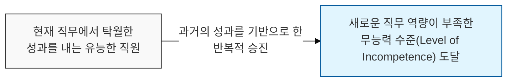
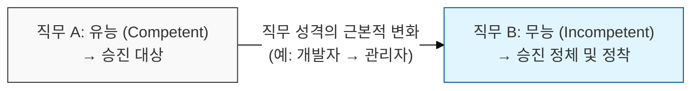

# 모든 직원은 자신의 무능력 수준까지 승진한다, Peter 원칙

## I. 관료 조직의 승진 역설, **Peter** 원칙 개요

**정의**: 계층 구조 내에서 모든 직원은 자신이 더 이상 유능함을 발휘할 수 없는 '무능력의 수준'까지 승진하려는 경향이 있다는 법칙  

**특징**:  
( **승진의 기준** ) 다음 직무에 필요한 역량이 아닌, 현재 직무에서의 성공 여부가 승진의 결정적 요인이 됨  
( **무능력의 정착** ) 한 번 무능력 수준에 도달하면 더 이상 승진하지 못하고 그 자리에 머물며 조직의 효율을 저해함  
( **조직적 정체** ) 결국 조직의 모든 직위는 그 업무를 수행하기에 부적합한 사람들로 채워지는 경향을 보임  

## II. **Peter** 원칙의 메커니즘과 형상화

### 가. 유능함의 상실과 무능력 수준 도달 과정

### 나. **Peter** 원칙이 조직에 미치는 영향
| **구분** | **핵심 내용** | **조직적 결과** |
| :--- | :--- | :--- |
| **성과 창출의 주체** | 아직 무능력 수준에 도달하지 않은 이들에 의해 업무가 수행됨 | 실무 역량이 있는 주니어/미들급에 과도한 업무 집중 |
| **관리 효율 저하** | 관리 역량이 없는 기술 전문가가 관리자가 되어 의사결정 방해 | 팀 전체의 사기 저하 및 불필요한 관료주의 확산 |
| **창의성 말살** | 무능한 상급자가 자신의 지위를 지키기 위해 규칙 준수만 강조 | 혁신적인 시도보다 절차적 정당성에 집착 |

## III. **Peter** 원칙을 극복하기 위한 소프트웨어 조직의 전략

### 가. 역량 기반의 인사 및 조직 운영
| **전략** | **상세 내용** | **기대 효과** |
| :--- | :--- | :--- |
| **Succession Planning** | 다음 직급에 필요한 역량을 사전에 검증하고 교육 실시 | 준비되지 않은 승진으로 인한 무능력화 방지 |
| **Lateral Move** | 승진이 아닌 직무 순환을 통해 적성 및 역량 재배치 | 다양한 직무 경험 제공 및 최적의 배치(Best Fit) 실현 |
| **Creative Demotion** | 불이익 없이 하위 직급이나 실무로 복귀할 수 있는 문화 | 무능력 수준에서 벗어나 자신의 강점에 집중할 기회 제공 |

### 나. 프로젝트 관리 시 시사점
- **Promotion is not Reward**: 승진을 보상으로만 활용하지 말고, 새로운 역할에 대한 책임과 역량을 분리하여 생각해야 함
- **Skill Shift Awareness**: 개발 실력이 뛰어난 사람이 반드시 뛰어난 팀장이 되는 것은 아님을 인지하고, 소프트 스킬 교육을 강화해야 함
