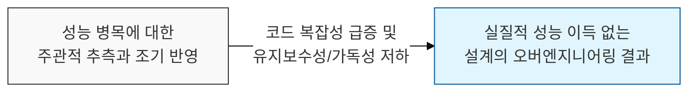
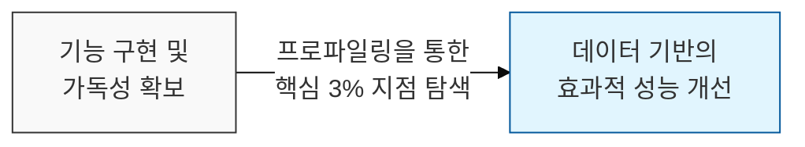

# 추측에 의한 성능 개선은 모든 악의 근원이다, 조기 최적화

## I. 성능과 가독성의 트레이드오프, **Knuth**의 최적화 원칙 개요

**정의**: 실제 성능 병목이 어디인지 측정(Profile)하기 전에, 성능을 높이려는 목적으로 코드를 복잡하게 설계하거나 수정하는 행위  

**특징**:  
( **악의 근원** ) 도널드 커누스(**Donald Knuth**)는 "작은 효율성에 대해서는 잊어버려라. 조기 최적화는 모든 악의 근원이다"라고 강조함  
( **추측의 위험** ) 개발자의 직관은 실제 병목 지점을 맞히는 데 서툴며, 엉뚱한 곳을 최적화하여 시간과 자원을 낭비함  
( **유지보수성 저하** ) 최적화된 코드는 대개 트릭이 포함되어 가독성이 떨어지고 향후 변경이 어려워짐  

## II. 조기 최적화의 메커니즘과 형상화

### 가. 측정 기반 최적화 vs 조기 최적화의 경로 차이

### 나. 조기 최적화가 초래하는 부정적 비용
| **구분** | **핵심 내용** | **발생 가능한 리스크** |
| :--- | :--- | :--- |
| **시간 비용** | 실질적 영향이 없는 코드 수정에 몰두 | 실제 비즈니스 로직 개발 일정 지연 |
| **가독성 비용** | 성능을 위해 비직관적인 알고리즘 채택 | 동료 개발자의 이해도 저하 및 버그 유발 |
| **유연성 비용** | 특정 하드웨어나 라이브러리에 종속된 최적화 | 환경 변화에 따른 아키텍처 재사용 불가 |

## III. 올바른 최적화를 위한 소프트웨어 공학적 전략

### 가. 단계별 성능 최적화 프로세스
| **단계** | **활동 내용** | **수행 원칙** |
| :--- | :--- | :--- |
| **1. Make it Work** | 정확한 기능을 수행하는 명확한 코드 작성 | 가독성과 유지보수성 최우선 |
| **2. Measure** | 프로파일링 도구를 사용한 실제 병목 지점 식별 | 데이터 기반의 객관적 판단 |
| **3. Make it Fast** | 식별된 소수의 핵심 경로(**Hot Path**)만 최적화 | 최적화 후 성능 향상 수치 검증 |

### 나. 개발 시 시사점
- **Focus on the 3%**: 전체 코드의 약 **3%** 미만의 부분에서 대부분의 실행 시간이 소요되므로, 나머지 **97%**는 명확한 코드를 유지해야 함
- **YAGNI 원칙**: "나중에 필요할 거야"라는 가정하에 미리 성능을 고려한 복잡한 구조를 도입하지 말아야 함
