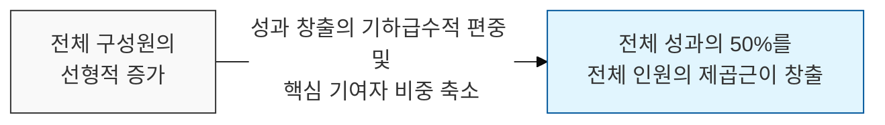
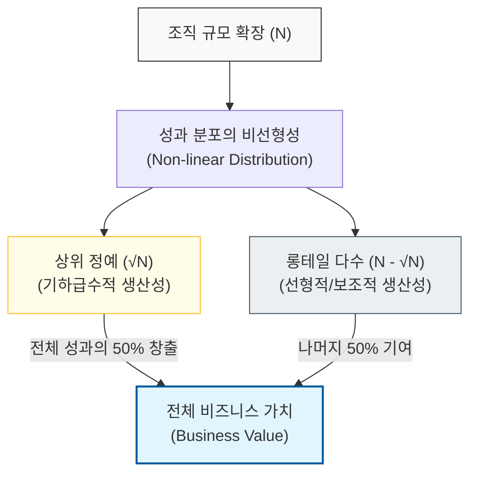

# 소수의 핵심 인재가 성과의 절반을 창출한다, Price의 법칙

## I. 생산성 불균형의 원리, **Price**의 법칙 개요

**정의**: 어떤 분야에서 성과를 내는 사람의 수는 전체 참여자 수의 제곱근과 같으며, 이 소수의 인원이 전체 성과의 절반을 만들어낸다는 법칙  

**특징**:  
( **제곱근의 원리** ) 전체 인원이 `N`명일 때, 약 `√N`명이 전체 결과물의 **50%**를 책임지는 현상을 보임  
( **파레토 법칙의 심화** ) 상위 **20%**가 **80%**를 만든다는 파레토 법칙보다 성과의 편중 현상을 더 강력하게 설명함  
( **규모의 역설** ) 조직 규모가 커질수록 실질적인 고성과자의 비율은 상대적으로 급격히 감소함  

## II. **Price**의 법칙의 메커니즘과 형상화

### 가. 성과 분포의 비선형성과 생산성 불균형 모델

### 나. **Price**의 법칙이 시사하는 조직 내 불균형
| **전체 인원(N)** | **핵심 성과자(√N)** | **비중 (%)** | **시사점** |
| :--- | :--- | :--- | :--- |
| **10**명 | 약 **3**명 | **30%** | 소규모 팀에서는 대다수가 핵심 역할을 수행 |
| **100**명 | **10**명 | **10%** | 조직이 커질수록 핵심 인재에 대한 의존도 심화 |
| **10,000**명 | **100**명 | **1%** | 거대 조직일수록 '무임승차' 또는 '평범한 다수' 급증 |

## III. 소프트웨어 엔지니어링에서의 **Price**의 법칙 대응 전략

### 가. 인재 관리 및 조직 운영 전략
| **전략** | **상세 내용** | **기대 효과** |
| :--- | :--- | :--- |
| **핵심 인재 보호** | 고성과자(Rockstar)에 대한 보상 및 번아웃 관리 | 조직 전체 성과의 50% 손실 방지 |
| **롱테일 인력 육성** | 평균 수준의 다수 인력을 성과자로 전환하는 교육 | 성과의 편중 현상 완화 및 조직 안정성 확보 |
| **소규모 팀 지향** | 대규모 프로젝트를 독립적인 소팀 단위로 분할 | 개별 구성원의 성과 가시성 및 책임감 강화 |

### 나. 프로젝트 관리 시 시사점
- **Bus Factor Management**: 소수의 핵심 인재에 성과가 집중되므로, 이들의 부재가 프로젝트 실패로 이어지지 않도록 지식 공유 체계가 필수적임
- **Quality over Quantity**: 개발자 수의 단순 증가보다 고역량 개발자 한 명의 확보가 시스템 아키텍처와 품질에 더 결정적인 영향을 미침
