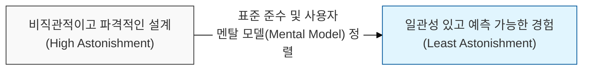
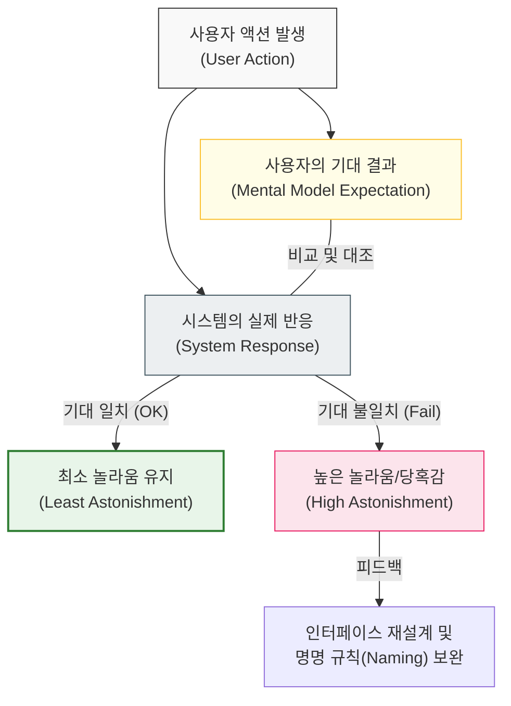

# 사용자의 직관을 배반하지 마라, 최소 놀라움의 원칙

## I. 예측 가능한 인터페이스의 미학, **최소 놀라움**의 원칙 개요

**정의**: 시스템의 구성 요소는 사용자가 이미 알고 있는 지식과 직관에 비추어 볼 때 가장 자연스러운 방식으로 작동해야 하며, 사용자를 당황하게(**Astonishment**) 만들지 않아야 한다는 설계 원칙  

**특징**:  
( **인지적 일관성** ) 유사한 기능을 가진 다른 도구나 표준 관습과 일치하는 동작을 제공하여 학습 비용을 최소화함  
( **부작용 제어** ) 명칭이나 형태가 암시하는 기능 외의 숨겨진 부작용(**Side Effect**)을 철저히 배제함  
( **사용자 중심** ) 개발자의 편의성이나 구현의 논리보다 사용자의 기대와 경험을 최우선 가치로 설정함  

## II. **최소 놀라움**의 원칙의 메커니즘과 형상화

### 가. 사용자 기대와 시스템 반응의 정렬 구조 모델

### 나. 최소 놀라움 달성을 위한 3대 설계 요소
| **요소** | **핵심 내용** | **구체적 실천 방안** |
| :--- | :--- | :--- |
| **일관성 (Consistency)** | 내부 및 외부 인터페이스의 통일성 유지 | 산업 표준(Standard) 가이드라인 준수 |
| **명확성 (Clarity)** | 기능의 목적을 직관적으로 드러냄 | 자기 설명적(**Self-documenting**) 명명법 적용 |
| **단순성 (Simplicity)** | 복잡한 옵션을 배제하고 본질에 집중 | 기본값(Default) 위주의 옵션 설계 (KISS 연계) |

## III. **최소 놀라움**의 원칙 적용 전략 및 실무 사례

### 가. 혁신과 친숙함 사이의 균형 전략
| **비교 항목** | **급진적 혁신 (Innovation)** | **최소 놀라움 준수 (Familiarity)** |
| :--- | :--- | :--- |
| **핵심 목표** | 기존에 없던 새로운 가치 창출 | 사용의 편의성 및 안정성 확보 |
| **위험 요소** | 사용자의 거부감 및 오작동 유발 | 혁신의 정체 및 구태의연한 UI |
| **절충 방안** | 점진적 변화 및 튜토리얼 제공 | 메타포(Metaphor)를 활용한 인지 전이 |

### 나. 개발 시 시사점
- **Naming is Design**: 함수나 변수의 이름은 그 기능을 100% 대변해야 함. `calculate()`라는 함수가 내부적으로 DB를 업데이트한다면 이는 최소 놀라움의 원칙을 정면으로 위반하는 것임
- **Documentation**: 만약 설계상 사용자의 직관과 어긋나는 부분이 불가피하게 발생한다면, 이를 문서화하고 강력한 경고나 가이드를 제공해야 함
