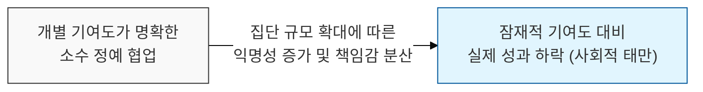
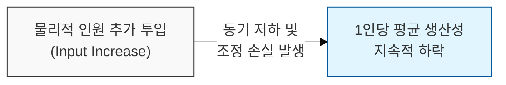

# 집단의 규모가 커질수록 개별 공헌도는 감소한다, Ringelmann 효과

## I. 사회적 태만의 심리학, **Ringelmann** 효과 개요

**정의**: 집단에 참여하는 인원이 늘어날수록 1인당 공헌도가 오히려 떨어지는 현상으로, **사회적 태만**(Social Loafing)이라고도 불리는 법칙  

**특징**:  
( **반비례 관계** ) 집단의 규모와 개별 구성원의 노력 수준은 반비례하는 경향을 보임  
( **책임감 분산** ) "나 하나쯤이야"라는 생각이나 결과에 대한 책임이 모호해질 때 발생함  
( **조정의 손실** ) 인원 증가에 따른 물리적/심리적 동기화 및 협업 조정의 어려움이 수반됨  

## II. **Ringelmann** 효과의 메커니즘과 형상화

### 가. 인원수 증가에 따른 실제 성과와 잠재 성과의 괴리

### 나. **Ringelmann** 효과의 주요 원인 분석
| **구분** | **핵심 내용** | **영향성** |
| :--- | :--- | :--- |
| **동기적 손실** | 개별 기여가 보이지 않을 때 발생하는 의욕 저하 | 사회적 태만 및 방관자 효과 유발 |
| **조정적 손실** | 여러 사람의 힘을 한 방향으로 모으는 기술적 한계 | 협업 인터페이스의 병목 및 충돌 증가 |
| **평가 모호성** | 성과 측정이 집단 단위로 이루어질 때 발생 | 무임승차(Free-riding) 현상 심화 |

## III. 소프트웨어 팀의 **Ringelmann** 효과 극복 전략

### 가. 조직 및 프로세스 측면의 대응
| **전략** | **상세 내용** | **기대 효과** |
| :--- | :--- | :--- |
| **기여 가시성 확보** | 코드 리뷰, 칸반 보드 등을 통한 개별 업무 시각화 | 책임감 고취 및 무임승차 방지 |
| **작은 단위 분할** | 대규모 팀을 자율적인 마이크로 팀(Squad)으로 재편 | 개인의 영향력 확대 및 소속감 강화 |
| **명확한 R&R 설정** | 작업 단위(Task)별 명확한 담당자 및 목표 지정 | 책임 소재 불분명에 따른 태만 억제 |

### 나. 프로젝트 관리 시 시사점
- **Optimal Team Size**: 무조건적인 인력 투입보다는 개인의 공헌도가 극대화될 수 있는 최적의 팀 규모(보통 **5~9**명) 유지가 중요함
- **Recognition & Feedback**: 개별 구성원의 노력을 구체적으로 인정하고 피드백하는 문화가 사회적 태만을 방지하는 핵심 기제임
